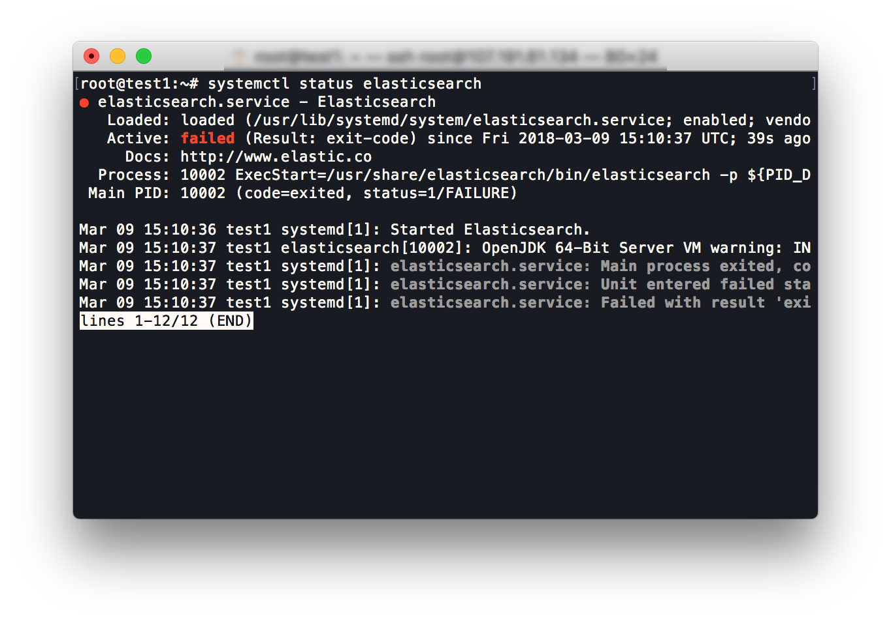
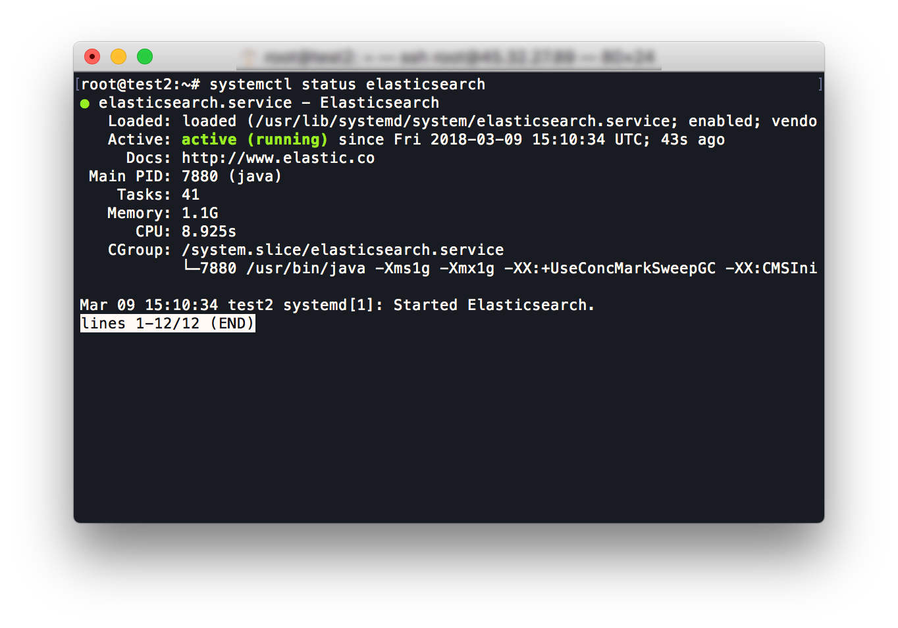
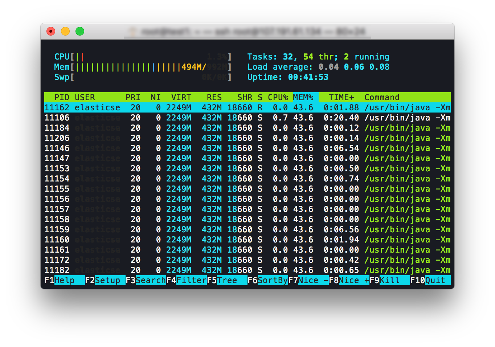
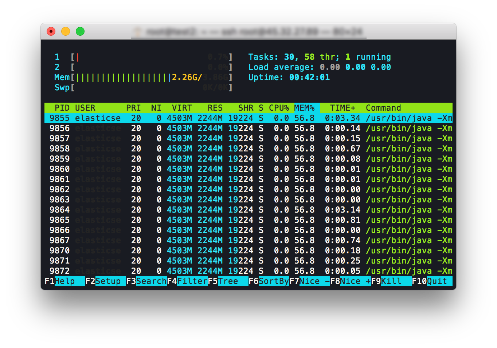

Elasticsearch Guide
====

The following guide explains how to use [Elasticsearch](https://www.elastic.co/products/elasticsearch).

Why you might need Elasticsearch
----

If you want to use Full-text search, you should setup Elasticsearch.

Installing Pre-required dependency
----

Elasticsearch is built using Java, and requires at least Java 8 in order to run.

Install Java 8:

```
sudo apt install openjdk-8-jre
```

> The openjdk-8-jre package contains just the Java Runtime Environment. If you want to develop Java programs then please install the openjdk-8-jdk package.

You need to install the `apt-transport-https`.

```bash
sudo apt install apt-transport-https
```

Installing Elasticsearch
-----

### Import the Elasticsearch PGP Keyedit

Download and install the public signing key:
```bash
wget -qO - https://artifacts.elastic.co/GPG-KEY-elasticsearch | sudo apt-key add -
```

### Installing from the APT repository

```bash
sudo echo "deb https://artifacts.elastic.co/packages/6.x/apt stable main" | sudo tee -a /etc/apt/sources.list.d/elastic-6.x.list
```

```bash
sudo apt update && sudo apt install elasticsearch
```

### Running Elasticsearch with systemd

To configure Elasticsearch to start automatically when the system boots up, run the following commands:

```bash
sudo /bin/systemctl daemon-reload
sudo /bin/systemctl enable elasticsearch.service
```

Start Elasticsearch:

```bash
sudo systemctl start elasticsearch
```

If you want to check Elasticsearch status, run the following commands:

```bash
sudo systemctl status elasticsearch
```

***Note: If your VPS has insufficient memory, Elasticsearch may not be able to start. See the Advanced Configuration section at the end of this document for some options if this is the case.***

### Configuring Mastodon for Elasticsearch

Change Elasticsearch configuration in `.env.production` to:
```
# Optional ElasticSearch configuration
ES_ENABLED=true
ES_HOST=localhost
ES_PORT=9200
```

### Run chewy:deploy to create & populate index

```bash
su - mastodon
cd live
RAILS_ENV=production bundle exec rails chewy:deploy
```

You now need to restart Mastodon.

### Advanced Elasticsearch Configuration (Optional)

***If you can't start Elasticsearch, It's probable that the allocated memory is insufficient.***

|RAM 1GB|RAM 4GB|
|:--:|:--:|
|||

This guide may be useful if you can't start Elasticsearch, or if Elasticsearch uses too much memory.

First, Elasticsearch needs a lot of memory.

You should check [this page](https://www.elastic.co/guide/en/elasticsearch/guide/current/hardware.html).   
But, as far as I can recollect, Mastodon does not require much memory for Elasticsearch.  
When building Elasticsearch server on low memory VPS, It's necessary to change the configuration.

Change these lines in `/etc/elasticsearch/jvm.options`:

```
# Xms represents the initial size of total heap space
# Xmx represents the maximum size of total heap space

-Xms1g
-Xmx1g
```

#### Note: Are you worried about how much memory configuration need on your VPS? This list may be useful! In my opinion, It would be better to set it from 35% to 50% of the total memory.

|Memory|Xms|Xmx|
|:--:|:--:|:--:|
|1GB|256m|256m|
|2GB|512m|512m|
|3GB|1g|1g|
|4GB|2g|2g|

|RAM 1GB|RAM 4GB|
|:--:|:--:|
|||

***Please don't forget! This isn't necessarily the best configuration.***

#### Warning: The memory in this list is for Elasticsearch. It's not the total memory of the VPS.

After changing any of these settings, start Elasticsearch:

```bash
sudo systemctl start elasticsearch
```

And check Elasticsearch status:

```bash
sudo systemctl status elasticsearch
```

#### Note: You can also configure Mastodon to use Elasticsearch on a different server.

If you want to use an Elasticsearch instance running on a different server, just include its address in `.env.production`

```
# Optional ElasticSearch configuration
ES_ENABLED=true
ES_HOST=Put the IP of Elasticsearch server here.
ES_PORT=9200
```

To configure your remote server, see the [Elasticsearch documentation on network settings](https://www.elastic.co/guide/en/elasticsearch/reference/current/modules-network.html).

Resources
-----

- [Install Elasticsearch with Debian Package](https://www.elastic.co/guide/en/elasticsearch/reference/current/deb.html)
- [Elasticsearch - Hardware](https://www.elastic.co/guide/en/elasticsearch/guide/current/hardware.html)
- [How to download and install prebuilt OpenJDK packages](http://openjdk.java.net/install/index.html)
