Frequently Asked Questions
==========================

Translations of this FAQ:

* [Español](FAQ_ESP.md)
* [日本語](FAQ_JA.md)

#### What is a Mastodon?

A prehistoric animal, predecessor of the mammoth. Goes "toot."

#### Why the name Mastodon?

There's a progressive metal band with the same name that I'm a fan of that brought the animal to my attention. I thought it's a pretty cool name/animal.

#### How exactly is it decentralized?

There are different ways in which something can be decentralized; in this case, Mastodon is the "federated" kind. Think e-mail, not BitTorrent. There are different servers (instances), users have an account on one of them, but can interact and follow each other regardless of where their account is.

#### Technically, how does the federation work?

We are using the OStatus suite of protocols:

1. Webfinger for user-on-domain lookup
2. Atom feeds with ActivityStreams, Portable Contacts, Threads extensions for the actual content
3. PubSubHubbub for subscribing to Atom feeds
4. Salmon for delivering certain items from the Atom feeds to interested parties such as the mentioned user, author of the status being replied to, person being followed, etc

#### What is mastodon.social?

The "flagship" instance of Mastodon, aka the server I run myself with the latest code. It's not supposed to be the only instance in the end.

#### What else is part of the federated network?

Let's call it the "fediverse". It has existed for a longer while, populated by GNU social servers, Friendica, Hubzilla, Diaspora etc. Not every one of those servers is fully compatible with every other. Mastodon strives to be fully standards-compliant and compatibility with GNU social is higher in priority than the others.

#### I tried logging into a GNU social client app with Mastodon and it didn't work, why?

While Mastodon is compatible with GNU social in terms of server to server communication, the client to server API (aka how you access Mastodon) is different. Therefore, client apps that were made for specifically GNU social will not work with Mastodon. The reason for this is half technical, half ideological.

Because Mastodon has been created from a blank slate, it is much simpler to have the API mirror internal structures as closely as possible, rather than build an emulation layer. Secondly, the GNU social client API is actually a half-way implementation of the legacy Twitter API - that's the reason why it works with some older Twitter client apps. However, many of those apps are not maintained anymore, the GNU social API does not actually keep up with the real Twitter API and never fully implemented all its features; at the same time, the Twitter API was never meant for a federated service and so obscures some of the functionality.

#### How is Mastodon funded?

Development of Mastodon and hosting of mastodon.social is funded through my [Patreon (also BTC/PayPal donations)](https://www.patreon.com/user?u=619786). Beyond that, I am not interested in VC funding, monetizing, advertising, or anything of that sort. I could offer setup/maintenance services on demand.

The software is free and open source and communities should host their own servers if they can, that way the costs are more or less distributed. Obviously it'd be hard for me to pay the bills if literally everyone decided to use the mastodon.social instance only.

#### This looks a lot like Twitter, what’s the difference?
Mastodon is decentralized. Anyone can run a Mastodon server, under their own community rules. Twitter is run by a central authority, and sets the rules for everyone.

#### What is a “federation”?
It’s a group of mastodon servers that share toots with each other.

#### What is an “instance”?
It’s a server that you can have an account on. Each has its own policies, because they can be run by anyone!

#### How should I choose which instance to use?
[Many instances exist](https://instances.mastodon.xyz/list) for almost every interest. It's okay to try a couple of public ones while looking for one that feels right. Talking about your interests on a public instance like [Mastodon.Social](https://mastodon.social) may help you get invited to other instances.

To preview what an instance is saying, use [this preview tool](http://www.unmung.com/mastoview?url=mastodon.social&view=local) created by [Kevin Marks](https://mastodon.social/@kevinmarks).

#### How many people signed up for Mastodon? Can I see a chart of user counts over time?
Sure, you can follow [@mastodonusercount@social.lou.lt](https://social.lou.lt/@mastodonusercount).

#### How do you really spell “mast–don”?
It’s **mastodon** with two Os. You will get it wrong at least once.

#### How do I get this on Android?
Try [Tusky](https://play.google.com/store/apps/details?id=com.keylesspalace.tusky).

#### On Android, I really want multiple account support.
Try [TootyFruity](https://play.google.com/store/apps/details?id=ch.kevinegli.tootyfruity221258).

#### How do I get this on iPhone?
Try [Amaroq](https://itunes.apple.com/us/app/amaroq-for-mastodon/id1214116200). Also, Safari might be a choice.

#### Are there other mobile/desktop/cli apps?
[Yep.](Apps.md)

#### Can Tusky do ‘💇’? How about feature “🔥”? And what’s with Tusky’s “⛱”?
You can follow or contact Tusky at [@Tusky@mastodon.social](https://mastodon.social/@Tusky), or the developers [@Vavassor@mastodon.social](https://mastodon.social/@Vavassor) and [@daycode@mastodon.social](https://mastodon.social/@daycode)

#### How do I search?
You can search for people and hashtags, but not general text. Use the box above the tooting area.

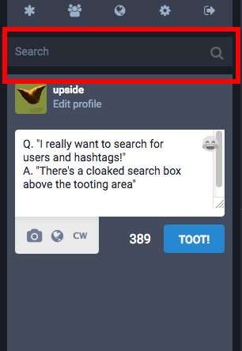

#### How do I DM (Direct Message)?"
Click on the **globe** beneath your toot for privacy options, including DM.

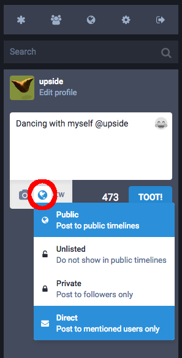

#### I don’t get the local vs. federated timeline thing.
“Local” toots are from the server you signed up at. “Federated” are the all the toots your server knows about. (It's complicated, but short version is: “toots from people that you and other locals follow.”)

#### Are there instances that my instance doesn't federate with? How do I know?
Some instances are private and will not federate with your instance. Others may be blocked by your instance. To find out more about how your instance federates, ask your admin. (see also: “[Who is my admin, and how do I contact/follow them?](#who-is-my-admin-and-how-do-i-contact-follow-them)”)

#### Can I have more than one account? Can I use the same email on different instances?
Yes and yes! If you find another instance you would like to join, sign up! Note that not all instances are open to new registrations and it’s possible that someone has already taken your preferred username.

#### Can I import the people I follow to another instance?
Yes. This may take time depending on the instance you move to. Talk to the admin of your new instance if you have difficulties. If your new instance does not federate with the instances of the people you follow, you may lose them.

#### How do I prevent people from impersonating me?
Because anyone can create a username on any instance, it is impossible to prevent others from using the same username on another instance. Some people have taken to running their own single-user instance to verify themselves, or use [Keybase](https://keybase.io/).

#### How do I enable Two Factor Authentication?
If your instance supports it, the option will be in Preferences under Two-factor Authentication. [Mastodon's 2FA](2FA.md) uses both a QR code and plain-text secrets.

#### Why can't I see someone's toots?
This could occur for several reasons. A person's posts may be private. You must be a follower of a private account to see their non-public posts. Additionally, if someone has blocked you, you will no longer see their non-public posts.

#### What’s trending?
To find out what’s trending, follow the esteemed [@TrendingBot@mastodon.social](https://mastodon.social/@TrendingBot).

#### What’s “CW”?
“CW” stands for “Content Warning.” You can use it to hide your toot, like a spoiler.

#### How does the “Mark Image as Sensitive” feature work (“NSFW”)?
When you add a picture to your post using the camera icon, an additional toggle will appear [typically as "NSFW"]. Clicking this will hide your image behind a "Sensitive Content" warning, preventing others from seeing your images until they click on them.

#### What’s with the pineapples?
They’re tasty, and they make people smile. Just go with it.

#### I see “Awoo” a lot, what does that mean?
Try saying it out loud. It’s fun!

#### How do I delete my account?
At the moment, you will have to toot the admin of your instance for help on that one.

#### Who is my admin, and how do I contact/follow them?
Click on **Getting Started**, then **Extended Information**. An info page displays. Hopefully, they put their contact information in there!

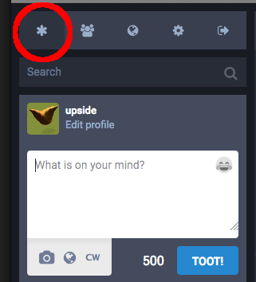
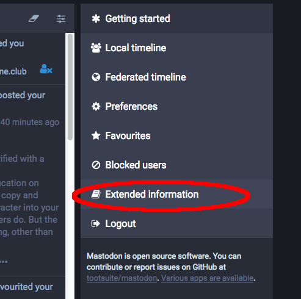
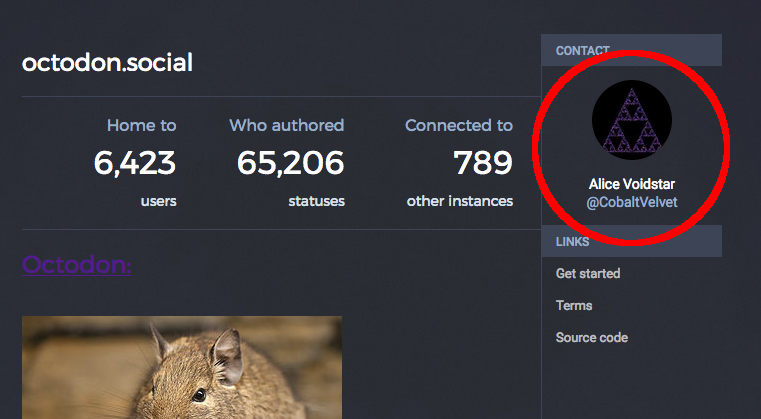

#### Wow, I keep seeing offensive stuff from a particular instance, is there a way to block *all* of it?
If your instance is running version 1.4.1 of Mastodon or later, yes! Visit the user page of a user on the instance you want to block, then click the drop-down menu on the left-hand side, just above their toots. You should see an option to hide everything from the instance that user is on:

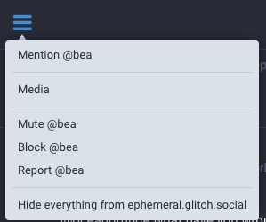

If your instance is running a version of Mastodon prior to 1.4.1, you can't do this without a lot of clicking, sorry. But, your instance admin can do it! Please contact them.

(You can tell what version of Mastodon your instance is running by following the steps in "[Who is my admin, and how do I contact/follow them?](#who-is-my-admin-and-how-do-i-contact-follow-them)". The version number is listed in the right-hand column of that extended information page.)

#### Is Mastodon moderated?
Each instance handles moderation differently, and each has their own moderators. It’s okay to ask what the rules are for the instance you are on. Usually the rules are posted on the instance's about page ([like the “more” page at Mastodon.social](https://mastodon.social/about/more))

#### How do I report offensive content?
Beneath each post, you will see three dots. Clicking on those will allow you to expand a post or report the content. When reporting content, select all posts that need moderator attention.

#### How do I handle harassment?
If your admin takes harassment seriously, you can report it to them through the post-reporting system. This can be found through the ellipsis (“…”) beneath the post, or by contacting your admin directly.

#### Will my Private Messages reach people on other instances?
Yes, they should. However, private messages are *not secure*. You should avoid sending sensitive information through them.

#### What does “Adjust Status Privacy” mean and how does it work?
The **globe** icon under the toot area adjusts your status privacy by changing who can see your posts. This is what happens:

| Privacy setting | Broadcasted to | Viewable by | Notes |
| --------------- | ----------- | ------ | ----- |
| Public          | Global, public timelines | Everyone | Federated. People on other instances will probably see it. |
| Unlisted        | Followers only | Everyone | Can be boosted and thus seen on other instances.  |
| Private         | Followers only |  Followers only | Cannot be boosted. |
| Direct          | Mentioned people only  | Mentioned people only | Similar to email |

#### Can I use hashtags? Should I?
Yes! Hashtags are tracked and are often fun, but some tags help people avoid triggering posts. This is especially appreciated on public posts of #POLITICS, #HEALTH, #DEPRESSION, or #LEWD OR #NSFW topics. Such posts are also what the Content Warning system was designed for.

#### How do I get verified with a “✅”?
“✅” is an emoji, *only* for lulz. There is no verification on Mastodon. You can copy and paste “✅” into your bio if you wish, you cheeky monkey.

#### Can I edit a toot?
No, sorry. But you could delete your toot and rewrite…

#### If I delete a post, does it get deleted everywhere?
Deleting a post will delete it from the local timeline. However, if it has already been boosted, it may still be seen and may federate.

#### How do I view my favorite toots?
Click **Getting Started**, then **Favourites**. Yes—Mastodon uses UK spelling!

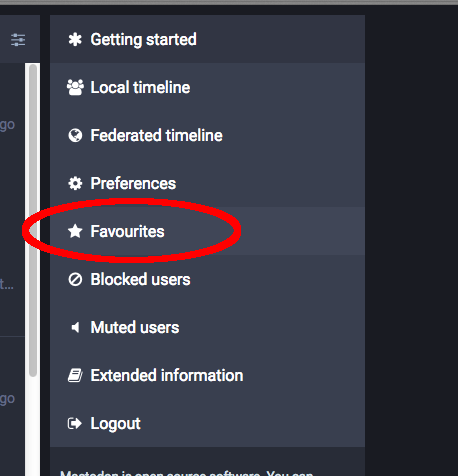

#### Can I quote a toot?
Not currently. You must manually copy and paste the text to quote it.

#### If my instance shuts down forever, do I lose my data?
Yes you do.

#### Can I save my data?
Yes, some of it! It‘s under **Preferences->Data export**

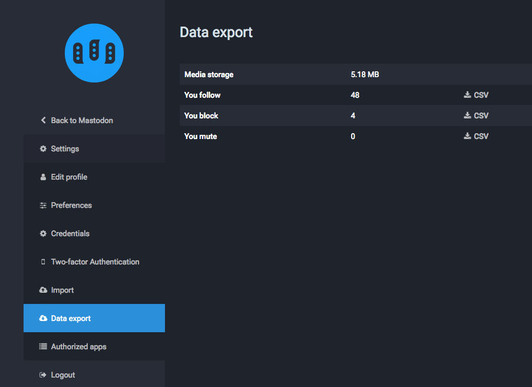

#### I can’t see toots of a remote user under their bio!
In **Expanded View**, click their avatar. This will take you directly to their instance, which displays all their public toots.

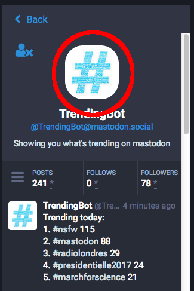
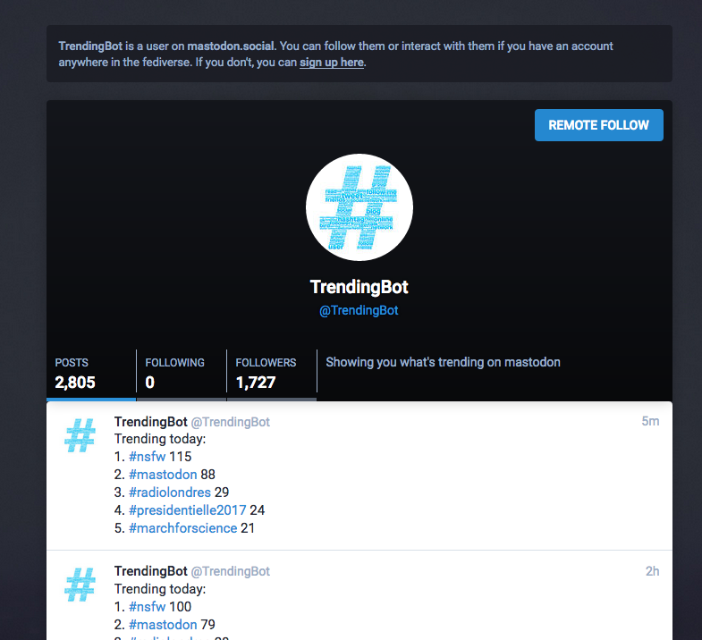

#### How do I see threads?
Click the toot body for **Expanded View**. This will show threads the toot’s connected to.

#### How do I link to toots?
There are two permalinks for toots. With inline toots, **right-click** the timestamp. On expanded toots, **right-click** the date on the bottom.

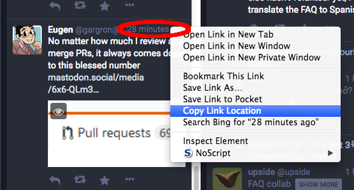
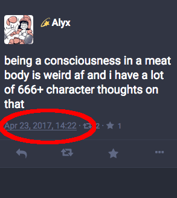

#### How do I link to my profile?
In Firefox, **right-click** on your avatar picture. Select **Copy Link Location**.

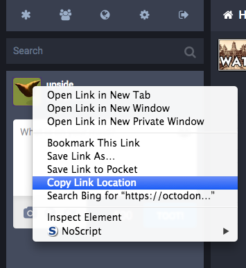

#### Does clicking a #hashtag show  local results, or federated?
Federated.

#### When I mute a boost, who gets muted, the booster or the original author?
The original author.

#### Can I preview the people on an instance, and what they’re saying?
Yes, try the excellent [instance preview tool](http://www.unmung.com/mastoview?url=mastodon.social&view=local).

#### How do I hide the toots of languages I don’t understand?
The developers are working on this and other filtering options, stay tuned!

#### Is automatic translation supported?
Not yet, but there is a [Firefox TamperMonkey script](https://github.com/tomouchuu/mastodon-translate) that might work for you.

#### Do toots automatically broadcast federated, or stay local?
By default, toots are federated (public), and will show on both timelines. You can change the default behavior through **Settings->Preferences->Post Privacy.**

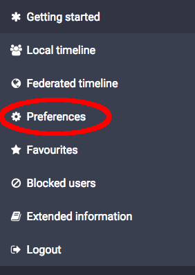
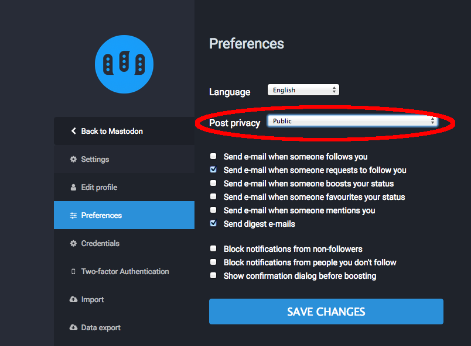

#### What is the default image upload size limit and how can I change it?
The default limit is 8 megabytes, however this can be changed by editing the following line in `mastodon/app/models/media_attachment.rb`:

`  validates_attachment_size :file, less_than: 8.megabytes`

Change the 8 to another integer to change the limit.

#### How do I start my own instance?
See the [User Guide](../README.md), under the heading “Running Mastodon.”

#### I found a bug or have a suggestion for Mastodon.
You can file a bug or submit suggestions at [Mastodon’s Issue Tracker.](https://github.com/tootsuite/mastodon/issues)

#### Hey I love mastodon FAQs! Can I have more?
Here’s more, from hardworking individuals trying to help, too.

* [https://hastebin.com/raw/xuqogukimu](https://hastebin.com/raw/xuqogukimu)

* [https://github.com/ThomasLeister/masto-faq](https://github.com/ThomasLeister/masto-faq)

* [http://mastoguide.info/Pages/FAQindex.html](http://mastoguide.info/Pages/FAQindex.html)

* [https://medium.com/tebelorg/my-first-10-days-on-mastodon-fediverse-f6f1d73db8d7](https://medium.com/tebelorg/my-first-10-days-on-mastodon-fediverse-f6f1d73db8d7)

* [https://github.com/tootsuite/documentation/blob/master/Using-Mastodon/FAQ.md](https://github.com/tootsuite/documentation/blob/master/Using-Mastodon/FAQ.md)

---
This FAQ was compiled with contributions from [@Gargron](https://mastodon.social/@Gargron),  [@raccoon](https://mastodon.social/@Raccoon), [@upside](https://octodon.social/@upside), [@zacanger](https://mastodon.social/@zacanger), [@NthTensor](https://octodon.social/@NthTensor), [@ametlles](https://mastodon.social/@ametlles) and many others in the fediverse!
