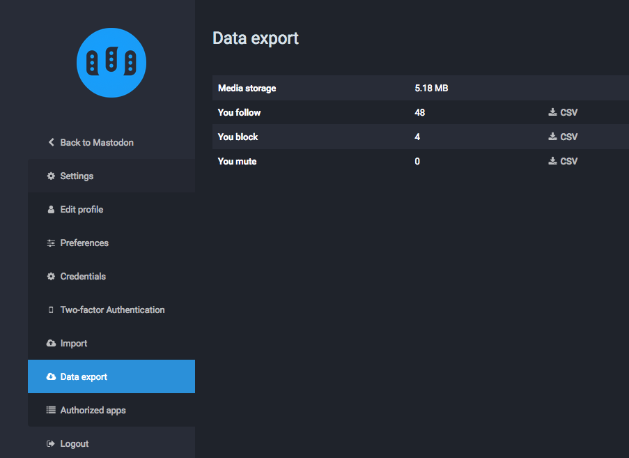

Preguntas frecuentes
==========================

#### ¿Qué es un *Mastodon*?
Es un animal prehistórico, predecesor del mamut. Los mastodontes hacen “toot” (al menos en inglés, en español berrearían, ¿no?).

#### ¿Por qué el nombre *Mastodon*?
Existe una banda de metal progresivo con el mismo nombre del que soy fan, la cual hizo que este animal llamara mi atención. Pensé que el nombre/animal es muy cool.

#### ¿Por qué Mastodon es una red descentralizada?
Hay diferentes maneras en las cuales algo puede ser descentralizado;  en este caso, Mastodon es del tipo “federado”. Piensa en el correo electrónico, no tanto en los servicios torrent para compartir archivos: existen muchos servidores distintos (“instancias” o “nodos” en el caso de esta red) y los usuarios tienen una cuenta en alguno de estos servidores, pero pueden interactuar y seguirse entre ellos sin importar en qué servidor esté su cuenta.

#### Técnicamente, ¿cómo funciona la federación?
Estamos utilizando el conjunto de protocolos OStatus:

1. Webfinger para la búsqueda de usuarios en distintos dominios
2. *Feeds* de Atom con las extensiones ActivityStreams, Portable Contacts y Threads para el contenido
3. PubSubHubbub para la suscripción a los *feeds* de Atom
4. Salmon para la entrega de ciertos elementos desde los *feeds* de Atom a todos los interesados, como un usuario siendo mencionado, el autor del estatus al que se le está respondiendo, una persona siendo seguida, etc.

#### ¿Qué es mastodon.social?
Es la instancia (o nodo) “emblemática” de Mastodon, también conocida como el servidor que administro yo mismo ([@Gargron](https://mastodon.social/@Gargron)) con las modificaciones al código más recientes. No se supone que tenga que ser la única instancia al final de cuentas.

#### ¿Qué otras plataformas son parte de la red federada?
Llamemos a la red federada “fediverso”.  El fediverso ha existido por más tiempo que Mastodon, poblado por servidores de GNU social, Friendica, Hubzilla, Diaspora, etc. No todos estos servidores son completamente compatibles entre ellos. Mastodon hace lo posible por adaptarse a los estándares actuales, por lo mismo, tener compatibilidad con GNU social es de mayor prioridad que tenerla con otras plataformas.

#### Intenté iniciar sesión en Mastodon con una app cliente para GNU social, pero no funcionó, ¿por qué?
Si bien Mastodon es compatible con GNU social en términos de comunicación de servidor a servidor, no sucede lo mismo con la comunicación de cliente a servidor API (o el cómo accedes a Mastodon). Por lo tanto, las apps que fueron hechas específicamente para GNU social no van a funcionar con Mastodon. La razón de esto es por una parte técnica y por la otra ideológica.

Como Mastodon ha sido creado en blanco, es mucho más simple hacer que la API refleje las estructuras internas de la manera más fiel posible, en lugar de crear una capa que las emule. Por otra parte, la API cliente de GNU social es de hecho una implementación a medias de la API de legado (*legacy*) de Twitter –esta es la razón por la que funciona con algunos clientes viejos para Twitter–. Sin embargo, muchas de estas apps dejaron de ser mantenidas, la API de GNU social no se mantuvo a la par de la API real de Twitter y nunca implementó todas sus características; al mismo tiempo, la API de Twitter nunca fue pensada para un servicio federado y por lo tanto obscurece una parte de su funcionalidad.

#### ¿Cómo se financia Mastodon?
El desarrollo de Mastodon y el alojamiento web de mastodon.social es financiado por medio de mi [Patreon (y a través de donaciones en BTC/PayPal)](https://www.patreon.com/user?u=619786). ). Más allá de lo anterior, no estoy interesado en financiamiento de capital de riesgo (*VC funding*), monetización, dinero a través de anunciantes, ni nada parecido.  En todo caso puedo ofrecer servicios de instalación/mantenimiento sobre demanda.

El software es libre y gratuito, y las comunidades deberían alojar sus propios servidores si pueden hacerlo, de esa manera los costos quedan más o menos distribuidos. Obviamente sería difícil para mí pagar las cuentas si literalmente todo el mundo decide usar sólo la instancia mastodon.social.

#### Mastodon se parece mucho a Twitter, ¿cuál es la diferencia?
Mastodon es una red social descentralizada; cualquiera puede iniciar y mantener su propio servidor de Mastodon, bajo las reglas para su comunidad que elija. Twitter es manejado por una autoridad centralizada y establece reglas que se aplican a todos.

#### ¿Qué es una “federación”?
Es un grupo de servidores de Mastodon que comparten toots entre ellos.

#### ¿Qué es una “instancia” o “nodo”?
Es un servidor en el que puedes tener una cuenta. Cada instancia tiene sus propias políticas y reglas, ¡porque pueden ser administradas por cualquiera!

#### ¿Cómo elijo qué instancia o nodo usar?
[Existen muchas instancias](https://instances.mastodon.xyz/list) para  casi cualquier interés. Está bien si quieres probar un par de nodos públicos mientras encuentras algún otro que te agrade. Comentar tus intereses en una instancia pública, como [mastodon.social](https://mastodon.social) puede ayudar a que te inviten a otras instancias más específicas.

Para ver un *preview* de lo que sucede en un nodo puedes usar [esta herramienta](http://www.unmung.com/mastoview?url=mastodon.social&view=local) creada por [Kevin Marks](https://mastodon.social/@kevinmarks).

#### ¿Cuánta gente está registrada en Mastodon? ¿Puedo ver una gráfica con el número de usuarios a través del tiempo? 
Claro, sólo sigue a [@mastodonusercount@social.lou.lt](https://social.lou.lt/@mastodonusercount).

#### ¿Cómo puedo acceder a Mastodon en Android?
Puedes probar [Tusky](https://play.google.com/store/apps/details?id=com.keylesspalace.tusky).

#### Me gustaría tener soporte para múltiples cuentas en Android.
Puedes probar [TootyFruity](https://play.google.com/store/apps/details?id=ch.kevinegli.tootyfruity221258).

#### ¿Cómo puedo acceder a Mastodon desde un iPhone?
Puedes probar [Amaroq](https://itunes.apple.com/us/app/amaroq-for-mastodon/id1214116200). También puedes elegir hacerlo en Safari.

#### ¿Existen otras apps para móvil/escritorio/cli?
[Sí.](Apps.md)

#### ¿Tusky puede hacer ‘💇’? ¿Qué tal la característica “🔥”? ¿Y qué pasa con “⛱” en Tusky?
Puedes seguir o contactar a la cuenta de Tusky en  [@Tusky@mastodon.social](https://mastodon.social/@Tusky) o a los desarrolladores en [@Vavassor@mastodon.social](https://mastodon.social/@Vavassor) y [@daycode@mastodon.social](https://mastodon.social/@daycode).

#### ¿Cómo hago búsquedas?
Puedes buscar a usuarios o *hashtags*, pero no hacer búsquedas de texto general. Usa el campo que está arriba del área donde escribes los toots.

#### ¿Cómo mando un DM (Mensaje Directo)?
Haz click en el **icono de globo** que aparece debajo de tu toot para cambiar las opciones de privacidad, las cuales incluyen mensajes directos.

#### No entiendo la diferencia entre historia (*timeline*) local e historia federada.
Los toots “locales” corresponden al servidor en el que te registraste. La “federada” son todos los toots que tu servidor recibe de distintos servidores (es más complicado, pero la versión corta es: “los toots de gente que tú y otros usuarios locales siguen”).

#### ¿Hay nodos o instancias con las cuales no federa la instancia en la que estoy? ¿Cómo puedo saberlo?
Algunos nodos son privados y por lo tanto no estarán federados con el tuyo. U otros podrían haber sido bloqueados por el tuyo. Puedes preguntar a tu admin para saber más sobre con cuáles nodos están federando (ve a: “[¿Quién es mi admin? ¿Cómo me pongo en contacto o sigo a esa persona?](#who-is-my-admin-and-how-do-i-contact-follow-them)”).

#### ¿Puedo tener más de una cuenta? ¿Puedo usar la misma dirección de correo electrónico en diferentes instancias o nodos?
¡Sí y sí! Si encuentras alguna otra instancia a la que te gustaría unirte, ¡regístrate! Toma nota de que no todas las instancias están abiertas para que se inscriban miembros nuevos y de que es posible que alguien ya haya tomado tu nombre de usuario preferido ahí.

#### ¿Puedo importar las cuentas que sigo si me mudo de instancia o nodo?
Sí. Esto puede tomar tiempo dependiendo del nodo al que te estés mudando. Habla con quien administre tu nuevo nodo si tienes dificultades. Si tu nuevo nodo no está federado con los nodos a los que pertenecen estas cuentas, posiblemente las pierdas.

#### ¿Cómo evito que alguien se haga pasar por mí en Mastodon?
Puesto que cualquiera puede crear cualquier nombre de usuario en cualquier nodo o instancia, siempre que no haya sido registrado antes, es imposible prevenir que otras personas usen el mismo nombre de usuario en diferentes instancias. Alguna gente se ha tomado el trabajo de instalar y mantener sus propias instancias personales de un solo usuario como forma de verificación, o usa [Keybase](https://keybase.io/).

#### ¿Cómo activo la Autenticación en Dos Pasos (**“Autenticación de dos factores”** en la página)?
Si el nodo en el que estás tiene soporte para hacerlo, la opción estará en **Preferencias** (*Preferences*) > **Autenticación de Dos Factores** (*Two-factor Authentication*). La [Autenticación de Dos Factores de Mastodon](2FA.md) (liga en inglés) usa tanto código QR como llaves en texto no enriquecido.

#### ¿Por qué no puedo ver los toots de alguien?
Esto puede ocurrir por varias razones. Por una parte, puede que los toots de una persona sean privados; tienes que seguir a una cuenta privada para poder ver el contenido no-público. Por otra parte, si alguien te ha bloqueado, no podrás ver aquellos toots no-públicos de su cuenta.

#### ¿Cuáles son las tendencias en Mastodon?
Para conocer las tendencias sigue al estimadísimo bot [@TrendingBot@mastodon.social](https://mastodon.social/@TrendingBot).

#### ¿Qué es “CW”?
“CW” son las siglas de “Content Warning” (advertencia sobre contenido). Puedes usar esta opción para esconder el contenido de un toot, como un *spoiler*.

#### ¿Cómo funciona la característica de “Marcar contenido como sensible” (“NSFW”)?
Cuando añades una imagen a un toot usando el icono de cámara, aparecerá un icono adicional (típicamente con la legenda “NSFW”). Al hacer click en este icono la imagen acompañando el toot será ocultada por una advertencia de **Contenido sensible**, la cual previene que otros usuarios vean la imagen publicada a menos de que hagan click en ella.

"NSFW" son las siglas de *Not Safe For Work* (literalmente "No apropiado para el trabajo"). Se utiliza en diferentes lugares de Internet para advertir que el contenido no es apropiado para visualizar en el trabajo o en lugares públicos por ser pornográfico, sangriento, violento u ofensivo.

#### ¿Por qué tanta piña/ananá?
Son deliciosas y hacen sonreír a la gente. Sólo sigue la corriente.

#### Veo mucho “Awoo” por todos lados, ¿qué significa?
Intenta decirlo en voz alta: “aúu”. ¡Es divertido!

#### ¿Cómo puedo borrar mi cuenta?
Por el momento no puedes hacerlo directamente, tendrás que mandarle un toot a quien administre tu instancia para que te ayude.

#### ¿Quién es mi admin? ¿Cómo me pongo en contacto o sigo a esa persona?
Haz click en **Primeros pasos** (*Getting Started*), luego en **Información adicional** (*Extended Information*); se desplegará una página con información sobre el nodo o la instancia en la que estás. ¡Esperemos que tu admin haya puesto su información de contacto ahí!

#### Wow, sigo viendo cosas ofensivas por parte de usuarios de una instancia o nodo en particular, ¿hay alguna manera de bloquear a *todo* el nodo?
No sin que hayan muchos clicks involucrados, lo lamento. ¡Pero tu admin sí puede hacerlo! Por favor ponte en contacto con tu admin.

#### Alguien modera a Mastodon?
Cada nodo o instancia maneja la moderación de manera distinta y cada uno tiene a sus propios moderadores. Está bien si preguntas qué reglas siguen en el nodo en el que estás. Usualmente las reglas están publicadas en la página del nodo en la liga **Acerca de esta instancia** (“About”), [como en la página de “more” en mastodon.social](https://mastodon.social/about/more).

#### ¿Cómo reporto contenido ofensivo?
Debajo de cada toot verás **tres puntos**, junto a la opción de darle favorito. Hacer click en esos tres puntos te permitirá ver un menú que te ofrece las opciones de expandir un toot o reportar el contenido de éste. Al momento de reportar el contenido, por favor selecciona todos los toots que necesiten atención por parte de los moderadores.

#### ¿Qué hago si me acosan en Mastodon?
Si quien administra tu nodo o instancia se tomo el acoso de manera seria, puedes reportarlo a través del sistema de reportes. Puedes acceder a éste por medio de los **tres puntos** debajo de cada toot o contactando directamente a tu admin.

#### ¿Mis mensajes privados pueden llegar a personas de otras instancias?
Sí, deberían de hacerlo. Sin embargo, los mensajes privados *no son seguros*; te recomendamos evitar enviar información confidencial por medio de ellos.

#### ¿Qué significa el icono de **Ajustar privacidad** (*Adjust Status Privacy*) y cómo funciona?
El **icono de globo terráqueo** debajo del área en la que escribes un toot te permite ajustar la privacidad del toot al modificar quién puede ver tu publicación. Esto es lo que sucede:

| Configuración | Destinatarios | Quién lo puede ver | Notas |
| --------------- | ----------- | ------ | ----- |
| Público (*Public*)       | Global, historias (*TLs*) públicas | Todos | Contenido federado. Gente de otros nodos muy probablemente lo verán. |
| Sin federar (*Unlisted*) | Sólo tus seguidores | Todos | Puede ser retooteado y así ser visto en otros nodos.  |
| Privado (*Private*)      | Sólo tus seguidores |  Sólo tus seguidores | No puede ser retooteado. |
| Directo (*Direct*)       | Sólo la gente mencionada  | Sólo la gente mencionada | Similar al correo electrónico. |

#### ¿Puedo usar hashtags? ¿Debería de hacerlo?
¡Sí! Los hashtags son monitoreados y muchas veces son divertidos, pero algunos se usan para ayudar a otras personas a evitar contenido sensible. Esto es particularmente apreciado en toots públicos sobre política (#POLITICS), salud (#HEALTH), depresión (#DEPRESSION), temas lascivos (#LEWD) o no apropiados en general (#NSFW). Para este tipo de temas sensibles es que se diseñó el sistema de **Content Warning**.

#### ¿Cómo hago para que mi cuenta sea verificada y tenga “✅”?
“✅” es un emoji, *sólo* se usa por los lulz. No hay cuentas verificadas en Mastodon. Puedes copiar y pegar “✅” en tu biografía si quieres.

#### ¿Los toots se pueden editar?
No, lo siento. Pero puedes borrarlos y rescribirlos…

#### Si borro un toot, ¿es borrado de todos lados?
Borrar un toot lo borrará de la historia (*timeline*) local. Sin embargo, si ya ha sido retooteado (*boosted*) todavía podrá ser visto y tal vez pueda ser federado.

#### ¿Cómo veo mis toots favoritos?
Haz click en **Primeros pasos** (*Getting Started*), luego en **Favoritos** (*Favourites*).

#### ¿Se puede citar un toot?
No por el momento. Debes copiar y pegar manualmente el texto del toot para citarlo.

#### Si cierran para siempre la instancia o el nodo en el que estoy, ¿perdería todos los datos de mi cuenta?
Sí, así es.

#### ¿Puedo salvar los datos de mi cuenta?
Sí, ¡una parte de ellos! Sólo ve a **Preferencias** (*Preferences*) y luego a **Exportar información** (*Data export*).

#### No puedo ver los toots de un usuario remoto (de otra instancia) al ir a su bio!
Ve a la **vista expandida** de su perfil, luego haz click en su imagen de perfil. Al hacerlo irás directamente al servidor en el que se aloja la cuenta, el cual desplegará todos sus toots públicos.

#### ¿Cómo veo un hilo de toots?
Haz click en el texto del toot para ver la **vista expandida** de éste. Te mostrará el hilo al que el toot está conectado.

#### ¿Cómo obtengo la liga de un toot?
Hay dos ligas permanentes (*permalinks*) para los toots. Puedes hacer **click derecho** en la marca de tiempo localizada en el encabezado del toot. O en los toots expandidos, haz **click derecho** en la fecha que aparece abajo del toot.

#### ¿Cómo obtengo la liga de mi perfil?
Haz **click derecho** en tu imagen de perfil y luego selecciona **Copiar dirección de enlace**.

#### Al hacer click en un #hashtag, ¿los resultados que se muestran son de toots locales o federados?
Federados.

#### Cuando silencio un retoot (*boost*), ¿a quién estoy silenciando? ¿A quien hizo el retoot o al autor original?
Al autor original del toot.

#### ¿Puedo ver un *preview* de los miembros de una instancia cualquiera y de lo que están tooteando?
Sí, prueba [esta excelente herramienta](http://www.unmung.com/mastoview?url=mastodon.social&view=local) para ver *previews* de instancias.

#### ¿Cómo filtro los toots en idiomas que no entiendo?
El equipo de desarrolladores están trabajando en un filtro para esto junto con otras opciones de filtrado. ¡Mantente en tu asiento!

#### ¿Hay soporte para hacer traducciones automáticas de los toots?
Todavía no, pero el [script para TamperMonkey en Firefox](https://github.com/tomouchuu/mastodon-translate) podría funcionarte.

#### ¿Los toots automáticamente son publicados en la federación o se quedan en la instancia local?
Por default los toots están federados (son públicos) y se mostrarán tanto en la historia (*timeline*) local como en la federada. Puedes cambiar esté comportamiento default al hacer click en **Preferencias** (*Settings*) > **Preferencias** (*Preferences*) > **Privacidad de publicaciones** (*Post Privacy*).

#### ¿Cómo hago mi propia instancia o nodo?
Lee la [Guía de Usuario](../README.md), bajo el encabezado “Running Mastodon” (guía en inglés).

#### Encontré un error/tengo una sugerencia para Mastodon.
Puedes reportar errores o enviar sugerencias al [Rastreador de Problemas de Mastodon](https://github.com/tootsuite/mastodon/issues) (liga en inglés).

#### ¿Existen nodos o instancias sólo para hispanoparlantes o específicas para un país de habla española?
Por supuesto, en este momento ya existen varias instancias dirigidas a hablantes de español y a comunidades de países específicos. Esta es la lista hasta hoy:

*	Para hispanohablantes en general: [https://mastodones.club/](https://mastodones.club/)

*	México: [https://mstdn.mx/](https://mstdn.mx/)

*	Argentina: [https://mastodonar.club/](https://mastodonar.club/)

*	Uruguay: [https://mastodon.undernet.uy/](https://mastodon.undernet.uy/)

*	Perú: [https://mastodon.pe/](https://mastodon.pe/)

#### Ey, ¡me encantan las Preguntas Frecuentes sobre Mastodon! ¿Dónde hay más?
Aquí hay algunas más de individuos muy trabajadores que también quieren ayudar (ligas en inglés):

* [https://hastebin.com/raw/xuqogukimu](https://hastebin.com/raw/xuqogukimu)

* [https://github.com/ThomasLeister/masto-faq](https://github.com/ThomasLeister/masto-faq)

* [http://mastoguide.info/Pages/FAQindex.html](http://mastoguide.info/Pages/FAQindex.html)

* [https://medium.com/tebelorg/my-first-10-days-on-mastodon-fediverse-f6f1d73db8d7](https://medium.com/tebelorg/my-first-10-days-on-mastodon-fediverse-f6f1d73db8d7)

* [https://github.com/tootsuite/documentation/blob/master/Using-Mastodon/FAQ.md](https://github.com/tootsuite/documentation/blob/master/Using-Mastodon/FAQ.md)

---
Este documento de Preguntas Frecuentes fue formado con las contribuciones de [@Gargron](https://mastodon.social/@Gargron),  [@raccoon](https://mastodon.social/@Raccoon), [@upside](https://octodon.social/@upside), [@zacanger](https://mastodon.social/@zacanger), [@NthTensor](https://octodon.social/@NthTensor), [@ametlles](https://mastodon.social/@ametlles), ¡y mucha otra gente del fediverso!

Traducción al español por [@ametlles](https://mastodon.social/@ametlles). ¡Gracias a [@ara_batur](https://mastodones.club/@ara_batur) por los cambios sugeridos!
