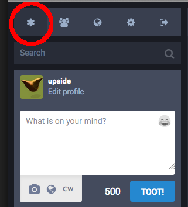
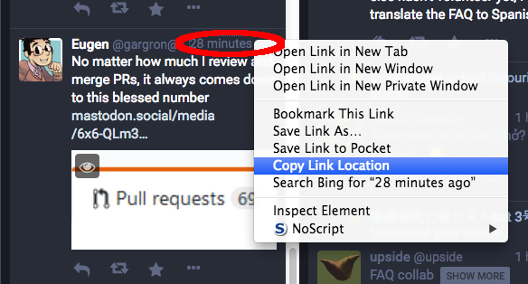
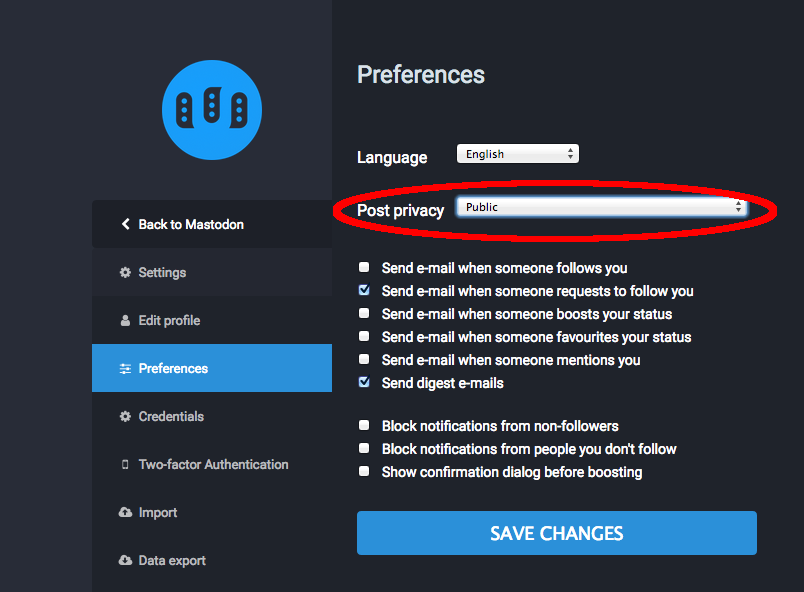

Foire Aux Questions
==========================

#### Qu'est-ce qu'un Mastodon?

C'est un animal préhistorique, prédécesseur du mammouth. Il barrit (on entend «pouet!», ou «toot» en anglais).

#### Pourquoi le nom Mastodon?

Un groupe de métal progressif dont je suis fan porte le même nom; c'est ce qui a fait que l'animal a attiré mon attention. J'ai trouvé que c'était un nom/animal plutôt cool.

#### De quelle manière est-ce décentralisé?

Il existe plusieur moyens de procéder pour décentraliser quelque chose. Dans le cas de Mastodon, il s'agit d'un système «fédéré». Penser «courrier electronique» plutôt que «BitTorrent». Il y a plusieurs serveurs différents appelées instances; les utilisateurs ont compte sur l'une d'entre elles mais peuvent interagir et se suivre les uns les autres, quelle que soit l'instance sur laquelle se trouve leur compte.

#### Techniquement, comment fonctionne la fédération?

Nous utilisons la suite de protocoles OStatus:

1. Webfinger pour la recherche des utilisateurs sur différents domaines
2. Atom feeds (flux) avec les extensions ActivityStreams, Portable Contacts, et Threads pour le contenu
3. PubSubHubbub pour gérer les abonnements aux flux Atom
4. Salmon pour transmettre certains éléments des flux Atom à toutes les parties concernées comme les utilisateurs mentionnés, l'auteur du statut auquel une réponse a été rédigée, l'utilisateur que quelqu'un suit, etc.

#### Qu'est-ce que mastodon.social?

C'est l'instance «phare» de Mastodon, autrement dit celle que je fais tourner moi-même ([@Gargron](https://mastodon.social/@Gargron)), en toute dernière version. Elle n'est pas vouée à devenir la seule instance de Mastodon.

#### Quelles autres plateformes font aussi partie du réseau fédéré?

appelons ce réseau le «fediverse». Le fediverse existait déjà avant Mastodon, peuplé par des serveurs de GNU social, Friendica, Hubzilla, Diaspora etc. Tous ces serveurs ne sont pas complètement compatibles entre eux. Mastodon s'efforce à être entièrement conformes aux standards, et la compatibilité avec GNU social considérée prioritaire par rapport aux autres systèmes.

#### J'ai essayé de me connecter à Mastodon en utilisant une application pour GNU social et ça n'a pas marché. Pourquoi?

Bien que Mastodon soit compatible avec GNU social en termes de communication de serveur à serveur, l'API de client à serveur (autrement dit, la façon dont on accède à Mastodon) est différente. C'est pourquoi les applications qui ont été faites spécifiquement pour GNU social ne fonctionnent pas pour Mastodon. La raison est à la fois technique et idéologique.

Comme Mastodon a été créé à partir de zéro, il est beaucoup plus simple que l'API reflète la structure interne le plus fidèlement possible, plutôt que de construire une couche d'émulation. De plus, ll'API client de GNU social est en fait une implémentation partielle d'une version obsolète de l'API de Twitter. C'est pourquoi GNU social peut fonctionner avec certaines versions (anciennes) d'applications pour Twitter. Cependant, beaucoup de ces applications ne sont plus maintenues, l'API de GNU social ne suit pas forcément les évolutions de l'API de Twitter et n'a jamais implémenté la totalité de ses fonctionnalités. 

#### Comment est financé Mastodon?

Le développement de Mastodon et l'hébergement de mastodon.social sont financés grâce à mon [Patreon (ainsi que des dons BTC/PayPal)](https://www.patreon.com/user?u=619786). En dehors de ce financement, je ne suis pas intéressé par des financements capital risque, la monétisation, la publicité ou toute autre chose de la sorte. Je peux éventuellement proposer des services d'aide à la mise en place ou la maintenance selon la demande.

Le logiciel est gratuit et open source, et les communautés doivent héberger elles-même leurs serveurs si elles le peuvent, de manière à ce que les coûts soient également plus ou moins distribués. Il serait évidemment trop diffile pour moi de payer les factures si tout le monde décidait d'utiliser uniquement l'instance mastodon.social.

#### Mastodon ressemble beaucoup à Twitter. Quelles sont les différences ?
Mastodon est décentralisé. Chacun peut proposer son propre serveur Mastodon, avecses propres règles de communauté. Twitter est un service fourni par une seule autorité centrale, et fixe les règles pour tout le monde.

#### Qu'est-ce qu'une «fédération»?
C'est un groupe de serveurs Mastodon qui partagent des pouets (toots) entre eux.

### Qu'est-ce qu'une «instance»?
C'est un serveur sur lequel il est possible d'avoir un compte. Chaque instance a ses propres règles, parce qu'elles peuvent être gérées par n'importe qui!

#### Comment choisi-t-on quelle instance utiliser?
[Il existe beaucoup d'instances](https://instances.mastodon.xyz/list) pour à peu près tous les goûts. Il est courant d'essayer quelques instances publiques lorsqu'on est à la recherche de celle qui semble convenir le mieux. Parler de ses centres d'intérêt sur une instance publique comme [Mastodon.Social](https://mastodon.social) peut aider à se faire inviter sur d'autres instances.

Pour avoir un aperçu de ce que les utilisateurs d'une instance disent, on peut utiliser [cet outil d'aperçu](http://www.unmung.com/mastoview?url=mastodon.social&view=local) créé par [Kevin Marks](https://mastodon.social/@kevinmarks).

#### Combien de personnes sont sur Mastodon ? Il y a-t-il un historique du nombre d'utilisateur que je peux consulter ?
Bien sûr ! Il suffit de suivre [@mastodonusercount@social.lou.lt](https://social.lou.lt/@mastodonusercount).

#### Comment on prononce vraiment «mast–don»?
C'est **mastodon** avec deux «O». Tout le monde se trompe au moins une fois.

#### Comment puis-je utiliser Mastodon sur Android?
Essaye [Tusky](https://play.google.com/store/apps/details?id=com.keylesspalace.tusky).

#### Sur Android, j'aimerais pouvoir me connecter à plusieurs comptes à la fois.
Essaye [TootyFruity](https://play.google.com/store/apps/details?id=ch.kevinegli.tootyfruity221258).

#### Comment puis-je utiliser Mastodon sur iPhone?
Essaye [Amaroq](https://itunes.apple.com/us/app/amaroq-for-mastodon/id1214116200). Tu peux aussi utiliser Safari directement.

#### Est-ce qu'il y a d'autres applications mobile/de bureau/en ligne de commande?
[Oui.](Apps.md)

#### Est-ce que ça serait possible que Tusky fasse ‘💇’? Et la fonctionnalité “🔥”? Quid de “⛱” sur Tusky?
Il est possible de contacter Tusky via [@Tusky@mastodon.social](https://mastodon.social/@Tusky), ou les développeurs [@Vavassor@mastodon.social](https://mastodon.social/@Vavassor) et [@daycode@mastodon.social](https://mastodon.social/@daycode)

#### Comment puis-je rechercher quelque chose?
Il est possible de rechercher des personnes ou des mots-dièse (hashtags), mais pas du texte. Utilise le champ au-dessus de la zone de pouet.

#### Comment envoyer un message directement à quelqu'un?"
En cliquant sur la **planète** en dessous de ton pouet, tu peux accéder aux paramètres de confidentialité, y compris les messages directs.

#### Je ne comprends pas la différence entre la timeline locale et la timeline fédérée.
Les pouets «locaux» sont ceux du serveur sur lequel tu as un compte. les pouets «fédérés» sont tous les pouets que ce serveur connaît. (C'est compliqué, mais pour résumer: «Les pouets des personnes que toi et les autres utilisateurs de ton instance suivez»)

#### Est-ce qu'il y a des instances avec lesquelles mon instance ne se fédère pas? Comment puis-je le savoir?
Certaines instances sont privées et ne se fédèreront pas avec ton instance. D'autres peuvent être bloquées par ton instance. Pour en savoir sur comment ton instance se fédère avec les autres, contacte ton admin. (cf: «[Qui est l'admin de mon instance, et comment puis-je la·le contacter/suivre?](#qui-est-l-admin-de-mon-instance-et-comment-la-le-contacter-suivre)»)

#### Est-ce que je peux avoir plusieurs comptes? Puis-je utiliser la même adresse email sur différentes instances?
Oui et oui! Si tu trouves une autre instance que tu voudrais rejoindre, rejoins-la! Sache cependant que certaines instances ne permettent pas de s'y inscrire, et qu'il est possible que quelqu'un y utilise déjà ton pseudonyme favori.

#### Est-il possible d'importer les comptes que je suis avec mon compte d'une instance à une autre?
Oui. Cette opération peut prendre du temps en fonction de l'instance vers laquelle tu vas. Contacte l'admin de ta nouvelle instance si tu rencontres des difficultés. Si ta nouvelle instance n'est pas fédérée avec l'ancienne, tu risques de perdre les comptes importés.

#### Comment puis-je empêcher les gens d'usurper mon identité?
Comme tout le monde peut créer un compte sur n'importe quelle instance, il est impossible d'empêcher les  autres utilisateurs d'utiliser le même nom d'utilisateur que toi sur une autre instance. Pour s'identifier auprès des autres utilisateurs, certaines personnes maintiennent leur propre instance avec pour unique utilisateur leur compte, ou utilisent [Keybase](https://keybase.io/).

#### Comment activer l'identification à deux facteurs (2FA)?
Si ton instance le permet, l'option se trouve dans Préférences, sour le menu «Identification à deux facteurs». [Le 2FA de Mastodon](2FA.md) utilise un QR code et un mot de passe texte.

#### Pourquoi ne puis-je pas voir les pouets de certaines personnes?
Il y a plusieur raisons pour que cela se produise. Les posts de cette personne sont peut-être privés. Il faut suivre un compte pour voir ses pouets qui ne sont pas publics. Si quelqu'un t'a bloqué, il ne sera plus possible de voir ses posts non publics.

#### Quelles sont les tendances?
Pour savoir les tendances sur Mastodon, suis le bot d'estimations [@TrendingBot@mastodon.social](https://mastodon.social/@TrendingBot).

#### Qu'est-ce que «CW»?
«CW» signifie «Alerte sur le contenu» («Content Warning» en anglais). Il est utilisé pour cacher le contenu d'un pouet, comme les «spoilers».

#### Comment fonctionne l'option «Marquer le média comme sensible» («NSFW» - Not Safe For Work)?
Quand tu joint une image à ton post en utilisant l'icône «appareil photo», une option supplémentaire apparaît (en général «NSFW»). Cliquer dessus va cacher l'image derrière une alerte «Contenu Sensible», permettant aux autres de ne voir l'image postée que s'iels le souhaitent, en cliquant dessus.

#### Qu'est-ce qui se passe sur Mastodon avec les ananas?
L'ananas, c'est bon. Et ça fait rire les gens. Contente-toi de ça.

### Je vois souvent «Awoo», qu'est-ce que ça veut dire?
Essaye de le dire à haute voix («Awou»). C'est rigolo!

#### Comment puis-je supprimer mon compte?
Pour l'instant, il faut demander de l'aide à l'admin de ton instance.

#### Qui est l'admin de mon instance et comment la·le contacter/suivre?
Clique sur **Pour Commencer**, puis **Plus d'informations**. Cela affiche une page d'information. Normalement, les informations de contact de l'admin sont ici!

#### Oulah, je vois sonvent du contenu offensant qui provient d'une même instance, est-ce qu'il y a un moyen de bloquer *tous* ces contenus?
Si ton instance est en version 1.4.1 de Mastodon ou plus récente, oui! Visite la page d'un utilisateur de l'instance que tu veux bloquer, puis clique sur le menu déroulant sur la gauche luste au dessus de ses pouets. Il devrait y avoir une option pour cacher tout le contenu provenant de l'instance de cet utilisateur:

Si ton instance est dans une version de Mastodon antérieure à 1.4.1, tu ne peux pas faire ça autrement qu'un utilisateur à la fois. Cependant, ton admin peut. Contacte-la·le.

(You can tell what version of Mastodon your instance is running by following the steps in "[Who is my admin, and how do I contact/follow them?](#who-is-my-admin-and-how-do-i-contact-follow-them)". The version number is listed in the right-hand column of that extended information page.)

#### Is Mastodon moderated?
Each instance handles moderation differently, and each has their own moderators. It’s okay to ask what the rules are for the instance you are on. Usually the rules are posted on the instance's about page ([like the “more” page at Mastodon.social](https://mastodon.social/about/more))

#### How do I report offensive content?
Beneath each post, you will see three dots. Clicking on those will allow you to expand a post or report the content. When reporting content, select all posts that need moderator attention.

#### How do I handle harassment?
If your admin takes harassment seriously, you can report it to them through the post-reporting system. This can be found through the ellipsis (“…”) beneath the post, or by contacting your admin directly.

#### Will my Private Messages reach people on other instances?
Yes, they should. However, private messages are *not secure*. You should avoid sending sensitive information through them.

#### What does “Adjust Status Privacy” mean and how does it work?
The **globe** icon under the toot area adjusts your status privacy by changing who can see your posts. This is what happens:

| Privacy setting | Broadcasted to | Viewable by | Notes |
| --------------- | ----------- | ------ | ----- |
| Public          | Global, public timelines | Everyone | Federated. People on other instances will probably see it. |
| Unlisted        | Followers only | Everyone | Can be boosted and thus seen on other instances.  |
| Private         | Followers only |  Followers only | Cannot be boosted. |
| Direct          | Mentioned people only  | Mentioned people only | Similar to email |

#### Can I use hashtags? Should I?
Yes! Hashtags are tracked and are often fun, but some tags help people avoid triggering posts. This is especially appreciated on public posts of #POLITICS, #HEALTH, #DEPRESSION, or #LEWD OR #NSFW topics. Such posts are also what the Content Warning system was designed for.

#### How do I get verified with a “✅”?
“✅” is an emoji, *only* for lulz. There is no verification on Mastodon. You can copy and paste “✅” into your bio if you wish, you cheeky monkey.

#### Can I edit a toot?
No, sorry. But you could delete your toot and rewrite…

#### If I delete a post, does it get deleted everywhere?
Deleting a post will delete it from the local timeline. However, if it has already been boosted, it may still be seen and may federate.

#### How do I view my favorite toots?
Click **Getting Started**, then **Favourites**. Yes—Mastodon uses UK spelling!

#### Can I quote a toot?
Not currently. You must manually copy and paste the text to quote it.

#### If my instance shuts down forever, do I lose my data?
Yes you do.

#### Can I save my data?
Yes, some of it! It‘s under **Preferences->Data export**

#### I can’t see toots of a remote user under their bio!
In **Expanded View**, click their avatar. This will take you directly to their instance, which displays all their public toots.

#### How do I see threads?
Click the toot body for **Expanded View**. This will show threads the toot’s connected to.

#### How do I link to toots?
There are two permalinks for toots. With inline toots, **right-click** the timestamp. On expanded toots, **right-click** the date on the bottom.

#### How do I link to my profile?
In Firefox, **right-click** on your avatar picture. Select **Copy Link Location**.

#### Does clicking a #hashtag show local results, or federated?
Federated.

#### When I mute a boost, who gets muted, the booster or the original author?
The original author.

#### Can I preview the people on an instance, and what they’re saying?
Yes, try the excellent [instance preview tool](http://www.unmung.com/mastoview?url=mastodon.social&view=local).

#### How do I hide the toots of languages I don’t understand?
The developers are working on this and other filtering options, stay tuned!

#### Is automatic translation supported?
Not yet, but there is a [Firefox TamperMonkey script](https://github.com/tomouchuu/mastodon-translate) that might work for you.

#### Do toots automatically broadcast federated, or stay local?
By default, toots are federated (public), and will show on both timelines. You can change the default behavior through **Settings->Preferences->Post Privacy.**

#### What is the default image upload size limit and how can I change it?
The default limit is 8 megabytes, however this can be changed by editing the following line in `mastodon/app/models/media_attachment.rb`:

`  validates_attachment_size :file, less_than: 8.megabytes`

Change the 8 to another integer to change the limit.

#### How do I start my own instance?
See the [User Guide](../README.md), under the heading “Running Mastodon.”

#### I found a bug or have a suggestion for Mastodon.
You can file a bug or submit suggestions at [Mastodon’s Issue Tracker.](https://github.com/tootsuite/mastodon/issues)

#### Hey I love mastodon FAQs! Can I have more?
Here’s more, from hardworking individuals trying to help, too.

* [https://hastebin.com/raw/xuqogukimu](https://hastebin.com/raw/xuqogukimu)

* [https://github.com/ThomasLeister/masto-faq](https://github.com/ThomasLeister/masto-faq)

* [http://mastoguide.info/Pages/FAQindex.html](http://mastoguide.info/Pages/FAQindex.html)

* [https://medium.com/tebelorg/my-first-10-days-on-mastodon-fediverse-f6f1d73db8d7](https://medium.com/tebelorg/my-first-10-days-on-mastodon-fediverse-f6f1d73db8d7)

* [https://github.com/tootsuite/documentation/blob/master/Using-Mastodon/FAQ.md](https://github.com/tootsuite/documentation/blob/master/Using-Mastodon/FAQ.md)

---
This FAQ was compiled with contributions from [@Gargron](https://mastodon.social/@Gargron), [@raccoon](https://mastodon.social/@Raccoon), [@upside](https://octodon.social/@upside), [@zacanger](https://mastodon.social/@zacanger), [@NthTensor](https://octodon.social/@NthTensor), [@ametlles](https://mastodon.social/@ametlles) and many others in the fediverse!
