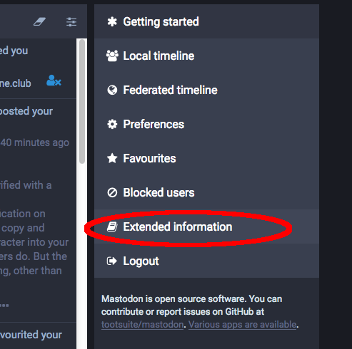

Foire Aux Questions
==========================

#### Qu'est-ce qu'un Mastodon?

C'est un animal préhistorique, prédécesseur du mammouth. Il barrit (on entend «pouet!», ou «toot» en anglais).

#### Pourquoi le nom Mastodon?

Un groupe de métal progressif dont je suis fan porte le même nom; c'est ce qui a fait que l'animal a attiré mon attention. J'ai trouvé que c'était un nom/animal plutôt cool.

#### De quelle manière est-ce décentralisé?

Il existe plusieur moyens de procéder pour décentraliser quelque chose. Dans le cas de Mastodon, il s'agit d'un système «fédéré». Penser «courrier électronique» plutôt que «BitTorrent». C'est un réseau de plusieurs serveurs différents appelés «instances». Les utilisateur·trice·s ont chacun·e un compte sur une de ces instances, mais peuvent interagir entre elleux et se suivre les un·e·s les autres, quelles que soient leurs instances respectives.

#### Techniquement, comment fonctionne la fédération?

Depuis la version 1.6 de Mastodon, nous utilisons le protocole [ActivityPub](https://www.w3.org/TR/activitypub/). À l'heure actuelle, ActivityPub est candidat pour devenir un standard W3C.

Avant la version 1.6 nous utilisions la suite de protocoles OStatus:

1. Webfinger pour la recherche des utilisateurs sur différents domaines
2. Atom feeds (flux) avec les extensions ActivityStreams, Portable Contacts, et Threads pour le contenu
3. PubSubHubbub pour gérer les abonnements aux flux Atom
4. Salmon pour transmettre certains éléments des flux Atom à toutes les parties concernées comme les utilisateurs mentionnés, l'auteur du statut auquel une réponse a été rédigée, l'utilisateur que quelqu'un suit, etc.

Nous utilisons toujours OStatus en tant que protocole additionnel, pour des raisons de compatibilité.

#### Qu'est-ce que mastodon.social?

C'est l'instance «phare» de Mastodon, autrement dit celle que je fais tourner moi-même ([@Gargron](https://mastodon.social/@Gargron)), en toute dernière version. Elle n'est pas vouée à devenir la seule instance de Mastodon.

#### Quelles autres plateformes font aussi partie du réseau fédéré?

Appelons ce réseau le «fediverse». Le fediverse existait déjà avant Mastodon, peuplé par des serveurs de GNU social, Friendica, Hubzilla, Diaspora etc. Tous ces serveurs ne sont pas complètement compatibles entre eux. Mastodon s'efforce à être entièrement conformes aux standards, et la compatibilité avec GNU social considérée prioritaire par rapport aux autres systèmes.

#### J'ai essayé de me connecter à Mastodon en utilisant une application pour GNU social et ça n'a pas marché. Pourquoi?

Bien que Mastodon soit compatible avec GNU social en termes de communication de serveur à serveur, l'API de client à serveur (autrement dit, la façon dont on accède à Mastodon) est différente. C'est pourquoi les applications qui ont été faites spécifiquement pour GNU social ne fonctionnent pas pour Mastodon. La raison est à la fois technique et idéologique.

Comme Mastodon a été créé à partir de zéro, il est beaucoup plus simple que l'API reflète la structure interne le plus fidèlement possible, plutôt que de construire une couche d'émulation. De plus, l'API client de GNU social est en fait une implémentation partielle d'une version obsolète de l'API de Twitter. C'est pourquoi GNU social peut fonctionner avec certaines versions (anciennes) d'applications pour Twitter. Cependant, beaucoup de ces applications ne sont plus maintenues, l'API de GNU social ne suit pas forcément les évolutions de l'API de Twitter et n'a jamais implémenté la totalité de ses fonctionnalités. 

#### Comment est financé Mastodon?

Le développement de Mastodon et l'hébergement de mastodon.social sont financés grâce à mon [Patreon (ainsi que des dons BTC/PayPal)](https://www.patreon.com/user?u=619786). En dehors de ce financement, je ne suis pas intéressé par des financements capital risque, la monétisation, la publicité ou toute autre chose de la sorte. Je peux éventuellement proposer des services d'aide à la mise en place ou la maintenance selon la demande.

Le logiciel est gratuit et open source, et les communautés doivent héberger elles-même leurs serveurs si elles le peuvent, de manière à ce que les coûts soient également plus ou moins distribués. Il serait évidemment trop difficile pour moi de régler les factures si tout le monde décidait d'utiliser uniquement l'instance mastodon.social.

#### Mastodon ressemble beaucoup à Twitter. Quelles sont les différences ?
Mastodon est décentralisé. Chacun peut proposer son propre serveur Mastodon, avecses propres règles de communauté. Twitter est un service fourni par une seule autorité centrale, et fixe les règles pour tout le monde.

#### Qu'est-ce qu'une «fédération»?
C'est un groupe de serveurs Mastodon qui partagent des pouets (toots) entre eux.

### Qu'est-ce qu'une «instance»?
C'est un serveur sur lequel il est possible d'avoir un compte. Chaque instance a ses propres règles, parce qu'elles peuvent être gérées individuellement par des personnes différentes!

#### Comment choisit-on quelle instance utiliser?
[Il existe beaucoup d'instances](https://instances.mastodon.xyz/list) pour à peu près tous les goûts. Il est courant d'essayer quelques instances publiques lorsqu'on est à la recherche de celle qui semble convenir le mieux. Parler de ses centres d'intérêt sur une instance publique comme [Mastodon.Social](https://mastodon.social) peut aider à se faire inviter sur d'autres instances.

Pour avoir un aperçu de ce que les utilisateurs d'une instance disent, on peut utiliser [cet outil d'aperçu](http://www.unmung.com/mastoview?url=mastodon.social&view=local) créé par [Kevin Marks](https://mastodon.social/@kevinmarks).

#### Combien de personnes sont sur Mastodon ? Il y a-t-il un historique du nombre d'utilisateur que je peux consulter ?
Bien sûr ! Il suffit de suivre [@mastodonusercount@social.lou.lt](https://social.lou.lt/@mastodonusercount).

#### Comment on prononce vraiment «mast–don»?
C'est **mastodon** avec deux «O». Tout le monde se trompe au moins une fois.

#### Comment puis-je utiliser Mastodon sur Android?
Essaye [Tusky](https://play.google.com/store/apps/details?id=com.keylesspalace.tusky).

#### Sur Android, j'aimerais pouvoir me connecter à plusieurs comptes à la fois.
Essaye [TootyFruity](https://play.google.com/store/apps/details?id=ch.kevinegli.tootyfruity221258).

#### Comment puis-je utiliser Mastodon sur iPhone?
Essaye [Amaroq](https://itunes.apple.com/us/app/amaroq-for-mastodon/id1214116200). Tu peux aussi utiliser Safari directement.

#### Est-ce qu'il y a d'autres applications mobile/de bureau/en ligne de commande?
[Oui.](Apps.md)

#### Est-ce que ça serait possible que Tusky fasse ‘💇’? Et la fonctionnalité “🔥”? Quid de “⛱” sur Tusky?
Il est possible de contacter Tusky via [@Tusky@mastodon.social](https://mastodon.social/@Tusky), ou les développeurs [@Vavassor@mastodon.social](https://mastodon.social/@Vavassor) et [@daycode@mastodon.social](https://mastodon.social/@daycode)

#### Comment puis-je rechercher quelque chose?
Il est possible de rechercher des personnes ou des mots-dièse (hashtags), mais pas du texte. Utilise le champ au-dessus de la zone de pouet.

#### Comment envoyer un message directement à quelqu'un?"
En cliquant sur la **planète** en dessous de ton pouet, tu peux accéder aux paramètres de confidentialité, y compris les messages directs.

#### Je ne comprends pas la différence entre la timeline locale et la timeline fédérée.
Les pouets «locaux» sont ceux du serveur sur lequel tu as un compte. les pouets «fédérés» sont tous les pouets que ce serveur connaît. (C'est compliqué, mais pour résumer: «Les pouets des personnes que toi et les autres utilisateurs de ton instance suivez»)

#### Est-ce qu'il y a des instances avec lesquelles mon instance ne se fédère pas? Comment puis-je le savoir?
Certaines instances sont privées et ne se fédèreront pas avec ton instance. D'autres peuvent être bloquées par ton instance. Pour en savoir plus sur la façon dont ton instance se fédère avec les autres, contacte ton admin. (cf: «[Qui est l'admin de mon instance, et comment puis-je la·le contacter/suivre?](#qui-est-l-admin-de-mon-instance-et-comment-la-le-contacter-suivre)»)

#### Est-ce que je peux avoir plusieurs comptes? Puis-je utiliser la même adresse email sur différentes instances?
Oui et oui! Si tu trouves une autre instance que tu voudrais rejoindre, rejoins-la! Sache cependant que certaines instances ne permettent pas de s'y inscrire, et qu'il est possible que quelqu'un y utilise déjà ton pseudonyme favori.

#### Est-il possible d'importer les comptes que je suis avec mon compte d'une instance à une autre?
Oui. Cette opération peut prendre du temps en fonction de l'instance vers laquelle tu vas. Contacte l'admin de ta nouvelle instance si tu rencontres des difficultés. Si ta nouvelle instance n'est pas fédérée avec l'ancienne, tu risques de perdre les comptes importés.

#### Comment puis-je empêcher les gens d'usurper mon identité?
Comme tout le monde peut créer un compte sur n'importe quelle instance, il est impossible d'empêcher les  autres utilisateurs d'utiliser le même nom d'utilisateur que toi sur une autre instance. Pour s'identifier auprès des autres utilisateurs, certaines personnes maintiennent leur propre instance avec pour unique utilisateur leur compte, ou utilisent [Keybase](https://keybase.io/).

#### Comment activer l'identification à deux facteurs (2FA)?
Si ton instance le permet, l'option se trouve dans Préférences, sour le menu «Identification à deux facteurs». [Le 2FA de Mastodon](2FA.md) utilise un QR code et un mot de passe texte.

#### Pourquoi ne puis-je pas voir les pouets de certaines personnes?
Il y a plusieur raisons pour que cela se produise. Les posts de cette personne sont peut-être privés. Il faut suivre un compte pour voir ses pouets qui ne sont pas publics. Si quelqu'un t'a bloqué, il ne sera plus possible de voir ses posts non publics.

#### Quelles sont les tendances?
Pour savoir les tendances sur Mastodon, suis le bot d'estimations [@TrendingBot@mastodon.social](https://mastodon.social/@TrendingBot).

#### Qu'est-ce que «CW»?
«CW» signifie «Alerte sur le contenu» («Content Warning» en anglais). Il est utilisé pour cacher le contenu d'un pouet, comme les «spoilers».

#### Comment fonctionne l'option «Marquer le média comme sensible» («NSFW» - Not Safe For Work)?
Quand tu joint une image à ton post en utilisant l'icône «appareil photo», une option supplémentaire apparaît (en général «NSFW»). Cliquer dessus va cacher l'image derrière une alerte «Contenu Sensible», permettant aux autres de ne voir l'image postée que s'iels le souhaitent, en cliquant dessus.

#### Qu'est-ce qui se passe sur Mastodon avec les ananas?
L'ananas, c'est bon. Et ça fait rire les gens. Contente-toi de ça.

### Je vois souvent «Awoo», qu'est-ce que ça veut dire?
Essaye de le dire à haute voix («Awou»). C'est rigolo!

#### Comment puis-je supprimer mon compte?
Pour l'instant, il faut demander de l'aide à l'admin de ton instance.
Clique sur **Préférences** (l'engrenage, dans la zone en haut à gauche de l'écran), puis dans le menu **Sécurité** clique sur lien sous **Supprimer le compte**.

#### Qui est l'admin de mon instance et comment la·le contacter/suivre?
Clique sur **Pour Commencer**, puis **Plus d'informations**. Cela affiche une page d'information. Normalement, les informations de contact de l'admin sont ici!

#### Oulah, je vois souvent du contenu offensant qui provient d'une même instance, est-ce qu'il y a un moyen de bloquer *tous* ces contenus?
Si ton instance est en version 1.4.1 de Mastodon ou plus récente, oui! Visite la page d'un·e utilisateur·rice de l'instance que tu veux bloquer, puis clique sur le menu déroulant sur la gauche juste au-dessus de ses pouets. Il devrait y avoir une option pour cacher tout le contenu provenant de l'instance de cet utilisateur:

Si ton instance est dans une version de Mastodon antérieure à 1.4.1, tu ne peux pas faire ça autrement qu'un utilisateur à la fois. Cependant, ton admin peut. Contacte-la·le.

(Pour connaître la version de Mastodon de ton instance, suis les différentes étapes de «[Qui est l'admin de mon instance et comment la·le contacter/suivre?](#qui-est-l-admin-de-mon-instance-et-comment-la-le-contacter-suivre)». Le numéro de version se trouve dans la colonne de droite de la page d'informations.)

#### Est-ce que Mastodon est modéré?
Chaque instance gère sa modération différemment, et chaque instance a ses propres modérateur·rice·s. C'est une bonne chose de demander quelles sont les règles concernant ton instance. La plupart du temps, les règles concernants une instance se trouvent sur la page à «propos» ([comme la page «plus» sur Mastodon.social](https://mastodon.social/about/more))

#### Comment puis-je signaler du contenu offensant?
Sous chaque post, il y a des points de suspension. En cliquant dessus, tu peux soit étendre le poste, soit signaler son contenu. Lors d'un signalement, pense à bien sélectioner tous les posts qui nécéssitent l'attention de ton admin.

#### Que faire en cas de harcèlement?
Si ton admin prend le harcèlement au sérieu, tu peux le lui signaler via le système de signalement des posts: via les points de suspension («…») sous le post, ou en contactant ton admin directement.

#### Est-ce que je peux écrire des messages privés à des personnes d'autres instances?
Oui, normalement. Cependant, les messages privés ne sont *pas sécurisés*. Il est déconseillé d'envoyer des informations sensibles via des messages privés.

#### À quoi sert l'option «Ajuster la confidentialité du message» et comment est-ce que ça marche?
L'icône de **globe** sous la zone de pouet permet d'ajuster la confidentialité du post en changeant qui peut voir le message:

| Option de confidentialité | Diffusé à                       | Visible par                     | Notes |
| ------------------------- | ------------------------------- | ------------------------------- | ----- |
| Public                    | Les fils publics et globaux     | Tout le monde                   | Ces messages sont fédérés. Des personnes d'autres instances pourront certainement les voir. |
| Non-listé                 | Abonnés seulement               | Tout le monde                   | Ces messages peuvent êtres boostés (partagés) et donc visibles sur d'autres instances.  |
| Privé                     | Abonnés seulement               | Abonné seulement                | Ne peuvent pas être boostés. |
| Direct                    | Personnes mentionnées seulement | Personnes mentionnées seulement | Similaires aux courriels |

#### Puis-je utiliser des hashtags (mot-dièse)? Est-ce conseillé?
Oui! Les Hashtags sont traqués et sont souvent rigolos, mais aussi servent parfois à éviter à certaines personnes de tomber sur des posts offensants. Les Hashtags sont particulièrements appréciés pour les posts publics à propos de #POLITIQUE (#POLITICS), #SANTÉ (#HEALTH), #DÉPRESSION (#DEPRESSION), ou de sujets #LEWD ou #NSFW. De tels posts sont aussi ce pourquoi la fonctionnalité d'alerte concernant le contenu (Content Warning) a été créée.

#### Comment puis-je être vérifié, avec un “✅”?
“✅” est un emoji, *juste* pour rire. Il n'y a pas de vérification de compte sur Mastodon. Tu peux copier/coller un “✅” dans ta description si tu le souhaites, petit·e effronté·e.

#### Puis-je modifier un pouet?
Non, désolé. Mais tu peux toujours supprimer un pouet et le réécrire…

#### Si je supprime un post, est-il supprimé partout?
Supprimer un post le supprime du fil local. Cependant, s'il a déjà été boosté, il se peut qu'il soit encore visible et peut se fédérer.

#### Comment puis-je voir mes pouets favoris?
Clique sur **Pour Commencer**, puis **Favoris**

#### Puis-je citer un pouet?
Pas pour le moment. Tu dois copier et coller manuellement le texte pour le citer.

#### Si mon instance ferme définitivement, est-ce que je perds mes données?
Oui.

#### Puis-je faire une sauvegarde de mes données?
Oui, en partie! C'est sous le menu **Préférences->Export des données**

#### Je ne peux pas voir les pouets d'un·e utilisateur·rice distant·e sous leur description!
Dans la **Vue Étendue** du profil, clique sur son avatar. Cela va te rediriger sur son instance, et afficher tous ses pouets publics.

#### Comment puis-je voir les conversations (threads)?
Clique sur un pouet pour accéder à sa **Vue Étendue**. Cela va afficher les autres pouets qui lui sont reliés.

#### Comment puis-je créer un lien vers un pouet?
Il y a deux permaliens possibles pour un pouet. Pour les pouets dans un fil, avec un **clic droit** sur l'horodatage. Sur la vue étendue d'un pouet, avec un **clic droit** sur la date en bas du pouet.

#### Comment puis-je avoir un lien vers mon profil?
Avec Firefox, via un **clic droit** sur ton avatar, puis en choisissant **Copier la destination du lien**.

#### Est-ce que le clic sur un #hashtag affiche des pouets locaux uniquement ou des pouets fédérés?
Des pouets fédérés.

#### Quand je masque un boost, qui est mis en sourdine: La personne qui booste le pouet ou l'auteur de celui-ci?
L'auteur.

#### Est-il possible d'avoir un aperçu des personnes d'une instance et de ce qu'elles postent?
Oui, essaye cet excellent [outil d'aperçu d'instance](http://www.unmung.com/mastoview?url=mastodon.social&view=local).

#### Comment puis-je masquer les pouets dans les langues que je ne comprends pas?
Les développeurs sont actuellement en train de travailler sur cette fonctionnalités ainsi que d'autres options de filtrage.

#### La traduction automatique est-elle supportée?
Pas encore, mais il existe un [script Firefox TamperMonkey](https://github.com/tomouchuu/mastodon-translate) qui pourrait te convenir.

#### Est-ce que les pouets se fédèrent automatiquement ou sont-ils d'abord locaux?
Par défaut, les pouets sont fédérés (publics), et apparaîtront dans les deux flux d'actualités. Tu peux changer le comportement par défaut via **Paramètres->Préférences->Confidentialité des posts.**

#### Quelle est la taille limite par défaut pour l'envoi d'images et comment puis-je la changer?
La limite par défaut est de 8 megaoctets (8Mo), cependant elle peut être changée en modifiant la ligne suivante dans le fichier `mastodon/app/models/media_attachment.rb`:

`  validates_attachment_size :file, less_than: 8.megabytes`

Changer le 8 par une autre valeur entière pour changer la limite.

#### Comment puis-je installer et démarrer ma propre instance de Mastodon?
Voir le [Guide Utilisateur](../README.md), sous la partie «Running Mastodon.»

#### J'ai trouvé un bogue ou j'ai une suggestion pour Mastodon.
Tu peux reporter un bogue ou soumettre des suggestions via le [Traqueur de problèmes (issues en anglais) de Mastodon.](https://github.com/tootsuite/mastodon/issues)

#### Hey, j'adore les FAQs sur Mastodon! Y en a-t-il d'autres?
En voici quelques unes, fruit du dur labeur d'autres personnes souhaitant aussi aider la communauté de Mastodon (contenu externe, en anglais).

* [https://hastebin.com/raw/xuqogukimu](https://hastebin.com/raw/xuqogukimu)

* [https://github.com/ThomasLeister/masto-faq](https://github.com/ThomasLeister/masto-faq)

* [http://mastoguide.info/Pages/FAQindex.html](http://mastoguide.info/Pages/FAQindex.html)

* [https://medium.com/tebelorg/my-first-10-days-on-mastodon-fediverse-f6f1d73db8d7](https://medium.com/tebelorg/my-first-10-days-on-mastodon-fediverse-f6f1d73db8d7)

* [https://github.com/tootsuite/documentation/blob/master/Using-Mastodon/FAQ.md](https://github.com/tootsuite/documentation/blob/master/Using-Mastodon/FAQ.md)

---
Cette FAQ a été compilée avec les contributions de[@Gargron](https://mastodon.social/@Gargron), [@raccoon](https://mastodon.social/@Raccoon), [@upside](https://octodon.social/@upside), [@zacanger](https://mastodon.social/@zacanger), [@NthTensor](https://octodon.social/@NthTensor), [@ametlles](https://mastodon.social/@ametlles) et plein d'autres personnes du fediverse!
