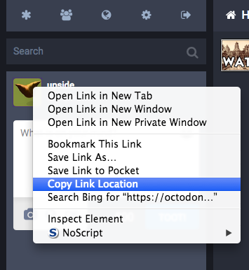

よくある質問
==========================

#### マストドンって何ですか？

先史時代にかつて存在した動物で、マンモスの祖先と言われています。

#### 何故マストドンという名前なのですか？

同名のヘヴィメタルバンドがあります。私(訳者注: 開発者の Gargron氏)はそのバンドのファンで、また私が興味を引く動物でした。私はこの名前と動物がクールだと思い、この名前を付けました。

#### マストドンはどのように分散化されているのですか？

何かを分散させるには様々な方法があります。この場合、マストドンは「連合」型になります。BitTorrentではなく、電子メールで考えてみましょう。電子メールでは、それぞれ異なるサーバー(インスタンス)があり、ユーザーはそのうち1つにアカウントを持っています。しかしアカウントの存在する場所に関係なく、相互にやり取りを行う事ができます。

#### 技術的には連合はどのように機能していますか？

OStatusプロトコル群を使用しています。

1. ドメイン上のユーザーの検索にWebfinger
2. AtomフィードとActivityStreams、Portable Contacts、実際のコンテンツのスレッド拡張機能
3. Atomフィードを購読するためのPubSubHubbub
4. Atomフィードから特定の項目、宛先ユーザー、メッセージの送信者、フォローされているユーザーなどの情報を利害関係者に配信するためのSalmon

#### mastodon.social とは何ですか？

マストドンのフラグシップインスタンス、またはサーバーで、私自身が最新のコードを適用して運用しています。これは最終的に想定される唯一のインスタンスではありません。

#### 連合ネットワークには他に何がありますか？

それらを「勢力」と呼んでみましょう。以前より、GNU SocialサーバーとしてFriendica、Hubzilla、Diasporaなどが存在していました。これらのサーバーのすべてが他のサーバーと完全な互換性があるわけではありません。マストドンは完全に標準準拠するように努めており、GNU Socialとの互換性は他のものに比べて優先的になっています。

#### 私はマストドンでGNU Social対応のクライアントアプリケーションにログインしようとしましたが、うまくできませんでした。それはなぜですか？

マストドンはサーバー間通信という点でGNU Socialと互換性がありますが、クライアントからサーバーへのAPI(またはマストドンへのアクセス方法)は異なります。 したがって、特にGNU Social向けに作られたクライアントアプリケーションはマストドンでは動作しません。 この理由の半分は技術的なもの、半分は思想的なものです。

マストドンは1から作成されているため、エミュレーションレイヤを構築するより、内部構造を反映したAPIを作る方が簡単です。 第二に、GNU SocialのクライアントAPIは実際のところ、その半分は従来のTwitter APIの実装です。これが、以前のTwitterクライアントアプリケーションで動作する理由です。 しかし、それらのアプリケーションの多くはもはやメンテナンスされておらず、GNU Social APIは実際のTwitter APIに追いつかず、すべての機能を完全には実装していません。同時に、Twitter APIは連合サービスを考慮していないため、APIからは利用できない機能もあります。

#### マストドンはどのように資金提供を受けていますか？

マストドンの開発とmastodon.socialのホスティングは、私の [Patreon (also BTC/PayPal donations)](https://www.patreon.com/user?u=619786)を通じて資金提供されています。それ以上のVCによる資金調達、収益化および広告などには興味がありません。私は必要に応じて、セットアップおよびメンテナンスサービスを提供することができます。

ソフトウェアは無償かつオープンソースであり、コミュニティが自らのサーバーをホストする必要がある場合は、多かれ少なかれコストが分散されます。文字通り、すべてのユーザーがmastodon.socialのインスタンスのみを使用することになるとしたら、私がその請求を支払うのは難しいでしょう。

#### これはTwitterと似ているようですが、何が違いますか？

マストドンは分散化されています。誰でも自分のコミュニティルール内でマストドンサーバーを実行できます。Twitterは中央集権機関によって運営され、全ユーザーにルールが適用されています。

#### "連合"とは何ですか？
相互にトゥートを共有しているマストドンサーバーのグループです。

#### "インスタンス"とは何ですか？
アカウントを持つ事ができるサーバーです。誰でも実行することができ、それぞれ毎に独自のポリシーやルールがあります。

#### どのインスタンスを使用すればいいですか？また、どのように選択する必要がありますか？

趣味や興味などによって[多くのインスタンスが存在しています](https://instances.mastodon.xyz/list)。気に入ったサーバーを見つけるために、公開されているものを色々試してみるのもよいでしょう。もし分からない場合は、 [Mastodon.Social](https://mastodon.social) のようなパブリックインスタンスであなたの趣味や興味について話してみてください。他のインスタンスへの招待の手助けになるかもしれません。

インスタンス内での会話がどのようなものかを見てみるには、[Kevin Marks](https://mastodon.social/@kevinmarks)によって作成された[このプレビューツール](http://www.unmung.com/mastoview?url=mastodon.social&view=local)を使ってみてください。

#### マストドンにはどれくらいの人が登録していますか？時系列でユーザー数のグラフを見ることはできますか？
もちろんです。[@mastodonusercount@social.lou.lt](https://social.lou.lt/@mastodonusercount) をフォローしてみてください。

#### 「マストドン」のスペルはどういう綴りになりますか?
**mastodon**です。2つのOを使います。

#### Androidではどうやって使用できますか？
[Tusky](https://play.google.com/store/apps/details?id=com.keylesspalace.tusky) を試してみてください。

#### Androidですが、複数アカウントで使用したいです
[TootyFruity](https://play.google.com/store/apps/details?id=ch.kevinegli.tootyfruity221258) を試してみてください。

#### iPhoneではどうやって使用できますか？
[Amaroq](https://itunes.apple.com/us/app/amaroq-for-mastodon/id1214116200) を試してみてください。また、ブラウザを使用するという選択もあります。

#### 他のモバイル/デスクトップ/コマンドラインアプリはありますか？
[はい](Apps.md)

#### Tuskyは"💇できますか？ "🔥"はどのような機能ですか？ また、Tuskyの "⛱"とは何ですか？
Tuskyについては [@Tusky@mastodon.social](https://mastodon.social/@Tusky) や開発者([@Vavassor@mastodon.social](https://mastodon.social/@Vavassor) と [@daycode@mastodon.social](https://mastodon.social/@daycode)) をフォローしたり、彼らに尋ねてみるとよいでしょう。

#### 検索はどのようにしたらいいですか？
ユーザーやハッシュタグは検索できますが、一般的なテキストは検索できません。 投稿画面の上にあるテキストボックスからできます。

#### DM (ダイレクトメッセージ)はどうやって送れますか？
DMを含むトゥートのプライバシーオプションは、地球儀マークをクリックして選択します。

#### ローカルと連合タイムラインの違いが分かりません
"ローカル"に表示されるトゥートは、あなたがログインしているサーバー内のトゥートです。"連合"はあなたのサーバが受信しているすべてのトゥートです。(これは少々複雑ですが、簡単に言うと"あなたと他のローカルユーザーがフォローしている人のトゥート"です。)

#### 私のインスタンスが接続していないインスタンスがありますか？ どうやって分かりますか？
一部のインスタンスはプライベートであり、インスタンスと接続しません。あなたのインスタンスによって特定のインスタンスがブロックされている可能性もあります。あなたのインスタンスがどのように外部と連携しているかについては、インスタンスの管理者に問い合わせてください。(参照: 「[管理者は誰ですか？どのように連絡またはフォローできますか？](#who-is-my-admin-and-how-do-i-contact-follow-them)」)

#### 複数のアカウントを持つことはできますか？ 別のインスタンスで同じメールを使用することはできますか？
もちろんです！あなたが参加したい別のインスタンスを見つけたら、登録してみてください。ただし、すべてのインスタンスが新規登録を受け付けているわけではなく、また誰かが既にあなたが利用したいユーザー名を取得している可能性もあります。

#### 私がフォローする人を別のインスタンスにインポートすることはできますか？
はい。 これは、移行先のインスタンスに応じて時間がかかることがあります。 問題がある場合は、移行先のインスタンスの管理者に相談してください。 あなたの移行先のインスタンスがあなたがフォローしている人のインスタンスと接続していない場合、それらのフォローは移行できないかもしれません。

#### 他の人が私に偽装するのを防ぐにはどうすればいいですか？
誰でも任意のインスタンスでユーザー名を作成できるため、他のインスタンスで同じユーザー名を使用できないようにすることは不可能です。一部の人は、自分が誰であるかを証明できるように自分専用のインスタンスを運用したり、[Keybase](https://keybase.io/)を使用しています。

#### 二段階認証を使うにはどうしたら良いですか？
インスタンスでサポートされている場合、[ユーザー設定]の[二段階認証]から利用できます。 [マストドンの二段階認証](2FA.md)では、QRコードまたは文字列キーで設定を行うことができます。

#### なぜある人のトゥートを見ることができないのですか？
これにはいくつかの理由が考えられます。Mastodonでは投稿ごとに公開範囲を限定することができます。非公開の投稿を表示するには、あなたはそのアカウントのフォロワーでなければなりません。さらに、誰かがあなたをブロックした場合、その人の非公開投稿を見ることはできなくなります。

#### トレンドを調べるには？
トレンドを調べるには、[@TrendingBot@mastodon.social](https://mastodon.social/@TrendingBot) をフォローしてください。

#### "CW"とは何ですか？
"CW"は 「Content Warning」の略で「閲覧注意」の意味です。ネタバレなどの理由でトゥート本文を隠したい場合に使うとよいでしょう。

#### 「画像を閲覧注意としてマークする」機能("NSFW")はどのように機能しますか？
カメラアイコンをクリックして投稿に画像を追加すると、通常 "NSFW" と書かれたボタンが追加されます。これをクリックすると、あなたの画像を「閲覧注意」の警告表示の後ろに隠し、他の人はこれをクリックしないと画像を見ることができなくなります。

#### パイナップルとは何ですか？
それはおいしくて、みんなが笑顔になります。そのままの意味です。

#### "Awoo"をよく見ます、それはどういう意味ですか？
それを大声で叫んでみましょう。楽しいよ！

#### アカウントを削除するにはどうすればいいですか？
現時点では、インスタンスの管理者にその旨を伝える必要があります。

#### 管理者は誰ですか？どのように連絡またはフォローできますか？
**スタート** をクリックし、 その後 **このインスタンスについて** をクリックすると、そのインスタンスの情報ページが表示されます。設定されていれば、そこに連絡先が記されています。

#### 特定のインスタンスから攻撃的なものが送られ続けています！これらを*全て*ブロックする方法はありますか？
残念ながら、あなた自身でそういったことを行うことはできません。しかしインスタンス管理者はできるので、彼らに連絡してください。

#### マストドンはモデレートされていますか？
各インスタンスはそれぞれのやり方でモデレーションを行い、それぞれに独自のモデレータがいます。あなたがいるインスタンスのルールが何であるか尋ねるのもよいでしょう。通常、ルールはインスタンスのページ([例えばMastodon.socialの"このインスタンスについて"](https://mastodon.social/about/more))に掲載されています。

#### 攻撃的なコンテンツを報告するにはどうすればよいですか？
各投稿の下に、3つの点が並んだボタンが表示されています。これをクリックすると、投稿を展開したり、モデレーターや管理者に報告したりできます。コンテンツを報告するときは、モデレータが判断を必要とするすべての投稿を選択してください。

#### 他人から嫌がらせを受けた場合はどうすればよいですか？
あなたのインスタンスの管理者がこれに対応してくれるのであれば、投稿の報告機能で嫌がらせを知らせることができます。 これは投稿の下の三点リーダ("...")ボタンから利用できますが、管理者に直接相談してもよいでしょう。

#### プライベートメッセージは他のインスタンスの人にも届くでしょうか？
はい、届きます。ただし、プライベートメッセージだからといって *安全というわけではありません* 。 機密情報を送信することは避けてください。

#### 「投稿のプライバシー設定を変更する」とは何を意味し、どのように機能しますか？
トゥートエリアの下の **地球儀** アイコンからあなたの投稿を見ることができる人を変更することができます。それぞれの設定は次のような意味を持ちます：

| プライバシー設定    | 配信先                     | 見える人       | 備考 |
| ----------------- | ------------------------- | ------------- | ----- |
| 公開               | グローバル、公開タイムライン | 全員           | 連合。 他のインスタンスの人にも表示されるでしょう。 |
| 未収載             | フォロワーのみ             | 全員            | ブーストされたり、他のインスタンスで見ることができます。  |
| 非公開             | フォロワーのみ             |  フォロワーのみ  | ブーストすることはできません。 |
| ダイレクト          | 宛先ユーザーのみ           | 宛先ユーザーのみ | 電子メールのようなもの |

#### ハッシュタグは使えますか？ 使ったほうがいいですか？
はい！ハッシュタグは話題を追いかけるのに役立ち、往々にして楽しいものですが、いくつかのタグは議論の種になる投稿を見たくない人にも役立ちます。例えば #POLITICS （政治）、 #HEALTH （健康）、 #DEPRESSION （憂鬱）、#LEWD （わいせつ）や #NSFW （職場での閲覧に適さない）といった話題についての公開投稿に使うとよいでしょう。CW（Content Warning）はこういった投稿に役立つ機能でもあります。

#### 認証マーク"✅"はどのようにして付けられますか？
"✅"はただの絵文字です。マストドンにはアカウントの認証制度はありません。"✅"をコピーしてプロフィールにペーストすれば希望通りになるでしょう。

#### トゥートを編集することはできますか？
残念ながらできません。しかし一度削除して改めて投稿し直すことはできます。

#### 投稿を削除した場合、投稿はどこでも削除されますか？
投稿を削除すると、ローカルタイムラインから削除されます。 しかし、すでにブーストされている場合は、連合や他のインスタンス上で見られるかもしれません。

#### お気に入りにしたトゥートはどうやって見られますか？
**スタート** から **お気に入り** をクリックします。

#### 引用トゥートはできますか？
現時点ではできません。 テキストを手動でコピー＆ペーストして引用する必要があります。

#### インスタンスが永久にシャットダウンされた場合、データは失われますか？
はい、その通りです。

#### 自分のデータを保存できますか？
はい、いくつかについてはできます。 **ユーザー設定 -> データのエクスポート** から行えます。

#### リモートユーザーのプロフィールの下にその人のトゥートが表示されません
プロフィール画面のアバターをクリックすると、相手のインスタンス上のユーザーページを開くことができます。そこでその人の公開トゥートを見ることができるでしょう。

#### スレッドはどのように見えますか？
トゥート本文をクリックし、**拡大表示**します。これにより、連なっているトゥートが表示されます。

#### トゥートへのリンクはどうしたら良いですか？
トゥートには2つのパーマリンクがあります。タイムライン上のトゥートではタイムスタンプを**右クリック**します。拡大されたトゥート画面では、下の日付表示を**右クリック**します。

#### プロフィールにリンクするにはどうしたら良いですか？
Firefoxでは**あなたのアバター画像**を右クリックして、 **リンク先のコピー**を選択します。

#### #hashtag をクリックするとローカルでの検索結果が表示されますか？それとも連合での検索結果が表示されますか？
連合での検索結果が表示されます。

#### ブースト投稿に対してミュートした場合、ブーストした人とオリジナルの投稿者のどちらがミュートされますか？
オリジナルの投稿者です。

#### あるインスタンスにどんな人がいるか、何を話しているかをプレビューすることはできますか？
はい、 [instance preview tool](http://www.unmung.com/mastoview?url=mastodon.social&view=local) を試してみてください。

#### 私が読めない言語のトゥートを非表示にするにはどうしたらいいですか？
**スタート**から**ユーザー設定**をクリックし、**除外する言語** から非表示にしたい言語にチェックを入れ、**変更を保存** ボタンを押してください。

#### 自動翻訳はサポートされていますか？
いいえ、まだです。しかし [Firefox TamperMonkey script](https://github.com/tomouchuu/mastodon-translate) によってで実現できるかもしれません。

#### トゥートは自動的に連合に向けて配信されますか？ローカルに留まりますか？
デフォルトではトゥートは連合に配信(公開)され、どちらのタイムラインにも表示されます。デフォルトの公開範囲は、**設定 -> ユーザー設定 -> 投稿プライバシー**から変更することができます。

#### 画像アップロードのサイズ制限のデフォルトはいくつですか？どうすれば変更できますか？
デフォルトの制限は 8MB です。これは `mastodon/app/models/media_attachment.rb` で次の行を編集することで変更できます:

`  validates_attachment_size :file, less_than: 8.megabytes`

制限サイズを変更するには、8を別の整数に変更します。

#### 自分のインスタンスを立ちあげるにはどうすればいいですか？
[User Guide](../README.md) の “Running Mastodon” の見出しを参照してください。

#### バグを発見したり、マストドンに提案がある場合はどうしたら良いですか？
[MastodonのIssue Tracker](https://github.com/tootsuite/mastodon/issues) にバグを報告したり、提案を提出することができます。

#### マストドンのよくある質問が好きです！もっと他にないですか？
以下に、個別にヘルプを作成してくれている人たちがいます。

* [https://hastebin.com/raw/xuqogukimu](https://hastebin.com/raw/xuqogukimu)

* [https://github.com/ThomasLeister/masto-faq](https://github.com/ThomasLeister/masto-faq)

* [http://mastoguide.info/Pages/FAQindex.html](http://mastoguide.info/Pages/FAQindex.html)

* [https://medium.com/tebelorg/my-first-10-days-on-mastodon-fediverse-f6f1d73db8d7](https://medium.com/tebelorg/my-first-10-days-on-mastodon-fediverse-f6f1d73db8d7)

* [https://github.com/tootsuite/documentation/blob/master/Using-Mastodon/FAQ.md](https://github.com/tootsuite/documentation/blob/master/Using-Mastodon/FAQ.md)

---
このFAQは、 [@Gargron](https://mastodon.social/@Gargron) 、 [@raccoon](https://mastodon.social/@Raccoon), [@upside](https://octodon.social/@upside) 、 [@zacanger](https://mastodon.social/@zacanger) 、 [@NthTensor](https://octodon.social/@NthTensor) 、 [@ametlles](https://mastodon.social/@ametlles) および連合の多くの方々の協力によって作成されました。
