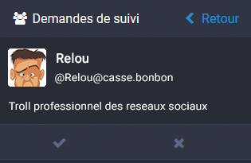

Mastodon User's Guide
=====================

Ceci est une traduction française du [guide officiel](User-guide.md) de Mastodon. 
Créé avec Mastodon v2.2.0 pour support.

* [English](User-guide.md)
* [Français](User-guide_FR.md)
* [Hungarian](User-guide_HUN.md)

## Table of Contents

* [Intro](User-guide_FR.md#intro)
  * [Décentralisation et Fédération](User-guide_FR.md#decentralisation-et-federation)
* [Pour démarrer](User-guide_FR.md#pour-demarrer)
  * [Paramétrer votre Profil](User-guide_FR.md#parametrer-votre-profil)
  * [Notifications via e-mail](User-guide_FR.md#notifications-via-e-mail)
  * [Poster du texte](User-guide_FR.md#poster-du-texte)
    * [Avertissements sur le contenu](User-guide_FR.md#avertissements-sur-le-contenu)
    * [Hashtags](User-guide_FR.md#hashtags)
    * [Partages et Favoris](User-guide_FR.md#partages-et-favoris)
  * [Poster des images](User-guide_FR.md#poster-des-images)
  * [Suivre d'autres utilisateurs](User-guide_FR.md#suivre-dautres-utilisateurs)
  * [Notifications](User-guide_FR.md#notifications)
  * [Applis pour mobiles](User-guide_FR.md#applis-pour-mobiles)
  * [Les fils publics](User-guide_FR.md#les-fils-publics)
    * [Le fil public global](User-guide_FR.md#le-fil-public-global)
    * [Le fil public local](User-guide_FR.md#le-fil-public-local)
    * [Les listes](User-guide_FR.md#les-listes)
  * [Recherche](User-guide_FR.md#Recherche)
  * [Données privées, Securité](User-guide_FR.md#donnees-privees-securite)
  * [Authentification à deux facteurs](User-guide_FR.md#authentification-a-deux-facteurs)
  * [Caractère privé du compte](User-guide_FR.md#caractere-prive-du-compte)
  * [Statut du pouet](User-guide_FR.md#statut-du-pouet)
  * [Bloquage](User-guide_FR.md#bloquage)
  * [Masquer](User-guide_FR.md#masquer)
  * [Signalement d'un Pouet ou d'un utilisateur](User-guide_FR.md#signalement-dun-pouet-ou-dun-utilisateur)
* [Encore des questions ?](User-guide_FR.md#encore-des-questions)

## Intro

Mastodon est une application de réseau social basée sur le protocole ActivityPub. Il se comporte presque comme les autres réseaux sociaux, avec toutefois une différence majeure : il est open-source et n'importe qui peut l'utiliser sur son propre serveur (également appelé "*instance*"), et chaque utilisateur d'instance peut interagir librement avec tous les autres utilisateurs des autres instances ( appelées "*fédération*" ). Par conséquent, il est tout à fait possible de mettre en place un serveur ("*instance*") pour l'usage d'une petite communauté, tout en permettant les interactions avec les autres communautés.

Mini préambule en parlant de Mastodon:
post = pouet
serveur = instance

#### Décentralisation et Fédération

Mastodon est un système décentralisé par l'entremise du concept appelé "*fédération*" - cad : plutôt que d'utiliser et dépendre de l'infrastructure d'une seule personne ou organisation, n'importe qui peut télécharger et mettre en place le logiciel sur son propre serveur. La fédération signifie que différents serveurs Mastodon peuvent interagir ensemble de façon transparente, un peu comme avec les e-mails.

Donc, n'importe qui peut télécharger et mettre en place Mastodon pour une petite communauté, mais chaque utilisateur de l'instance en question peut suivre, envoyer à, et lire des posts ("*pouet*") d'autres utilisateurs sur d'autres [instances](#compatibilite).
Cela signifie que non seulement aucune compagnie ne peut posséder et revendre les données des utilisateurs, mais également que si un serveur (instance) ferme pour une raison ou une autre, les utilisateurs peuvent en mettre en place un autre eux-mêmes ou bien simplement migrer sur une instance déjà existante pour continuer à profiter du service.

Au sein d'une même instance Mastodon, les noms d'utilisateurs apparaissent sous la forme `@nom`, de la même façon qu'avec service comme Twitter. Les utilisateurs d'autres instances apparaissent et peuvent être recherchés et suivis, sous la forme `@nom@instance`.
Par exemple, `@gargron` sur l'instance `mastodon.social` peut être suivi depuis une autre instance sous la forme `@gargron@mastodon.social`.
En fait, voyez ça comme une adresse e-mail. La première partie est votre nom/pseudo, et la seconde partie concerne l'instance sur laquelle vous êtes inscrit(e), et ça c'est la même règle partout. Simple, non ?

Les posts (pouets) des utilisateurs d'instances externes sont "*fédérés*" dans l'instance locale (la vôtre). Autrement dit, si l'`utilisateur1@mastodon.truc` suis l'`utilisateur2@mastodon.machin`, alors tous les posts (pouets) de l'`utilisateur2@mastodon.machin` apparaîtrons dans le fil de la colonne "accueil" (home feed) de l'`utilisateur1@mastodon.truc` ainsi que le fil public de l'instance `mastodon.truc`.
Les administrateurs ont un certain contrôle sur ce paramètre et peuvent empêcher les posts d'utilisateurs d'apparaître sur le fil public de l'instance. Les paramètres des posts (pouets) d'utilisateurs permettent également de jouer sur le côté privé ou non. Voir plus bas dans la section [Statut du pouet](User-guide_FR.md#statut-du-pouet).

## Pour démarrer

#### Paramétrer votre Profil

Vous pouvez personnaliser votre profil de différentes façons. Vous pouvez choisir le nom/pseudo qui vous plaît, une photo/image de profil, une image pour la bannière de votre page profil, ainsi qu'une courte "bio" qui résume vos intérêts/activités en quelques mots.

 Pour éditer votre profil, vous devez cliquer sur l'icône préférences dans la colonne de composition en haut à gauche (ou bien dans la colonne à l'extrême droite de l'écran si le menu est à l'affiche), et cliquer sur "Modifier le profil" dans le menu de gauche. Votre nom/pseudo est limité à 30 caractères, et votre "bio" à 160. Les formats d'images acceptés pour votre avatar et bannière sont png, gif et jpg, et ne peuvent pas excéder 2Mo.
La taille pour les avatars est de 120x120 pixels et celle des bannières de 700x335 pixels. Les images seront automatiquement redimensionnées si elles excédent ces dimensions.

#### Notifications via e-mail

 Mastodon peut envoyer des notifications d'activités par e-mail si vous le choisissez. Pour ajuster les paramètres de notification en fonction de vos préférences, cliquez sur l'icône préférences dans la colonne de composition en haut à gauche,  puis sur  "notifications" dans le menu de gauche. Dans cette section, vous trouverez plusieurs possibilités de paramétrages concernant les types de notifications que vous souhaitez recevoir ou non.

#### Poster du texte

La façon la plus simple d’interagir avec Mastodon est de poster un message texte, appelé aussi "pouet". Pour faire un "pouet", entrez simplement un message dans le champ "qu'avez vous en tête ?" de la colonne de composition à gauche, et cliquez sur le bouton "POUET !". Il y a une limite de 500 caractères par pouet, mais si vous avez vraiment besoin de davantage de caractères, vous pouvez répondre à votre propre pouet et ils apparaîtront comme le fil d'une conversation.

Si vous souhaitez répondre au "pouet" d'un autre utilisateur, cliquez sur l'icône "Répondre". Votre message commencera alors automatiquement par l'adresse de l'utilisateur afin qu'il lui soit adressé, et ce dernier recevra automatiquement une notification de votre réponse.

De la même façon, pour commencer une conversation avec un autre utilisateur, mentionnez simplement son nom/pseudo dans votre pouet. Lorsque vous commencez à taper le symbole @ suivi directement par une chaîne de caractère (sans espace), Mastodon va automatiquement suggérer des utilisateurs qui peuvent correspondre à la chaîne de caractère que vous avez entré. Par exemple, si vous vous commencez à taper @co, Mastodon pourrait suggérer @copain @copine @collègue, etc.
Comme pour les réponses, mentionner un utilisateur de cette façon lui enverra automatiquement une notification.
Si vous commencez votre pouet par directement mentionner un utilisateur, il sera traité par Mastodon comme une réponse et apparaîtra uniquement dans le fil des utilisateurs qui suivent à la fois l'utilisateur mentionné et vous-même. Il pourra cependant être également visible dans votre profil en fonction de vos paramètres privés.

##### Avertissements sur le contenu

Lorsque vous souhaitez poster quelque chose qui ne serait pas visible par défaut ; par exemple des informations sur un film qui vient de sortir, des opinions personnelles que vous pensez potentiellement énervantes, etc. (référez-vous à la ligne de conduite de l'instance sur laquelle vous êtes inscrit), vous pouvez cacher ce contenu derrière un avertissement.

Pour faire ceci, cliquez sur le bouton  sous le champ de composition des messages. Ceci fera apparaître un autre champ intitulé "écrivez ici votre avertissement" dans lequel vous pouvez entrer une courte description du contenu principal qui sera caché.

Ceci va permettre à votre contenu d'être caché derrière un bouton "déplier" dans votre fil, et l'on ne pourra voir que la mention concernant le contenu ainsi que les utilisateurs éventuellement mentionnés dans le post caché.

Mettre en place un avertissement sur le contenu lorsque vous joignez des images à votre post affichera un bandeau noir avec l'inscription "contenu sensible, cliquer pour afficher".

##### Hashtags

Si vous postez quelque chose qui fait référence à un sujet plus large, il peut être utile d'ajouter un "hashtag" à ce dernier. Cela se fait très simplement lors de la rédaction du post en ajoutant un signe # suivi d'un mot.
Par exemple, #introduction qui est très populaire sur mastodon.social afin que les nouveaux inscrits se présentent, ou #art pour parler/montrer des sujets artistiques, etc.
Un hashtag ne peut être composé que des lettres et des nombres, et doit obligatoirement comporter au moins une lettre. Un espace ou un & marquera la fin du hashtag.

Lorsque le pouet est posté, le hashtag devient un lien cliquable. Cliquer sur un hashtag dans un pouet va avoir comme effet d'afficher dans le fil de droite tous les pouets publics correspondant au même hashtag (dans un sens, c'est un raccourci pour une recherche sur le sujet du hashtag).
Cela permet aux utilisateurs de grouper des posts ayant des sujets similaires, afin de former un fil spécialement dédié pour les gens ayant un intérêt pour le sujet en question. Les hashtags peuvent donc également être recherché via le champ "Rechercher" au dessus du champ de composition dans la colonne de gauche.

Lorsque vous avez une recherche de hashtag en cours, le fil affiché sera automatiquement mis à jour avec les nouveaux pouets correspondants. Vous pouvez "épingler" la colonne affichant votre recherche pour conserver à la fois le fil de recherche et les fonctionnalités de la colonne de droite (Cependant cela nécessire un écran plus large, ou l'utilisation de [thèmes spécifiques](User-guide_FR.md#theming-local))
Pour épingler la colonne, cliquez sur le symbole "réglages" (à côte du lien "retour") puis "épingler". Si vous cliquez à nouveau sur ce menu, vous avez la possibilité de "retirer" votre épingle, ou bien de déplacer cette colonne (flèches gauche/droite)

Les pouets non-listés, privés ou directs ne figurent pas dans un fil de recherche de hashtag, mais s'ils contiennent des hashtags, ils   peuvent tout de même servir de raccourcis pour effectuer une [recherche](User-guide_FR.md#Recherche) de pouets public contenant ce hashtag.
Une recherche de hashtag ne peut donner en résultats que des pouets "connus" de votre instance.

##### Partages et Favoris

Vous pouvez *ajouter en favoris* le pouet d'un autre utilisateur en cliquant sur l'icône en forme d'étoile sous le post. Cette action enverra une notification à l'utilisateur que vous avez mis son pouet en favoris. La signification d'un favori varie grandement suivant le contexte de son utilisation, allant d'un simple "j'ai vu" à une marque d'approbation ou de support vis-à-vis des propos exprimés.
Cliquer sur l'icône étoile/favoris d'un pouet ajoute également celui-ci à la liste de vos pouets favoris que vous pouvez retrouver en cliquant sur le lien éponyme dans la colonne de droite.

Vous pouvez également *partager* un pouet en cliquant sur l’icône "flèches circulaires". Partager un pouet va l'afficher dans votre fil et le rendra donc visible par tous les utilisateurs qui vous suivent, même s'ils ne suivent pas l'utilisateur à l'origine du pouet partagé.
C'est utile si quelqu'un post un message dont vous estimez qu'il devrait être plus visible, puisque cela augmente la portée du message tout en conservant les informations de l'auteur du post.

#### Poster des images

 Pour pouvoir poster une image, il suffit de cliquer sur l'icône "image" de votre colonne de composition, et sélectionner un fichier image à envoyer.

Vous pouvez également faire un simple glisser/lâcher de votre image depuis votre bureau/explorateur jusqu'au champ de saisie de la colonne composition.

Si le contenu de votre image est "sensible" (comme de la nudité ou de la violence), vous avez la possibilité d'utiliser le bouton "marquer le media comme sensible", qui a la forme d'un œil, et qui apparaît une fois que vous avez ajouté l'image dans le champ de composition. Cela aura pour effet de cacher l'image de votre pouet derrière un encart noir par défaut, mais qui sera cliquable afin de voir ce qu'il y a derrière.

Ajouter un [Avertissements sur le contenu](User-guide_FR.md#avertissements-sur-le-contenu) à votre pouet forcera toute image à être cachée, mais vous pouvez également utiliser le bouton "marquer le media comme sensible" pour cacher une/des image(s) sans avoir à utiliser l'avertissement sur le contenu.

Enfin, vous pouvez joindre des fichiers vidéos ou GIF à vos pouets. Cependant, il y a une limite de 8Mo à respecter pour ces fichiers, et le format des vidéos doit être .webm ou .mp4

#### Suivre d'autres utilisateurs

Suivre d'autres utilisateurs inclura tous leur posts ainsi que les posts d'autres utilisateurs qu'ils auront [partagé](User-guide_FR.md#partages-et-favoris) dans le fil de votre colonne "accueil".
L'accueil vous donne un fil séparé du [fil public local](User-guide_FR.md#le-fil-public-local), dans lequel vous pouvez lire/voir uniquement les gens que vous suivez à l'écart du "bruit" de toutes les conversations du fil public local ou global.

 Pour pouvoir suivre un utilisateur, cliquez sur son nom ou son image de profil, et cliquez ensuite sur l'icône "suivre" représentée par un personnage avec un symbole +.

Si le compte présente une icône de cadenas  à côté du nom, cela signifie que le propriétaire du compte recevra une notification pour autoriser ou non qui demande à le suivre (et par conséquent voir ses posts).  
Afin d'illustrer le fait d'attendre une approbation de la part de l'utilisateur que vous voulez suivre, l'icône suivre  se changera en sablier  une vois que vous aurez cliqué dessus.
La nécessité d'approuver tout nouvel utilisateur qui voudrait suivre un profil est un paramètre qui peut être activé sur votre propre profil dans les préférences de ce dernier. (Préférences/Réglages/Modifier le profil, cliquer sur "verrouiller le compte")

Lorsque vous suivez le compte d'un utilisateur, l'icône "suivre" deviendra bleue
sur leur profil, et le + se transforme en x .
Vous pouvez par la suite arrêter de suivre un profil en cliquant à nouveau sur cette icône, le x redeviendra un + et l'icône à nouveau grise.

Si vous connaissez le nom d'utilisateur de qqun que vous souhaitez suivre, vous pouvez également accéder à leur profil en entrant leur nom dans le champ [Rechercher](User-guide_FR.md#Recherche) de la colonne de composition à gauche. Cela fonctionne également pour les utilisateurs externe à votre instance, cependant, cela va dépendre de la connexion de votre instance à celle de l'utilisateur. Si l'instance n'est pas déjà connue de la vôtre, alors vous devrez entrer l'adresse complète de l'utilisateur (par ex. `gargron@mastodon.social`), composée comme vu précédemment par le nom/pseudo ainsi que le nom du serveur.

Une alternative permet de suivre un profil que vous auriez par exemple ouvert dans un autre onglet ou même un autre navigateur, et pas nécessairement à partir de Mastodon. Dans ce cas précis, lorsque vous cliquez sur "suivre" ou "s'abonner" sur le profil, vous allez devoir ensuite entrer l'adresse complète de **votre** compte Mastodon depuis lequel vous allez suivre ce profil. (par ex `myaccount@mastodon.social`, tjrs suivant le principe nom/pseudo@instance)

#### Notifications

Lorsqu'une personne suis votre profil ou émet une demande pour suivre votre profil, vous mentionne dans un pouet, partage ou met votre post en favoris, vous allez recevoir une notification. Celles-ci apparaissent dans la colonne "Notifications", et vous pouvez également recevoir des avertissements sonores et visuels si votre navigateur le supporte et que vous l'avez autorisé.

 Vous êtes en mesure de filtrer le type de notifications que vous souhaitez voir dans la colonne du même nom en cliquant sur l'icône "réglages" dans le coin haut/droit de la colonne, et en activant/desactivant les options selon vos préférences.

 Si votre colonne notification devient encombrée, vous pouvez en vider le contenu en cliquant sur "nettoyer" dans le menu accessible via l'icône réglages.

 Vous pouvez également masquer les notifications des personnes/profils que vous ne suivez pas, ou qui ne suivent pas votre profil. Pour y parvenir, cliquer sur l'icône préférence de la colonne composition, puis  réglages/notifications, et enfin activer les 2 options "masquer les notifications" en fonction de vos préférences.

#### Applis pour mobiles

Mastodon dispose d'une API ouverte, donc n'importe qui peut développer un client our une "appli" pour utiliser Mastodon à partir de n'importe quel périphérique (ordinateur, téléphone, etc.).
Beaucoup de gens ont déjà développé des appli pour iOS et Android. Vous pouvez en trouver une liste [ici](Apps.md). Un grand nombre de ces projets sont également open source et accueillent volontiers des collaborateurs.

#### Les fils publics

En plus de votre fil d'accueil, il existe 2 autres fils disponibles. Le fil public global, et le fil public local. Ces 2 fils sont un excellent moyen de découvrir d'autres utilisateurs à suivre et/ou pour interagir avec eux.

- #### Le fil public global

Le fil public global montre tous les pouets public postés par les utilisateurs qui sont connus de votre instance. Cela signifie que les utilisateurs que vous voyez sont soit sur la même instance que vous, soit qu'un utilisateur de votre instance suit ce(s) profil(s). Le fil public global est un excellent moyen de connaître des utilisateurs du monde entier qui peuvent à leur tour élargir davantage votre cercle de connaissances et connecter votre instance avec une plus grande partie du réseau utilisé par Mastodon.

 Pour voir le fil public global, cliquez sur l'icône "fil public global"  dans le menu en haut de votre colonne de composition (ou bien dans la colonne de droite si le menu est disponible). Pour annuler cette action, cliquez sur le lien "retour" en haut de la colonne ou s'affiche le fil global public.

- #### Le fil public local

Le fil public local montre uniquement les posts créés par les utilisateurs de l'instance sur laquelle vous êtes inscrits. Cela peut être utile si votre instance a des règles particulières que d'autres instances ne partagent pas, comme des sujets qui doivent être masqués par un avertissement sur le contenu, des plaisanteries liées à votre communauté ou des intérêts communs que vous ne trouvez pas ailleurs.

Pour voir le fil public local public, cliquer sur l'icône "fil public local" dans le menu en haut de la colonne composition ou bien sur le lien du même nom s'il est disponible dans la colonne de droite ("pour commencer")

- #### Les listes

Les listes permettent de regrouper certains des utilisateurs que vous suivez dans leur propre fil suivant un thème que vous aurez défini. Par ex, vous pouvez créer une liste art&culture dans laquelle vous allez inclure tous les utilisateurs que vous suivez correspondants à ce critère. De cette façon, en ouvrant ce fil dans une colonne dédiée, les pouets des utilisateurs y sont classés selon vos critères et vous voyez plus facilement ce que vous souhaitez.

Pour créer une liste, il faut déjà suivre quelques utilisateurs. Puis, cliquer sur le lien "listes" dans le menu de la colonne de droite s'il est disponible. Dans le champ "Titre de la nouvelle liste", vous donnez le nom du thème qui va correspondre au contenu de votre liste, puis vous cliquez sur le bouton +

Puis vous éditez votre nouvelle liste pour y ajouter des profils.

Dans la nouvelle pop-up qui s'ouvre, vous tapez le nom des profils que vous souhaitez dans votre liste puis cliquez sur le bouton + pour les y ajouter. Cette nouvelle liste commencera à afficher du contenu dès que les utilisateurs que vous avez ajoutés commenceront à publier de nouveaux pouets.

Ensuite, pour pouvez "épingler" cette liste dans une colonne de la même façon qu'évoqué précédemment avec une recherche de [hashtags](User-guide_FR.md#hashtags), et ainsi conserver ce fil visible en plus des autres colonnes par défaut.

Pour supprimer une liste, simplement cliquer sur son nom puis sur l'icône réglages en haut à droite comme pour l'éditer, et choisir "effacer la liste".

 

#### Recherche

Mastodon dispose d'un champ de recherche, qui se trouve au-dessus du champ de rédaction des pouets. Cliquez dans le champ de recherche fera apparaître un pop-up décrivant toutes les options qui s'offrent à vous.

Vous pouvez utiliser la recherche pour les choses suivantes:

* **[Hashtags](User-guide_FR.md#hashtags)** - Les hashtags "connus" de votre instances et correspondant à votre recherche seront listés. Cliquer sur un hashtag lancera une recherche sur tous les pouets public comportant celui-ci sur toutes les instances connues de la vôtre. Les pouets non listés n'apparaîtrons pas dans les résultats.
La recherche est limitée aux posts connus de votre instance, ce qui peut en gros être décrit par "les pouets créées ou partagés par les membres de votre instance, ou bien par des gens dont le profil est *suivi par* des membres de votre instance.

* **Utilisateurs** - Si vous cherchez un `@pseudo`, la recherche vous montrera tous les utilisateurs connus de votre instance pouvant correspondre à ce nom. Vous pouvez chercher plus précisément avec `@pseudo@instance`, ce qui retournera un résultat si quelqu'un correspondant à votre recherche existe, et ce même si cet utilisateur n'est pas connu de votre instance. Vous pouvez ensuite cliquer sur le résultat pour voir le profil de l'utilisateur.
Si vous chercher l'adresse du profil d'un utilisateur, vous pouvez faire une recherche sous la forme `http://instance/@pseudo`, et cela donnera le même résultat que l'exemple précédent, mais cela aura également pour effet de mettre à jour l'avatar, la bio ainsi que les statistiques concernant les infos de suivi si elles sont périmées.

* **URLs de pouets** - Taper l'url d'un pouet spécifique dans le champ de recherche retournera ce pouet en résultat, vous permettant de l'ajouter aux favoris, y répondre ou bien le partager. Cela rendra également ce pouet "connu" de votre instance, et donc l'inclura dans le fil public global, et par la même occasion toutes les recherches hashtag correspondantes (s'il en contient un) faites par les utilisateurs de votre instance.

Pour pouvoir effectuer une recherche, tapez simplement votre requête dans le champ "Rechercher" et tapez sur la touche *entrée*. Les résultats apparaîtront directement sous le champ de recherche. Taper un mot seul retournera tous les hashtags contenant ce mot, ainsi que les profils comportant également ce mot, soit en tant que nom du profil, soit dans la partie nom/pseudo ou instance de l'adresse du profil.
Par exemple, taper `pointu` peut retourner:

* Expert pointu (`@gerard@bouchard`)
* Gerard (`@chapeaupointu@instance`)
* Gerard (`@pote@pointu.instance`)
* `#pointu`
* `#chapeaupointu`

## Données privées, Securité

Mastodon à quelques paramètres de sécurité et vie privée un peu plus avancés que certains réseaux publics tels que Twitter. Notamment, les contrôles concernant la confidentialité sont assez fin; cette section explique justement comment ces derniers fonctionnent.

#### Authentification à deux facteurs

L'authentification à deux facteurs (2FA) est un mécanisme qui améliore la sécurité de votre compte Mastodon en requérant la validation d'un code numérique depuis un second périphérique (habituellement un téléphone mobile) associé à votre compte Mastodon lorsque vous vous identifiez. Cela signifie que même si quelqu'un met par malchance la main sur votre e-mail + votre mot de passe, il ne pourrait pas "entrer" dans votre compte puisqu'il lui faudrait aussi le second périphérique pour s'identifier.

La double authentification de Mastodon utilise "Google Authenticator" (ou tout autre appli compatible, comme par ex. Authy). Vous pouvez l'installer gratuitement sur [Android](https://play.google.com/store/apps/details?id=com.google.android.apps.authenticator2) ou [iOS](https://itunes.apple.com/gb/app/google-authenticator/id388497605).
Cette page [Wikipedia](https://en.wikipedia.org/wiki/Google_Authenticator#Implementations) dresse une liste des applis disponibles pour d'autres systèmes/périphériques.

 Pour activer la double authentification sur votre compte Mastodon, cliquez sur l'icône préférence dans la colonne de composition à gauche (ou bien le lien du même nom si disponible dans la colonne de droite), puis "Réglages/Identification à deux facteurs" dans le menu de gauche, et suivez ensuite les instructions.
Une fois installé, à chaque fois que vous vous identifierez, vous devrez générer un code utilisable une seule fois par l'appli installée sur le deuxième périphérique associé à votre compte.

#### Caractère privé du compte

Pour vous permettre un contrôle plus fin sur la visibilité de vos pouets, Mastodon propose des comptes "privés/verrouillés". Si votre compte est configuré comme étant verrouillé, vous recevrez une notification à chaque fois que quelqu'un souhaitera suivre votre profil, et vous serez en mesure d'accepter ou refuser cette demande. De puis, chaque nouveau pouet que vous rédigerez sera privé par défaut (voir la section [Statut du pouet](User-guide_FR.md#statut-du-pouet) plus bas)

 Pour rendre votre compte "privé/verrouillé", cliquez sur le l'icône préférences dans le menu en haut de la colonne composition à gauche, (ou bien le lien du même nom si disponible dans la colonne de droite), puis "Réglages/Modifier le profil", et enfin, cochez la case "Verrouillez le compte". 

Vous pouvez voir les demandes de suivi dans le menu "pour commencer" de la colonne de droite.

et approuver ou rejeter individuellement les demandes avec les boutons respectifs se trouvant en dessous.

#### Statut du Pouet

Le statut du pouet est géré indépendamment du caractère privé du compte, et individuellement sur chaque pouet. Les 4 statuts possibles d'un pouet sont Public (par défaut), Non-listé, Privé, et Direct. Pour sélectionner le statut de votre pouet, cliquez sur l'icône globe  (qui serait un cadenas fermé si votre compte était vérouillé). 
Les changements concernant ce réglage sont persistants entre les pouets, donc si vous faites un pouet privé, les suivant seront également privés à moins que vous ne changiez à nouveau sur public. Vous pouvez changer le statut des pouets par défaut dans les préférences de votre compte (Préférences/Réglages/Préférences/Confidentialité des statuts).

**Public** est le statut des pouets par défaut sur la plupart des compte. Les pouet public sont visibles par n'importe quel utilisateur sur les fils publics, fédérés aux autres instances Mastodon sans restriction, et est visible de toute le monde sur votre page de profil, incluant les "bots" des moteurs de recherche ainsi que les internautes non-inscrit sur Mastodon.

**Non-listé** Ces pouets sont publics, sauf qu'ils n'apparaissent pas dans les fils public ou les résultats de recherche. Ils sont par contre visibles pour n'importe quel utilisateur suivant votre profil, ou n'importe quel internaute (utilisateur Mastodon ou non) visitant votre page profil. Donc mis à part le fait ne pas apparaître dans les résultats de recherche ou les fils publics, ils fonctionnent exactement comme les pouets public. 

**Privé** Ces pouets ne sont visibles des utilisateurs ni dans le fil public, ni sur votre page de profil disponible à tous, à moins qu'ils fassent partie des "abonnés/suiveur" autorisés de votre compte. Cette option est d'une utilité toute relative si votre compte n'est pas paramétré pour demander votre approbation à chaque nouvelle demande de suivi (sinon il suffit de vous suivre pour voir vos posts privés). Cependant, cette différentiation de statut entre le compte et les pouets signifie que si vous *verrouillez* effectivement votre compte, vous avez toujours la possibilité de changer le statut de certains pouets afin qu'ils deviennent non-listés ou bien même public alors que votre compte restera privé. 

Les pouets privés ne peuvent pas être partagés. Si quelqu'un que vous suivez fait un pouet privé, il apparaîtra dans votre fil avec une icône cadenas fermé en lieu et place du bouton partager. **NOTEZ** que certaines instances peuvent éventuellement ne pas respecter cette règle.  

Il n'y a pas de moyen fiable de vérifier qu'une instance respecte le statut des pouets. Les serveurs compatibles Mastodon utilisant le même protocole et pouvant par conséquent être inter-connectés, ne supportent pas les paramètres de confidentialité de Mastodon. Un utilisateur sur GNU Social (un réseau compatible) que vous @mentionnez dans un pouet privé ne pourrait même pas voir le statut du pouet et serait en mesure de le partager, ce qui rendrait le caractère privé complètement caduque.
Il n'y a pas non plus de moyen pour garantir qu'un administrateur ne modifie pas le code de son instance Mastodon afin qu'elle ne respecte plus les restrictions liées aux statuts des pouets. Un message d'avertissement s'affiche lorsque vous composez un pouet privé qui va fédérer une autre instance (en mentionnant quelqu'un), et à ce moment-là vous pouvez toujours vous demander à quel point vous avez confiance dans l'utilisateur que vous mentionnez ainsi que l'instance sur laquelle il est inscrit.

Les pouets privés ne sont pas chiffrés. Soyez sûr d'avoir confiance dans l'administrateur de votre instance afin d'éviter que ce dernier ne lise vos pouets privés dans votre dos. Ne postez jamais quelque chose de compromettant à quelque niveau que ce soit si vous pensez que cela peut être potentiellement intercepté.

**Direct** Ces pouets ne sont visibles que par les utilisateurs que vous avez mentionnés dans le pouet, et ne peuvent pas être partagé. Tout comme avec les pouets privés, vous devez avoir conscience que certains serveurs connectés peuvent ne pas respecter cette fonctionnalité. Si vous souhaitez discuter d'un sujet sensible, vous devriez le faire en dehors de Mastodon.

Pour résumer:

Statut du pouet | Visible sur les Profils | Visible les fils publics | Fédéré sur les autres instances
------------ | ------------------ | -------------------------- | ---------------------------
Public | Tout le monde, anonymes inclus | Yes | Yes
Non-listé | Tout le monde, anonymes inclus | No | Yes
Privé | Abonnés/suiveur seulement | No | Yes
Direct | No | No | Seulement les utilisateurs @mentionnés

#### Bloquage

Vous pouvez bloquer des utilisateurs pour les empêcher de vous contacter. Pour faire ceci, cliquez sur l'icône menu d'un de leur pouets (3 petits points) ou bien directement sur leur profil (3 barres horizontales), et sélectionnez "bloquer".

**NOTEZ** que cela les empêche de voir vos pouets public lorsqu'ils sont connectés à leur compte Mastodon, mais ils *pourront* voir vos pouets publics simplement en regardant votre page profil dans un autre navigateur non connecté, un onglet privé, ou via un autre compte que vous n'auriez pas bloqué, etc.

Les mentions, favoris, partages ou toute autre interaction avec vous depuis un compte bloqué ne vous seront pas visible. Vous ne verrez pas les réponses à une personne bloquée, même si la réponse contient une mention vous concernant. Et vous ne verrez pas plus les partages de ces même pouets. 

L'utilisateur bloqué ne sera pas averti que vous l'avez bloqué. Ils seront par contre retirés de vos suiveurs/abonnés

#### Masquer

Si vous ne souhaitez plus voir les pouets de certains utilisateurs, sans que cela vous importe qu'eux puissent voir ou non vos pouets, vous pouvez alors choisir de les "masquer". Vous pouvez masquer un utilisateur depuis le même menu que précédemment, sur leur profil ou sous leur pouets. Vous ne verrez plus les pouets des utilisateurs masqués, à moins qu'ils vous @mentionnent dans un pouet (auquel cas vous verrez le pouet en question, mais l'utilisateur sera toujours masqué).
Un utilisateur masqué n'a aucun moyen de savoir que vous l'avez masqué. Vous pouvez aussi masquer les partages d'un utilisateur, sans pour autant masquer ce dernier entièrement, toujours à partir du même menu. (ça fait beaucoup de "masquer" dans un seul paragraphe ! ;)

#### Signalement d'un Pouet ou d'un utilisateur

Si vous croisez un pouet ou un utilisateur qui semble ne pas respecter les règles de votre instance, ou bien que vous souhaitez attirer l'attention de l'administration sur un utilisateur (qui par ex. harcèle d'autres utilisateurs, poste du contenu illégal, etc.), vous avez la possibilité de le faire via le mouton menu (3 petits points) sous le pouet, ou bien directement sur le menu du profil (3 barres horizontales), et sélectionner "signaler".
Cela fera apparaître un pop-up comme celui-ci :

Dans ce pop-up, vous avez la possibilité de sélectionner les pouets qui vous semblent suspects vis à vis de votre instance, et laisser un petit commentaire en bas de la fenêtre avant d'envoyer votre signalement. La "signature" dans la capture d'écran n'est présente que pour le trait d'humour, puisque l'administrateur (et lui seul) qui reçoit le signalement sait également qui l'envoie.
Une fois envoyé donc, l'administrateur pourra prendre les mesures appropriées s'il s'avère qu'elles sont nécessaires, par exemple masquer les pouets de l'utilisateur du fil public, ou bannir leur compte dans les cas les plus extrêmes.

## Encore des question ?

Si vous avez d'autres questions, vous pouvez faire deux choses:

1.Demander directement sur Mastodon avec le hashtag #support (ceci fonctionne à priori mieux sur les instances avec beaucoup d'inscrits (actifs) ou sur celle avec beaucoup de connexions, que sur les petites instances.)
2. Aller sur le forum de discussion [Mastodon Meta Discussion Board](https://discourse.joinmastodon.org/c/general) (powered by Discourse). Lisez la [ligne de conduite](https://discourse.joinmastodon.org/faq) au préalable svp.

 
***

### Précisions

#### <a name="theming-local">Thèmes spécifiques</a>

Certaines instances mastodon disposent d'un thème personnalisé (icônes et couleurs différentes) par rapport à l'instance Mastodon par défaut. C'est un choix laissé à la discrétion de l'administrateur de l'instance, mais il existe d'autres possibilités de personnaliser votre expérience avec Mastodon, comme utiliser une extension de modification d'apparence dans votre navigateur.
Un exemple très utilisé parmi les extensions disponibles est "stylish" (gratuit pour firefox et chrome) et qui dispose déjà de bcp de thèmes tout prêt créés par d'autres utilisateurs. Par exemple, un des thèmes vous permet d'utiliser Mastodon sur une seule colonne (comme avec twitter par ex) si c'est ce que vous préférez, mais les possibilités de changements sont multiples : couleurs, taille et nombre de colonnes, etc.
