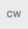
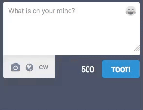
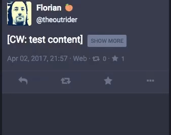

Mastodon felhasználói kézikönyv
===============================

* [Bevezetés](User-guide_HUN.md#bevezetés)
  * [Decentralizáció és federáció](User-guide_HUN.md#decentralizáció-és-federáció)
* [Első lépések](User-guide_HUN.md#első-lépések)
  * [Profilod létrehozása](User-guide_HUN.md#profilod-létrehozása)
  * [E-mail értesítések](User-guide_HUN.md#e-mail-értesítések)
  * [Szöveges üzenetek](User-guide_HUN.md#szöveges-üzenetek)
  * [Content Warnings - Figyelmeztetés szenzitív tartalmakra](User-guide_HUN.md#content-warnings---figyelmeztetés-szenzitív-tartalmakra)
  * [Címkék](User-guide_HUN.md#címkék)
  * [Reblogolás és kedvencekhez adás](User-guide_HUN.md#reblogolás-és-kedvencekhez-adás)

## Bevezetés

A Mastodon egy, az OStatus protokollon alapuló közösségi alkalmazás. Működésében nagyban emlékztet más közösségi alkalmazásokra - főképp a Twitterre -, egy jelentős különbséget azonban meg kell említenünk: a Mastodon nyílt forráskódú alkalmazás, bárki működtethet saját Mastodon-szervert (ezeket "*instanciának*" is nevezzük) és bármely szerver regisztrált felhasználói szabadon kapcsolatba léphetnek más szerverek felhasználóival (ezt nevezzük "*federációnak*"). Ezek révén válik lehetségessé, hogy kisebb közösségek saját szervert üzemeltessenek, melyet a közösségen belüli kapcsolattartásra használnak, ugyanakkor más közösségekkel is kapcsolatba tudnak lépni. 

#### Decentralizáció és federáció

A Mastodon egy "*federációnak*" nevezett koncepció alapján decentralizált (központosítatlan) rendszer - ahelyett, hogy egy személyre vagy szervezetre bízná a futtatásához szükséges infrastruktúra üzemeltetését, inkább bárki számára lehetővé teszi, hogy letöltse és futtassa az alkalmazást és saját szervert üzemeltessen. A federáció révén az egyes Mastodon szerverek gond nélkül kapcsolatba tudnak lépni egymással, hasonlóan például az e-mailhez.

A fentiekből adódóan bárki beszerezheti a Mastodont és üzemeltethet saját szervert például egy kisebb közösség számára, azonban így is lehetséges, hogy az egyes szerverek regisztrált felhasználói kövessék és olvassák más szerverek felhasználóinak üzeneteit, illetve üzenetet küldjenek számukra (ugyanez igaz más OStatus-alapú szolgáltatások szervereire is, mint például a GNU Social vagy a postActiv). Ez nem csak azt jelenti, hogy a felhasználói adatokat nem egy, az adatok hirdetők felé történő értékesítésében érdekelt vállalat birtokolja, de azt is, hogy ha egy bizonyos szerver megszűnne, a felhasználók egyszerűen indíthatnak egy újat, vagy átmigrálhatják profiljukat egy másik instanciára, ahelyett, hogy adataik végleg elvesznének.

Egy adott Mastodon instancián belül a felhasználónevek `@felhasználónév` formában jelennek meg (csakúgy, mint a Twitteren). A más szerveren regisztrált felhasználókat a `@felhasználónév@szervernév.tld` formában tudjuk keresni és követni - tehát a `@gargron` nevű felhasználót a `mastodon.social` szerveren más instanciákról a `@gargron@mastodon.social` formában érhetjük el.

A más szerver felhasználóinak üzenetei a "*federáció*" révén jelennek meg egy adott szerveren - például ha `user1@mastodon1` felhasználó követi `user2@gnusocial2` felhasználót, abban az esetben `user2@gnusocial2` üzenetei megjelennek `user1@mastodon1` *Kezdőlapján* (Home Feed) és a `mastodon1` szerver *Nyilvános időfolyamában* (Public Timeline). A Mastodon-szerverek adminisztrátorainak van erre a folyamatra némi ráhatásuk és letilthatják bizonyos felhasználók üzeneteinek megjelenését a Nyilvános időfolyamról. Hasonlóképp a felhasználók adatvédelmi beállításai is kihatnak a federációra - ezzel kapcsolatban lásd a [Tülk adatvédelem](User-guide_HUN.md#tülk-adatvédelem) fejezetet.

## Első lépések

#### Profilod létrehozása

Több módon is egyedivé teheted Mastodon-profilodat - beállíthatsz egyedi "Megjelenített nevet" (Display Name), Profil- és Fejlécképet (Avatar és Header) tölthetsz fel és írhatsz egy rövid "Önéletrajzot" (Bio) is magadról.

 Profilod szerkesztéséhez kattints a Beállítások ikonra a baloldali oszlopban és a megjelenő Beállítások oldalon válaszd a "Profil szerkesztése" (Edit Profile) menüpontot. A Megjelenített név 30 karakterben van maximálva, míg az Őnéletrajz maximum 160 karakter hosszú lehet. A Profilkép és a Fejléckép megengedett formátumai a png, a gif és a jpg, a megengedett maximális fájlméret pedig 2MB. A feltöltött képeket a rendszer automatikusan átméretezi: a Profilkép mérete 200x200 pixel, a Fejlécképé pedig 700x335 pixel lesz.

#### E-mail értesítések

 Ha kéred, a Mastodon e-mailben értesít téged bizonyos történésekről. Az értesítések beállításához kattints a Beállítások ikonra a baloldali oszlopban és a megjelenő oldalon válaszd a "Beállítások" (Preferences) menüpontot. Itt találod az e-mail értesítések listáját, ahol jelölheted az általad kívánt opciókat.

#### Szöveges üzenetek

A szöveges üzenet (más néven *Tülk*, angolul *Toot*) a Mastodonon történő interakció legalapvetőbb formája. *Tülköléshez* egyszerűen írd be üzeneted a baloldali oszlop "Mire gondolsz?" (What is on your mind?) mezőjébe és kattints a "TÜLK!" (TOOT) gombra. A tülkök maximum 500 karakter hosszúak lehetnek; amennyiben ennél hosszabbat szeretnél tülkölni, válaszolhatsz saját tülködre, így tülkjeid beszélgetés formájában (egy láncban) jelennek meg.

Ha más felhasználók tülkjeire szeretnél válaszolni, kattints a tülk alatti "Válasz" (Reply) ikonra. Ezzel automatikusan beemeled felhasználónevüket a beviteli mezőbe (a megválaszolni kívánt tülk előnézetével együtt) és az adott felhasználó is értesítést kap arról, hogy válaszoltál neki.

Ugyanígy, ha beszélgetést kezdeményeznél egy felhasználóval, egyszerűen foglald bele felhasználónevét a tülködbe. Mihelyt beírod a @ (kukac) karaktert és (szóköz nélkül) a felhasználónév első betűjét, a Mastodon a bevitt barakterek alapján azonnal megjeleníti javaslatait. Ahogy a válaszok esetében, az adott felhasználó akkor is értesítést kap, ha valaki megemlítette egy tülkben. Ha egy üzenet említéssel (felhasználónévvel) kezdődik, a rendszer válaszként kezeli - ebben az esetben csak azon felhasználók Kezdőlapján jelenik majd meg, akik *egyaránt* követnek téged *és* az említett személyt. Az ilyen tülkök azonban - adatvédelmi beállításaidtól függően - láthatóak lehetnek profiloldaladon is.

##### Content Warnings - Figyelmeztetés szenzitív tartalmakra 

Ha olyan tartalmat készülsz tülkölni, amelyet nem szeretnél, hogy azonnal látsszon - például spoilerek egy új filmmel kapcsolatban, vagy olyan gondolatok, amelyeket mások felkavarónak találhatnak -, lehetőséged van azt egy "Figyelmeztetés" (Content Warning) mőgé rejteni.

Ehhez a tülk-beviteli mező alatti  "CW" gombra kell kattintanod. Ez egy újabb, "Content warning" nevű mezőt jelenít meg - ide írhatsz egy rövid, semleges összefoglalást a tülköd tartalmáról, míg a tülk maga a megszokott "Mire gondolsz?" mezőbe kerüljön.

Ennek eredményeképp a teljes tülk egy "Show More" (Mutass többet) gomb mögé kerül, míg az időfolyamban csak a figyelmeztetés (a Content warning mezőbe írt szöveg) látszik majd:

**FIGYELEM**, ez a funkció nem rejti el a tülkhoz cstolt képeket - a képek külön jelölhetők "érzékeny tartalomként"; az így jelölt képek csak kattintás után válnak láthatóvá. Erről bővebben a [Képek tülkölése](User-guide_HUN.md#képek-tülkölése) fejezetben olvashatsz.

##### Címkék

Ha olyan tartalmat tülkölsz, amely egy jobban körülhatárolható témába illeszkedik, érdemes lehet "megcímkézni" azt. Címkét a tülkbe gépelt, #-t (kettős keresztet) követő szóval, vagy kifejezéssel hozhatsz létre, például #bemutatkozás (ennek angol változata, az #introduction kedvelt címke a mastodon.social instancián, ezt használják az új felhasználók, amikor bemutatkoznak a közösség többi tagjának), vagy #politika (a politikai témájú tülkök esetében). A tülkben lévő címkére kattintva új időfolyam jelenik meg, amely az adott címkével ellátott, publikus tülköket jeleníti meg (ez tulajdonképpen egy gyorskeresés az adott címkére). Ez a funkció lehetővé teszi, hogy az adott téma iránt érdeklődő felhasználó egy különálló időfolyamot hozzon létre a témába vágó tülkök kilistázására. A címkék a tülk-beviteli mező feletti kereső segítségével is lekereshetők.

##### Reblogolás és kedvencekhez adás

*Kedvenceidhez adhatod* egy másik felhasználó tülkjét a tülk alatti csillag ikonra kattintva. A másik felhasználó ilyenkor értesítést kap arról, hogy kedveled a tülkjét; kontextustól függően ez jelentheti egyszerűen azt, hogy "Figyelek arra, amit tülkölsz", de jelezhet tetszésnyilvánítást, vagy kifejezhet egyfajta egyetértést vagy helyeslést is a tülkben leírt gondolatokkal kapcsolatban.

A fentiek mellett lehetőséged van *reblogolni* a tülköket az alattuk található "egymásba futó nyilak" ikonra kattintva. A reblogolt tülkök megjelennek a te profiloldaladon is és a követőid számára is láthatók lesznek, még akkor is, ha ők maguk nem követik azt a felhasználót, akinek tülkjét reblogoltad. Ez a funkció hasznos lehet, ha olyan tülköt látsz, ami szerinted másokat is érdekelhet - a reblog szélesíti az eredeti tülk közönségét, miközben megtartja az eredeti szerző adatait is. 

