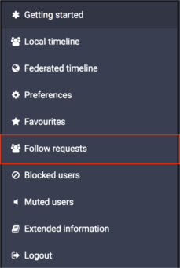

Mastodon felhasználói kézikönyv
===============================

* [Bevezetés](User-guide_HUN.md#bevezetés)
  * [Decentralizáció és federáció](User-guide_HUN.md#decentralizáció-és-federáció)
* [Első lépések](User-guide_HUN.md#első-lépések)
  * [Profilod létrehozása](User-guide_HUN.md#profilod-létrehozása)
  * [E-mail értesítések](User-guide_HUN.md#e-mail-értesítések)
  * [Szöveges üzenetek](User-guide_HUN.md#szöveges-üzenetek)
    * [Content Warnings - Figyelmeztetés szenzitív tartalmakra](User-guide_HUN.md#content-warnings---figyelmeztetés-szenzitív-tartalmakra)
    * [Címkék](User-guide_HUN.md#címkék)
    * [Reblogolás és kedvencekhez adás](User-guide_HUN.md#reblogolás-és-kedvencekhez-adás)
  * [Képek tülkölése](User-guide_HUN.md#képek-tülkölése)
  * [Más felhasználók követése](User-guide_HUN.md#más-felhasználók-követése)
  * [Értesítések](User-guide_HUN.md#értesítések)
  * [Mobilalkalmazások](User-guide_HUN.md#mobilalkalmazások)
  * [Publikus időfolyamok](User-guide_HUN.md#publikus-időfolyamok)
    * [A Nyilvános időfolyam](User-guide_HUN.md#a-nyilvános-időfolyam)
    * [A Helyi időfolyam](User-guide_HUN.md#a-helyi-időfolyam)
  * [Keresés](User-guide_HUN.md#keresés)
* [Adatvédelem és adatbiztonság](User-guide_HUN.md#adatvédelem-és-adatbiztonság)
  * [Kétlépcsős azonosítás](User-guide_HUN.md#kétlépcsős-azonosítás)
  * [Fiókod adatvédelme](User-guide_HUN.md#fiókod-adatvédelme)
  * [Tülk adatvédelem](User-guide_HUN.md#tülk-adatvédelem)
  * [Felhasználók blokkolása](User-guide_HUN.md#felhasználók-blokkolása)
  * [Felhasználók némítása](User-guide_HUN.md#felhasználók-némítása)
  * [Tülkök vagy felhasználók jelentése](User-guide_HUN.md#tülkök-vagy-felhasználók-jelentése)

## Bevezetés

A Mastodon egy, az OStatus protokollon alapuló közösségi alkalmazás. Működésében nagyban emlékeztet más közösségi alkalmazásokra – főképp a Twitterre –, egy jelentős különbséget azonban meg kell említenünk: a Mastodon nyílt forráskódú alkalmazás, bárki működtethet saját Mastodon-szervert (ezeket „*instanciának*” is nevezzük) és bármely szerver regisztrált felhasználói szabadon kapcsolatba léphetnek más szerverek felhasználóival (ezt nevezzük „*federációnak*”). Ezek révén válik lehetségessé, hogy kisebb közösségek saját szervert üzemeltessenek, amit a közösségen belüli kapcsolattartásra használnak; ugyanakkor más közösségekkel is kapcsolatba tudnak lépni. 

#### Decentralizáció és federáció

A Mastodon egy „*federációnak*” nevezett koncepció alapján decentralizált (központosítatlan) rendszer: ahelyett, hogy egy személyre vagy szervezetre bízná a futtatásához szükséges infrastruktúra üzemeltetését, inkább bárki számára lehetővé teszi, hogy letöltse és futtassa az alkalmazást és saját szervert üzemeltessen. A federáció révén az egyes Mastodon-szerverek gond nélkül kapcsolatba tudnak lépni egymással, hasonlóan például az e-mailhez.

A fentiekből adódóan bárki beszerezheti a Mastodont és üzemeltethet saját szervert például egy kisebb közösség számára, azonban így is lehetséges, hogy az egyes szerverek regisztrált felhasználói kövessék és olvassák más szerverek felhasználóinak üzeneteit, illetve üzenetet küldjenek számukra (ugyanez igaz más OStatus-alapú szolgáltatások szervereire is, mint például a GNU Social vagy a postActiv). Ez nemcsak azt jelenti, hogy a felhasználói adatokat nem egy, az adatok hirdetők felé történő értékesítésében érdekelt vállalat birtokolja, de azt is, hogy ha egy bizonyos szerver megszűnne, a felhasználók egyszerűen indíthatnak egy újat, vagy átmigrálhatják profiljukat egy másik instanciára, ahelyett, hogy adataik végleg elvesznének.

Egy adott Mastodon-instancián belül a felhasználónevek `@felhasználónév` formában jelennek meg (csakúgy, mint a Twitteren). A más szerveren regisztrált felhasználókat a `@felhasználónév@szervernév.tld` formában tudjuk keresni és követni - tehát a `@gargron` nevű felhasználót a `mastodon.social` szerveren más instanciákról a `@gargron@mastodon.social` formában érhetjük el.

A más szerver felhasználóinak üzenetei a „*federáció*” révén jelennek meg egy adott szerveren - például ha `user1@mastodon1` felhasználó követi `user2@gnusocial2` felhasználót, abban az esetben `user2@gnusocial2` üzenetei megjelennek `user1@mastodon1` *Kezdőlapján* (Home Feed) és a `mastodon1` szerver *Publikus időfolyamában* (Public Timeline). A Mastodon-szerverek adminisztrátorainak van erre a folyamatra némi ráhatásuk és letilthatják bizonyos felhasználók üzeneteinek megjelenését a Publikus időfolyamról. Hasonlóképp a felhasználók adatvédelmi beállításai is kihatnak a federációra - ezzel kapcsolatban lásd a [Tülk adatvédelem](User-guide_HUN.md#tülk-adatvédelem) fejezetet.

## Első lépések

#### Profilod létrehozása

Több módon is egyedivé teheted Mastodon-profilodat - beállíthatsz egyedi „Megjelenített nevet” (Display Name), Profil- és Fejlécképet (Avatar és Header) tölthetsz fel és írhatsz egy rövid „Önéletrajzot” (Bio) is magadról.

 Profilod szerkesztéséhez kattints a Beállítások ikonra a bal oldali oszlopban és a megjelenő Beállítások oldalon válaszd a „Profil szerkesztése” (Edit Profile) menüpontot. A Megjelenített név 30 karakterben van maximálva, míg az Őnéletrajz maximum 160 karakter hosszú lehet. A Profilkép és a Fejléckép megengedett formátumai a png, a gif és a jpg, a megengedett maximális fájlméret pedig 2 MB. A feltöltött képeket a rendszer automatikusan átméretezi: a Profilkép mérete 200×200 pixel, a Fejlécképé pedig 700×335 pixel lesz.

#### E-mail értesítések

 Ha kéred, a Mastodon e-mailben értesít téged bizonyos történésekről. Az értesítések beállításához kattints a Beállítások ikonra a bal oldali oszlopban és a megjelenő oldalon válaszd a „Beállítások” (Preferences) menüpontot. Itt találod az e-mail értesítések listáját, ahol jelölheted az általad kívánt opciókat.

#### Szöveges üzenetek

A szöveges üzenet (más néven *Tülk*, angolul *Toot*, az [első magyar instancián](https://the.wired.sehol.se) elterjedt szlengben *Röffentés*) a Mastodonon történő interakció legalapvetőbb formája. *Tülköléshez* egyszerűen írd be üzeneted a baloldali oszlop „Mire gondolsz?” (What is on your mind?) mezőjébe és kattints a „TÜLK!” (TOOT) gombra. A tülkök maximum 500 karakter hosszúak lehetnek; amennyiben ennél hosszabbat szeretnél tülkölni, válaszolhatsz saját tülködre, így tülkjeid beszélgetés formájában (egy láncban) jelennek meg.

Ha más felhasználók tülkjeire szeretnél válaszolni, kattints a tülk alatti „Válasz” (Reply) ikonra. Ezzel automatikusan beemeled felhasználónevüket a beviteli mezőbe (a megválaszolni kívánt tülk előnézetével együtt), és az adott felhasználó is értesítést kap arról, hogy válaszoltál neki.

Ugyanígy, ha beszélgetést kezdeményeznél egy felhasználóval, egyszerűen foglald bele felhasználónevét a tülködbe. Mihelyt beírod a @ (kukac) karaktert és (szóköz nélkül) a felhasználónév első betűjét, a Mastodon a bevitt barakterek alapján azonnal megjeleníti javaslatait. Ahogy a válaszok esetében, az adott felhasználó akkor is értesítést kap, ha valaki megemlítette egy tülkben. Ha egy üzenet említéssel (felhasználónévvel) kezdődik, a rendszer válaszként kezeli - ebben az esetben csak azon felhasználók Kezdőlapján jelenik majd meg, akik *egyaránt* követnek téged *és* az említett személyt. Az ilyen tülkök azonban – adatvédelmi beállításaidtól függően – láthatóak lehetnek profiloldaladon is.

##### Content Warnings - Figyelmeztetés szenzitív tartalmakra 

Ha olyan tartalmat készülsz tülkölni, amelyet nem szeretnél, hogy azonnal látsszon – például spoilerek egy új filmmel kapcsolatban, vagy olyan gondolatok, amelyeket mások felkavarónak találhatnak –, lehetőséged van azt egy „Figyelmeztetés” (Content Warning) mögé rejteni.

Ehhez a tülk-beviteli mező alatti  „CW” gombra kell kattintanod. Ez egy újabb, „Content warning” nevű mezőt jelenít meg - ide írhatsz egy rövid, semleges összefoglalást a tülköd tartalmáról, míg a tülk maga a megszokott „Mire gondolsz?” mezőbe kerüljön.

Ennek eredményeképp a teljes tülk egy „Show More” (Mutass többet) gomb mögé kerül, míg az időfolyamban csak a figyelmeztetés (a Content warning mezőbe írt szöveg) látszik majd:

**FIGYELEM**, ez a funkció nem rejti el a tülkhöz csatolt képeket - a képek külön jelölhetők „érzékeny tartalomként”; az így jelölt képek csak kattintás után válnak láthatóvá. Erről bővebben a [Képek tülkölése](User-guide_HUN.md#képek-tülkölése) fejezetben olvashatsz.

##### Címkék

Ha olyan tartalmat tülkölsz, amely egy jobban körülhatárolható témába illeszkedik, érdemes lehet „megcímkézni” azt. Címkét a tülkbe gépelt, #-t (kettős keresztet) követő szóval, vagy kifejezéssel hozhatsz létre, például #bemutatkozás (ennek angol változata, az #introduction kedvelt címke a mastodon.social-instancián, ezt használják az új felhasználók, amikor bemutatkoznak a közösség többi tagjának), vagy #politika (a politikai témájú tülkök esetében). A tülkben lévő címkére kattintva új időfolyam jelenik meg, amely az adott címkével ellátott, publikus tülköket jeleníti meg (ez tulajdonképpen egy gyorskeresés az adott címkére). Ez a funkció lehetővé teszi, hogy az adott téma iránt érdeklődő felhasználó egy különálló időfolyamot hozzon létre a témába vágó tülkök kilistázására. A címkék a tülk-beviteli mező feletti kereső segítségével is lekereshetők.

##### Reblogolás és kedvencekhez adás

*Kedvenceidhez adhatod* egy másik felhasználó tülkjét a tülk alatti csillag-ikonra kattintva. A másik felhasználó ilyenkor értesítést kap arról, hogy kedveled a tülkjét; kontextustól függően ez jelentheti egyszerűen azt, hogy „Figyelek arra, amit tülkölsz”, de jelezhet tetszésnyilvánítást, vagy kifejezhet egyfajta egyetértést vagy helyeslést is a tülkben leírt gondolatokkal kapcsolatban.

A fentiek mellett lehetőséged van *reblogolni* a tülköket az alattuk található „egymásba futó nyilak” ikonra kattintva. A reblogolt tülkök megjelennek a te profiloldaladon is és a követőid számára is láthatók lesznek, még akkor is, ha ők maguk nem követik azt a felhasználót, akinek tülkjét reblogoltad. Ez a funkció hasznos lehet, ha olyan tülköt látsz, ami szerinted másokat is érdekelhet - a reblog szélesíti az eredeti tülk közönségét, miközben megtartja az eredeti szerző adatait is. 

#### Képek tülkölése

 Képek tülköléséhez kattints a „Média hozzáadása” (Add media) ikonra a baloldali oszlopban a tülk-beviteli mező alatt és válaszd ki a feltölteni kívánt fájlt.

Ha a képen látható tartalom „érzékeny”, vagy például munkahelyi megtekintésre nem ajánlott, a képet érzékenynek jelölheted az  NSFW (az angol „Not Safe For Work” kifejezésből) gombra kattintva, amely a kép feltöltése után jelenik meg. Ez alapértelmezésként elrejti a képet, aminek a bélyegképe így csak kattintás után jelenik meg. Ez tehát tulajdonképpen a [Content warning](User-guide_HUN.md#content-warnings---figyelmeztetés-szenzitív-tartalmakra) médiatartalmakra alkalmazott megfelelője - és kombinálható is azzal, ha például mind a médiafájl, mind a tülk szöveges része érzékeny tartalom. Ha a szöveget nem ítéled érzékenynek, elég csak a médiafájlt NSFW-ként jelölnöd.

Tülkjeidhez csatolhatsz videót vagy GIF-animációkat is. Ugyanakkor fontos, hogy ezek maximális mérete 4 MB lehet és a videóknak .webm vagy .mp4 formátumúaknak kell lenniük.

#### Más felhasználók követése

Ha követsz egy felhasználót, akkor annak minden tülkje, valamint az általa [reblogolt](User-guide_HUN.md#reblogolás-és-kedvencekhez-adás) tülkök megjelennek a Kezdőlapodon. Ez egy olyan, [Publikus időfolyamtól](User-guide_HUN.md#publikus-időfolyamok) különálló időfolyamot biztosít számodra, ahol a számodra érdekes emberek tülkjei jelennek meg, az instancián zajló minden beszélgetés „zaja” nélkül.

 Egy felhasználó követéséhez nyisd meg annak profilját a nevére vagy a profilképére kattintva és kattints a „Követés” (Follow) ikonra a profil bal felső sarkában.

Amennyiben az illető neve mellett lakat ikont  látsz, a felhasználó profilja nem nyilvános - ebben az esetben a felhasználó értesítést kap arról, hogy követni szeretnéd és jóvá kell hagynia a kérést. Jóváhagyás után felkerülsz a követői listájára és láthatod a tülkjeit is. Annak jelzésére, hogy követési kérésed jóváhagyásra vár, az eddigi „Követés”  ikon helyett egy homokóra  ikon fog látszani. Ha te is manuálisan szeretnéd jóváhagyni a követési kérelmeket, ezt a Beállításokban, a saját Profil szerkesztése oldalon tudod beállítani.

Ha már követsz egy felhasználót, akkor a profiloldalán látható Követés ikon kékre változik ; ennek újbóli megnyomásával hagyhatod abba a felhasználó követését. 

Ha ismered egy adott felhasználó felhasználónevét, megnyithatod a profilját úgy is, hogy begépeled azt a bal oldali oszlopban található [keresőmezőbe](User-guide_HUN.md#keresés). Ez más szervereken regisztrált felhasználók esetében is működik, ám annak függvényében, hogy az adott szerver federál-e a tiéddel, lehet, hogy a teljes – szervernévvel ellátott – felhasználónevet (pl. `gargron@mastodon.social`) be kell írnod, mielőtt a kereső megjeleníti az adott felhasználót javaslatként.

Amennyiben a követni kívánt felhasználó profilja már meg van nyitva egy másik böngészőfülön, a legtöbb OStatus-alapú rendszer megjelenít egy „Követés” vagy „Feliratkozás” (Follow, ill. Subscribe) gombot a profiloldalon. Ezt megnyomva a rendszer kérni fogja a **te** teljes (szervernévvel ellátott) felhasználónevedet, **amellyel** követni kívánod az adott felhasználót (például ha a mastodon.social szerveren vagy regisztrálva, `felhasználóneved@mastodon.social` formában kell megadnod a fehasználóneved).

#### Értesítések

Értesítést kapsz a rendszertől, ha valaki követni kezd, vagy kéri, hogy követhessen; ha megemlít téged vagy válaszol neked; illetve ha reblogolja, vagy kedvencnek jelöli egy tülködet. Ez megjelenik asztali értesítésként (ha a böngésződ támogatja az ilyen értesítéseket, te pedig engedélyezted őket), illetve az „Értesítések” (Notifications) oszlopban.

 A megjelenített értesítéseket testre szabhatod az Értesítések oszlop tetején található Értesítési beállítások (Notification Settings) ikonnal, jelölve azokat, amelyeket meg szeretnél jeleníteni, vagy épp el szeretnél rejteni.

 Ha már túl sok értesítés halmozódott itt fel, törölheted azokat az oszlop tetején található Értesítések törlése (Clear notifications) ikonra kattintva.

 Az ismeretlenektől – azaz akiket nem követsz vagy akik nem követnek téged – érkező értesítéseket szintén kikapcsolhatod: ehhez kattints a bal oldali oszlopban található Beállítások ikonra, majd a megjelenő oldalon jelöld be a kívánt opciót („Block notifications from...”).

#### Mobilalkalmazások

A Mastodon API-ja nyitott, így bárki fejleszthet hozzá klienst vagy alkalmazást. Sokan már meg is tették, úgy Androidra, mint iOS-re. Az ismert mobilalkalmazások listáját [itt találod](Apps.md). Ezen projektek közül sok maga is nyílt forráskódú és mindig szívesen fogadják a közreműködőket.

#### Publikus időfolyamok

A Kezdőlapod mellett két másik, publikus időfolyam is elérhető: a Nyilvános időfolyam (Fedarated timeline) és a Helyi időfolyam (Local Timeline). Mindkettő kiválóan alkalmas arra, hogy új embereket ismerj meg és eszmét cseréljetek.

##### A Nyilvános időfolyam

A Nyilvános időfolyam (angolul: Federated Timeline) mutatja mindazon felhasználók publikus tülkjeit, akik „ismertek” az instanciád számára. Ez az „ismertség” két dolgot jelenthet: az adott felhasználó ugyanannak a szervernek a regisztrált tagja, mint te, vagy valaki a te szerveredről követi őt. A Nyilvános időfolyam éppen ezért nagyszerű hely arra, hogy kapcsolatot teremts a tágabb Mastodon-univerzummal. Más szerverek felhasználóit követve még több embert ismersz majd meg még több instanciáról, akiket követve még több felhasználóval ismerkedsz majd meg a teljes Mastodon- és OStatus-világban; és így tovább.

 A Nyilvános időfolyam megtekintéséhez kattints a baloldali oszlop „Nyilvános időfolyam” (Federated Timeline) ikonjára, vagy válaszd a megfelelő menüpontot a jobboldali „Első lépések” oszlopban. A Nyilvános időfolyam újbóli elrejtéséhez csak kattints a „Vissza” (Back) linkre az oszlop tetején jobbra.

##### A Helyi időfolyam

A Helyi időfolyamban csak azokat a publikus tülköket látod, amelyeket a te instanciád felhasználói írtak. Ez akkor lehet nagyon hasznos, ha például a te szervereden olyan közösségi szabályok vannak érvényben az érzékeny tartalmakat illetően, amelyek más instanciákon nincsenek; illetve például akkor, ha a te instanciád a közös érdeklődésre épül.

A Helyi időfolyam megtekintéséhez kattints a bal oldali oszlop „Helyi időfolyam” (Local Timeline) ikonjára, vagy válaszd a megfelelő menüpontot a jobb oldali „Első lépések” oszlopban.

#### Keresés

A Mastodon keresés funkcióját felhasználók és [címkék](User-guide_HUN.md#címkék) keresésére egyaránt használhatod. A kereső nem keres a tülkök teljes szövegében, csak a címkék között. Keresés indításához gépelj be valamit a bal oldali oszlopban található keresőmezőbe és üsd le az *Entert*. Ekkor megjelenik a keresőpanel, amely mutatja a javaslatokat és találatokat. Ezekre kattintva nyithatod meg az egyes felhasználók profiloldalát, illetve az egyes címkék időfolyamát.

## Adatvédelem és adatbiztonság

A Mastodonon számos – más nyilvános hálózatokhoz, például a Twitterhez képest jóval több – adatvédelmi és adatbiztonsági beállítási lehetőség található. Elsősorban az adatvédelmi beállítások adnak lehetőséget a finomhangolásra; ebben a fejezetben ezeket vesszük sorra.

#### Kétlépcsős azonosítás

A kétlépcsős azonosítás (angolul: Two-Factor Authentication, vagy 2FA) egy olyan mechanizmus, ami nagyban növeli Mastodon-fiókod biztonságát. Lényege, hogy bejelentkezéskor a jelszó mellett egy másik, a Mastodon-fiókodhoz hozzárendelt eszközre (jellemzően a mobiltelefonodra) küldött, számokból álló kódot is kér. Azaz hiába szerezte meg egy harmadik fél az e-mail címedet és a jelszavadat, a birtokodban lévő és a kódot fogadó eszköz nélkül nem tudja majd átvenni az irányítást a fiókod felett.

A Mastodon a Google Authenticatort (vagy egy azzal kompatibilis alkalmazást, például az Authy-t) használja a kétlépcsős azonosításhoz. Ez [Androidos](https://play.google.com/store/apps/details?id=com.google.android.apps.authenticator2) és [iOS-t](https://itunes.apple.com/gb/app/google-authenticator/id388497605) futtató eszközökre is ingyenesen telepíthető; további implementációkat [ezen a Wikipedia oldalon](https://en.wikipedia.org/wiki/Google_Authenticator#Implementations) találsz.

 A kétlépcsős azonosítás engedélyezéséhez kattints a bal oldali oszlopban a Beállítások ikonra, majd válaszd a „Kétlépcsős azonosítás” (Two-Factor Authentication) menüpontot és kövesd az ott megjelenő utasításokat. Aktiválás után minden bejelentkezéskor szükség lesz egy, a fiókodhoz hozzárendelt eszközön az Authenticator alkalmazás által generált, egyszerhasználatos kódra.

#### Fiókod adatvédelme

Annak érdekében, hogy te határozhasd meg azt, hogy ki látja tülkjeidet, a Mastodon támogatja a „privát”, vagy „zárt” fiók létrehozását. A privát fiókkal rendelkező felhasználók minden alkalommal értesítést kapnak, ha valaki követni szeretné őket, és lehetőségük van jóváhagyni vagy elutasítani a kérést. Ezen felül a fiókod privátra állítása után minden tülk, amit írsz, a Privát alapértelmezést kapja (bővebben lásd a [Tülk adatvédelem](User-guide_HUN.md#tülk-adatvédelem) című fejezetben).

 Fiókod privátra állításához kattints a bal oldali oszlopban a Beállítások ikonra, majd válaszd a „Profil szerkesztése” menüpontot, jelöld be a „Fiók lezárása” (Lock account) opciót, majd kattints a Mentésre.

A követési kéréseket ezek után az Első lépések oszlopban fogod látni,

ahol egyenként jóváhagyhatod vagy elutasíthatod őket.

#### Tülk adatvédelem

A tülkök adatvédelme független a fiókod adatvédelmétől és tülkönként külön szabályozható. A tülkök láthatóságának négy szintje a „Publikus” (Public, alapértelmezett), a Listázatlan (Unlisted), a Csak követőknek (Followers-only) és a Közvetlen (Direct). A tülk adatvédelmi szintjének beállításához kattints a  Földgömb (Adjust status privacy) ikonra. Az itt kiválasztott szint „öröklődik” a későbbi tülkökre, vagyis a „Csak követőknek” kiválasztásával minden későbbi tülködre ez lesz az alapértelmezett, mindaddig, amíg más szintet nem állítasz be. Az alapértelmezett szintet beállíthatod a bal oldali oszlop Beállítások ikonjára kattintva megjelenő oldalon is.

A legtöbb felhasználó tülkjeinek beállítása a **Publikus**. A Publikus tülkök korlátozások nélkül megjelenhetnek minden más felhasználó nyilvános időfolyamaiban, legyenek azok a felhasználó saját szerverén vagy más instanciákon; valamint szerepelni fognak a felhasználó nyilvános profiloldalán is, így a keresőrobotok és olyan internethasználók is láthatják, akik nem Mastodon-felhasználók.

A **Listázatlan** tülkök publikusak ugyan, ám nem jelennek meg a nyilvános időfolyamokban és keresési eredmények között. Mindazonáltal az ilyen tülkök megjelennek követőid Kezdőlapján és szerepelni fognak nyilvános profiloldaladon is (tehát látják majd a keresőrobotok és a Mastodonon kívüli internetezők is).

A **Csak követőknek** szánt tülkök nem szerepelnek a nyilvános időfolyamokon és a profiloldaladon sem (kivéve ha olyan felhasználó jeleníti meg azt, aki követ téged). Ugyanakkor ez csak félmegoldást jelent abban az esetben, ha felhasználói fiókod nincs privátra állítva, hiszen bárki jóváhagyás nélkül bekövethet téged és így látni fogja a Csak követőknek szánt tülkjeidet is. Ugyanakkor privátra állított felhasználó fiókodról küldött tülkjeid szintjét is felülbírálhatod az egyes tülkök szintjén és Listázatlan, vagy akár Publikus tülköket is írhatsz.

A **Csak követőknek** beállítással küldött tülköket reblogolni sem lehet. Ilyen tülkök megtekintésekor látni fogod, hogy a „Reblog” ikon helyén egy lakat szerepel. **VIGYÁZZ**, ezt a beállítást más instanciák beállításai nem biztos, hogy tiszteletben tartják.

Sajnos egyelőre nincs mód ellenőrizni, hogy egy másik szerver tiszteletben tartja-e a tülkök adatvédelmi beállításait. Más, nem Mastodont futtató szerverek (pl. egy GNU Social szerver) nem is támogatják a Mastodon adatvédelmi beállításait. Egy GNU Social felhasználó, akit @megemlítesz, nem is lesz tudatában annak, hogy a neki küldött üzenet privát, képes lesz azt reblogolni is, ezzel felülírva az eredeti üzenet adatvédelmi beállításait. Sőt, az is megtörténhet, hogy valaki egy olyan, módosított forráskódú Mastodon-instanciát üzemeltet, ami nem tartja tiszteletben a tülkök adatvédelmi beállításait. Csak követőknek szánt tülk írásakor a rendszer figyelmeztetni fog abban az esetben, ha a tülk federálódni fog más instanciákra. Ha ilyet látsz, érdemes elgondolkodnod azon, mennyire bízol meg az éppen @megemlített felhasználóban és abban az instanciában, ahol ő regisztrálva van.

A „Csak követőknek” szánt tülkök és a @megemlítések titkosítva sem lesznek. Bíznod kell abban, hogy az instanciád adminisztrátora nem olvasgatja mások levelezését. Sose írj olyan dolgot, amely inkriminálhat téged.

A **Közvetlen** tülkök csak azon felhasználók számára láthatók, akiket benne @megemlítesz és nem reblogolhatók. Ahogyan a „Csak követőknek” szóló tülkök esetében is említettük, más instanciák ezt nem feltétlenül tartják tiszteletben. Ha bizalmas beszélgetést szeretnél folytatni valakivel, érdemes lehet azt a Mastodonon kívül tenni. 

Egy táblázat a fentiek összefoglalására:

Tülk adatvédelmi szintje | Látható-e a profiloldalon | Látható-e a nyilvános időfolyamokban | Federál-e más szerverekre
------------ | ------------------ | -------------------------- | ---------------------------
Publikus | Igen, bárki számára | Igen | Igen
Listázatlan | Igen, bárki számára | Nem | Igen
Csak követőknek | Csak követőid számára | Nem | Csak más instanciák felhasználóinak @megemlítésekor
Direkt | Nem | Nem | Csak más instanciák felhasználóinak @megemlítésekor

#### Felhasználók blokkolása

Letilthatsz (blokkolhatsz) más felhasználókat, ha nem szeretnéd, hogy azok kapcsolatba lépjenek veled. Ehhez a tülkjük alatt, vagy a profiloldalukon található Menü ikonra kattintva válaszd a „Blokkolás” (Block) menüpontot.

**MEGJEGYZENDŐ**, hogy Publikus tülkeidet a blokkolt felhasználó ugyan nem fogja látni, míg be van jelentkezve, de *kijelentkezve, vagy egy másik felhasználói fiókkal bejelentkezve igen*.

A blokkolt felhasználók említései, reblogjai és kedvelései sem jelennek meg az időfolyamaidban. A blokkolt személyek tülkjeire érkező válaszokat sem fogod látni, még akkor sem, ha azokban @megemlítenek téged. A blokkolt személyek tülkjeit még akkor sem fogod látni, ha azokat olyan felhasználó reblogolja, akit te magad is követsz.

A letiltott személy nem kap értesítést arról, hogy blokkoltad őt. A letiltott felhasználók a követőid listájában sem fognak megjelenni.

#### Felhasználók némítása

*Lenémíthatsz* egy bizonyos személyt, akinek tülkjeit nem szeretnéd látni, de az nem zavar, ha ő látja az általad írt tülköket. Ehhez a tülkjük alatt, vagy a profiloldalukon található Menü ikonra kattintva válaszd a „@felhasználónév némítása” (Mute @felhasználónév) menüpontot. A lenémított személy nem fog tudomást szerezni arról, hogy lenémítottad.

#### Tülkök vagy felhasználók jelentése

Ha olyan tülkkel vagy felhasználóval találkozol, ami vagy aki megsérti az instanciád szabályzatát, vagy amire/akire fel szeretnéd hívni az instanciád adminisztrátorainak figyelmét (például valaki fenyeget másokat, pornográf spamet terjeszt vagy illegális tartalmat tülköl), akkor az adott tülk alatt, vagy a felhasználó profiloldalán található Menü ikonra kattintva válaszd a „@felhasználónév jelentése” (Report @felhasználónév) menüpontot. A jobb oldali oszlopban ilyenkor megjelenik a következő űrlap:

Ezen az űrlapon megjelölheted mindazokat a tülköket, melyeket jelenteni szeretnél az adminok felé és megjegyzésekkel (például „spammer felhasználó” vagy „ez a tülk figyelmeztetés nélküli pornográfiát tartalmaz”) is segítheted őket a probléma azonosításában és megoldásában. Elküldés után a bejelentés láthatóvá válik a szerver adminisztrátorai számára, így megtehetik a szükséges lépéseket, például a felhasználó tükjeinek eltávolítását a nyilvános időfolyamokból vagy akár a felhasználó kizárását.
