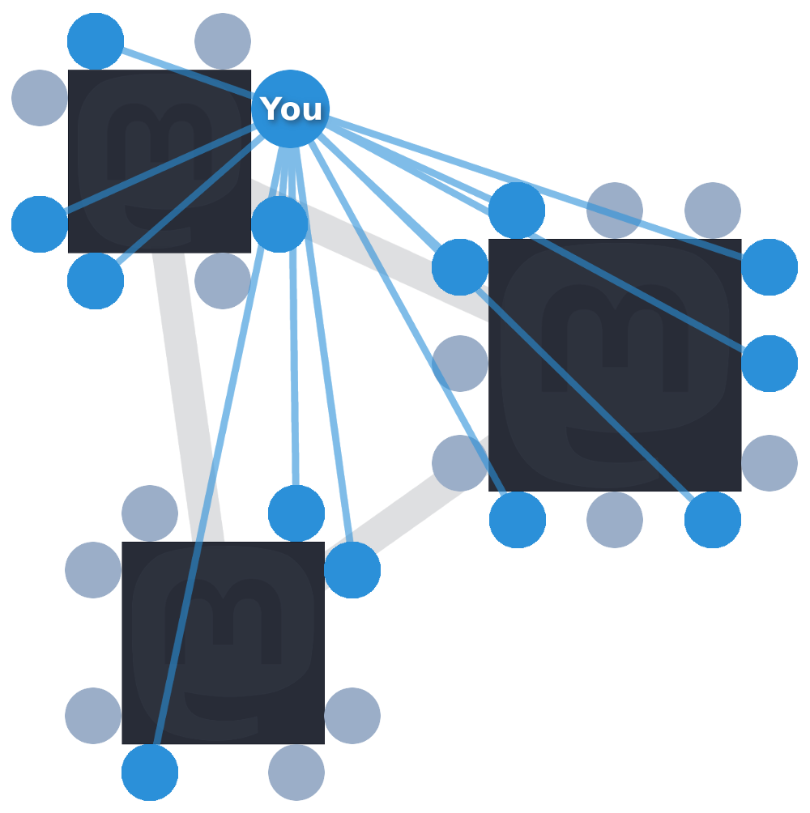

Mastodon 利用者ガイド
=====================

この利用者ガイドの翻訳:
* [英語](User-guide.md)
* [Hungarian](User-guide_HUN.md)
* [日本語](User-guide_JA.md)

## 目次

* [前書き](User-guide_JA.md#前書き)
  * [分散と連合](User-guide_JA.md#分散と連合)
* [使いはじめる](User-guide_JA.md#使いはじめる)
  * [プロフィールを設定する](User-guide_JA.md#プロフィールを設定する)
  * [メール通知](User-guide_JA.md#メール通知)
  * [テキスト投稿](User-guide_JA.md#テキスト投稿)
    * [コンテンツ警告（CW）](User-guide_JA.md#コンテンツ警告（CW）)
    * [ハッシュタグ](User-guide_JA.md#ハッシュタグ)
    * [ブーストとお気に入り](User-guide_JA.md#ブーストとお気に入り)
  * [画像の投稿](User-guide_JA.md#画像の投稿)
  * [ユーザのフォロー](User-guide_JA.md#ユーザのフォロー)
  * [通知](User-guide_JA.md#通知)
  * [モバイルアプリ](User-guide_JA.md#モバイルアプリ)
  * [連合タイムライン](User-guide_JA.md#連合タイムライン)
  * [ローカルタイムライン](User-guide_JA.md#ローカルタイムライン)
  * [検索](User-guide_JA.md#検索)
  * [リスト](User-guide_JA.md#リスト)
* [プライバシー、安全、セキュリティ](User-guide_JA.md#プライバシー、安全、セキュリティ)
  * [二要素認証](User-guide_JA.md#二要素認証)
  * [アカウントのプライバシー](User-guide_JA.md#アカウントのプライバシー)
  * [トゥートのプライバシー](User-guide_JA.md#トゥートのプライバシー)
  * [ブロック](User-guide_JA.md#ブロック)
  * [トゥートやユーザの通報](User-guide_JA.md#トゥートやユーザの通報)
* [疑問がある場合は？](User-guide_JA.md#疑問がある場合は？)

## 前書き

Mastodon とは、 ActivityPub プロトコルをベースとするソーシャルネットワークアプリケーションです。他のソーシャルネットワーク（とりわけ Twitter )と、ある重要な一点を除いて、非常に似た振る舞いをします。（その重要な一点とは、）オープンソースで、誰もが独自のサーバー（"*インスタンス*"とも呼ばれます）を立ち上げることができ、どのインスタンスのユーザも他のインスタンスと自由にやりとりすることができます（"*フェデレーション（連合）*"と呼ばれます）。従って、小規模なコミュニティでも、他のコミュニティとのやりとりも可能にしつつ、自分たちで使用する独自のサーバーをセットアップすることができます。

#### 分散と連合

Mastodon は、インフラを運営する一人の個人や組織に依存するのではなく、誰もがソフトウェアをダウンロードして実行することにより、独自のサーバーを稼働させることができる"フェデレーション（連合）"概念によって分散されたシステムです。 フェデレーションとは、異なる Mastodon サーバが互いにシームレスに会話できることを意味します。 例えば、Eメールと似たようなものです。

このように、誰でも Mastodon をダウンロードすることができ、小規模なインスタンスを立ち上げられます。インスタンスに登録されているユーザは、他の Mastodon インスタンス（および GNU Social や postActive などの OStatus 互換サービスを提供しているサーバー）からの投稿をフォロー、送信、および閲覧することができます。広告もトラッキングもありません。 また、使っているインスタンスがなくなった場合、新しく*インスタンスを*立ち上げることも、別のインスタンスに移動することもできます。

各 Mastodon インスタンス内では、 Twitter などの他のサービスと同様に、ユーザ名は `@username` として表示されます。他のインスタンスからのユーザは、 `@user@servername` 形式で表示され、検索ができます。例: Mastodon.social インスタンス上の `@gargron` をフォローする場合、`@gargron@Mastodon.social` で検索、フォローができます。

外部インスタンス上のユーザからの投稿は、ローカルのものに"*連合*"されます。つまり、 `user1@Mastodon1` が `user2@gnusocial2` をフォローすると、 `user2@gnusocial2` による投稿が `user1@mastodon1` のホームフィードと `mastodon1` サーバーの公開タイムラインの両方に表示されます。 Mastodon のサーバー管理者は、これに対して何らかの制御を行い、公開タイムラインに表示されるユーザの投稿を除外することができます。 Mastodon インスタンス上のユーザのプライバシー設定もよって影響します。 下記の「Toot のプライバシー」のセクションを参照してください。

## 使いはじめる

#### プロフィールを設定する

Mastodonのプロフィールは、さまざまな方法でカスタマイズができます。自由な表示名（"display" name）、プロフィールのアバター画像（"avatar "）、ヘッダーの背景画像、あなたやあなたのアカウントの説明文（"bio" 欄）を設定することができます。

 プロフィールを編集するには、「作成」列の「ユーザ設定」をクリックし、左側メニューで「プロフィールを編集」を選択します。表示名は30文字、説明文は160文字に制限されています。アバターとヘッダー画像は、png、gif、またはjpg 画像としてアップロードすることができ、2MBを超えることはできません。アバターの場合は120x120ピクセル、ヘッダーピクチャの場合は700x335ピクセルの標準サイズにリサイズされます。

#### メール通知

Mastodon ではユーザ設定アイコンから通知設定した場合、メールでアクティビティを通知することができます。メール通知の受信を設定するには、「作成」列の「ユーザ設定」をクリックし、左側メニューからユーザ設定を選択します。さまざまなアクティビティのメール通知の有効・無効にするチェックボックスがここにあります。

#### テキスト投稿

Mastodon の最も基本的なやりとりの方法は、*トゥート*とも呼ばれるテキストの投稿です。トゥートするには、「作成」列の "今なにしてる？" テキストボックスに投稿したいメッセージを入力し、 "トゥート" をクリックします。トゥートには最大500文字の制限があります。どうしてもそれよりも長く書く必要がある場合は、自身の投稿に返信することで繋げて見せることができます。

他ユーザのトゥートに返信したければ、そのトゥートの "返信" アイコンをクリックします。これにより、返信先の投稿のユーザ名が入力ボックスに追加され、そのメッセージのプレビューが表示されます。返信先のユーザは、あなたが反応したという通知を受け取ります。

同様に、別ユーザと会話を開始するには、相手のユーザ名を入力します（*メンション*します）。メッセージ内の @ 記号の後に（スペースなしで）直接入力すると、 Mastodon 内は自動的にそのユーザ名に一致するユーザの候補を挙げてくれます。 返信と同様、ユーザにメンションすると、通知が送信されます。投稿がメンションから始まる場合は返信として扱われ、あなたとメンション先のユーザの両方をフォローしているユーザのホームタイムラインにのみ表示されます。プライバシー設定によっては、プロフィール画面に表示されることもあります。

##### コンテンツ警告（CW）

即時に表示されたくない投稿（例えば公開直後の映画のネタバレや、人を不愉快にする恐れのある個人的な考え）をしようとするときには、「コンテンツ警告」を使って*隠す*ことができます。

この機能を使用するには、作成ボックスの下にある  "CW"アイコンをクリックします。 これにより、「コンテンツの警告」というラベルの付いた別のテキストボックスが追加されます。投稿の"本文"の内容を簡潔に要約したものをここに入力し、本来の非表示にしたい投稿は"今何してる？"に入力します。

こうすることで、投稿の本文はタイムライン上では「詳細を表示」ボタンで隠され、デフォルトではコンテンツ警告とメンションされたユーザだけが表示されることになります。

投稿にコンテンツの警告を追加すると、投稿に添付された画像は強制的に「Sensitive」クリックするまで非表示になります。コンテンツの警告以外で投稿に画像を添付する方法は本ユーザガイドの「画像の投稿」セクションを参照してください。

##### ハッシュタグ

比較的広い話題に属する投稿をしようとするなら、 "ハッシュタグ" を設定すると良いでしょう。通常の投稿に、 # 記号の後に続くフレーズを含めるだけでできます。ハッシュタグには、文字と数字のみを含めることができます（スペースまたは & を含めると、ハッシュタグがうまく機能しません）。例： #introductions (mastodon.social で人気がある自己紹介ハッシュタグ)、#politics（政治的な議論などを表すタグ） 。

トゥートが投稿されると、ハッシュタグはクリック可能なリンクになります。 トゥート上のハッシュタグをクリックすると、このハッシュタグを含む公開投稿のみのタイムラインが表示されます（つまり、検索のショートカットです）。 これにより、ユーザは同じような主題の投稿をグループ化し、その話題に興味のあるユーザのために別の"タイムライン"を形成することができます。 ハッシュタグは、作成ボックスの上にある検索バーから検索することもできます。

ハッシュタグ検索を開いていると、自動的に最新のトゥートが表示されます。 ハッシュタグ検索列の右上にある設定アイコンをクリックし、「カラムの固定」をクリックすると、列を固定して検索を開いたままにすることができます。 このメニューを再度開いた場合は、固定されたハッシュタグ列を左または右に移動するか、またはピン留めを外すことができます。

未収載、フォロワー限定のトゥートと、 DM はハッシュタグ検索に現れませんが、ハッシュタグが含まれる場合は、それをクリックしてそのハッシュタグを含む公開トゥートを検索できます。ハッシュタグ検索は、使用しているインスタンスが知っているトゥートのみ表示できます。

##### ブーストとお気に入り

ユーザのトゥートの下に表示された星アイコンをクリックすることでお気に入りに追加することができます。これにより、ユーザには投稿をお気に入りとしてマークされたことを示す通知が送信されます。文脈によって、単なる「見てますよ」から、トゥートに書かれた考えへの賛同や支持の意思表明まで、幅広い意味を持ちます。星アイコンをクリックすると、"Getting Started"にある「保存したトゥート」のリストに追加できます。

さらに「円環状の矢印」アイコンをクリックして、トゥートを*ブースト*（拡散）することができます。トゥートをブーストすると、プロフィールのタイムラインに表示され、元の投稿を作成したユーザをフォローしていない場合でも、あなたのフォロワーみんなにに表示させることができます。この機能は、メッセージのリーチ範囲を広げながらも発信者の情報を維持してくれるので、誰かがあなたにとって「他の人も見るべきだ」と思うようなトゥートをしたときに役立ちます。

#### 画像の投稿

 画像を投稿するには、作成列の"カメラ"アイコンをクリックするかタップして、アップロードするファイルを選択します。

また、デスクトップからドラッグして、テキストボックスにドロップすることもできます。

画像に "不適切な"コンテンツ (ヌードや暴力など) を含む場合は、"NSFW"(Not Safe For Work)ボタンを選択すると、画像を追加した後に目のシンボルのように表示されます。これにより、デフォルトでは投稿の画像が非表示になり、表示するにはクリックが必要になります。

[コンテンツ警告](User-guide.md#content-warnings)を追加すると、添付されているすべてのメディアを非表示にすることができますが、メディアの非表示ボタンを使用してコンテンツ警告を追加せずに画像を非表示にすることもできます。

ビデオファイルやGIFアニメーションをトゥートに添付することもできます。 ただし、これらのファイルには 8MB のファイルサイズの制限があり、ビデオは .webm または .mp4 形式でなければなりません。

#### ユーザのフォロー

ユーザをフォローすることと、そのユーザのトゥートと、そのユーザが[ブースト](User-guide.md#boosts-and-favourites)したトゥートもホーム画面に表示されます。これにより、[公開タイムライン](User-guide.md#the-public-timelines)とは別に、特定の人々が何をやっているのかを、他の人々によるノイズなく見ることができます。

これにより、一般的に公開されたトゥートとは分けて特定されたトゥートのみをタイムライン上で閲覧することができます。

 ユーザをフォローするには、名前またはアバターをクリックしてプロフィールを開き、プロフィールビューの左上にあるフォローアイコンをクリックします。

ユーザ名の横に南京錠アイコンがあるユーザに対しては、フォロワーになるためには、フォローをリクエストし、その通知を彼らが受け取り、それを承認する必要があります。フォローリクエストの承認待ちであることを示すために、フォローアイコン が砂時計のアイコンに変わります。あなた自身も、プロフィール設定も画面で、フォローリクエストを必要とするように設定できます。

ユーザをフォローすると、プロフィールのフォローアイコンが青色で表示されます。クリックすると、フォローを外すことができます。

特定の誰かのユーザ名を知っている場合は、作成列の[検索ボックス](User-guide.md#searching)にユーザ名を入力してプロフィールを開き、フォローすることができます。これはリモートユーザにも有効ですが、使用しているインスタンスにとって知られていない場合は、検索ボックスにドメインを含むフルネーム（例えば `gargron@Mastodon.social` のような）を入力する必要があります。

別のブラウザタブで誰かのユーザのプロフィールを開いている場合には、他の Mastdon インスタンスや OStatus 関係のインスタンスのプロフィールページには、「フォロー」や「購読」ボタンが表示されるはずです。このボタンを押すと、どのアカウント**から**フォローしようとするのか、フルネームの入力を求められるでしょう（例えば mastodon.social のアカウントなら、 `myaccount@mastodon.social` と入力することになります）。

#### 通知

ユーザがアカウントをフォローしたり、フォローをリクエストしたり、ユーザ名をメンションしたり、トゥートをお気に入りや拡散したりすると、通知が届きます。 これらは、"通知"列に表示される他、PC上のデスクトップ通知としても表示されます（ウェブブラウザがサポートしており、有効な場合）。

 通知に表示される通知の種類は、画面上部にある「通知設定」アイコンをクリックし、各通知のチェックボックスを選択することでを表示の有無を設定できます。

 通知が散らかってきたと感じたら、画面上部にある「クリア」アイコンをクリックすれば、列ごと内容を消去します。

 フォローしていないか、またはされていないユーザからの通知を完全に無効にすることもできます。設定するには、作成列の「ユーザ設定」アイコンをクリックします。左側メニューのユーザ設定から「通知をブロック」オプションにて設定します。

#### モバイルアプリ

Mastodon は公開 API があるので、誰でも Mastodon を使用するためのクライアントやアプリを開発することができます。 多くの人が、iOSとAndroid用のモバイルアプリを既に開発しており、これらのリストは[こちら](Apps.md)で見つけることができます。これらの多くはオープンソースプロジェクトで、協力者を歓迎しています。

#### 公開タイムライン

ホームタイムラインの他に、「連合タイムライン」と「ローカルタイムライン」という2つの公開タイムラインが利用できます。これらはどちらも、新しいユーザと出会い、交流するために便利です。

##### 連合タイムライン

「連合タイムライン」は、利用しているインスタンスが「知っている」すべてのユーザのすべての公開投稿を表示します。つまり、あなたと同じインスタンスにいるユーザと、それらのユーザがフォローしているユーザです。「連合タイムライン」は、広く世界中の会話に接触する素晴らしい方法です。連合タイムラインで出会ったリモートインスタンスのユーザをフォローすることは、より多くのインスタンスのより多くのユーザに出会うことに繋がり、ひいてはあなたの利用しているインスタンスを Mastodon と OStatus のネットワーク全体により強く接続することになります。

連合タイムラインを表示するには、作成列の"連合タイムライン"アイコン、またはスタートのボタンをクリックします。連合タイムラインを非表示にするには、上部にある"戻る"をクリックします。

#### ローカルタイムライン

「ローカルタイムライン」には、ホームインスタンス上のユーザが作成した公開投稿のみが表示されます。ローカルタイムラインは、利用しているインスタンスのコミュニティに、他のインスタンスにはない特有の規範がある場合に便利です。例えば、コンテンツ警告で統制されるべき特有のトピックや、内輪ネタや共通の興味です。

ローカルタイムラインを表示するには、作成列にある"ローカルタイムライン"またはスタートのボタンをクリックします。

#### 検索

Mastodon には検索機能があります。"トゥート"作成の上に配置されています。カーソルを検索ボックスにクリックすると、機能説明を示すヘルプのポップアップが表示されます。

検索は、次のように使えます:

* **[ハッシュタグ](User-guide.md#hashtags)** - インスタンスに記されているハッシュタグは、この検索で表示されます。クリックすると、インスタンスに記されているハッシュタグでタグ付けされた公開投稿を検索できます。未収載トゥートはハッシュタグ検索に表示されません。検索はインスタンスに記されている投稿に限定され、"あなたのインスタンスのユーザまたは*それらにフォローされたユーザ*が投稿したか、ブーストしたか、返信したトゥート"と大まかに定義されています。
* **人々** - `@username` を検索すると、そのユーザ名でインスタンスに知られているユーザが表示されます。これには、他のインスタンスを利用しているユーザも含まれます `@username@instance` とより正確に検索することがすれば、インスタンスに含まれていなくても、そのユーザ名とインスタンス名を持つユーザが表示されます。 検索結果をクリックすると、ユーザのプロフィールが表示されます `http://instan.ce/@username` などの他のユーザのプロフィールのURLを検索すると、同じことが実行されますが、ユーザのアバター、bio、フォロワー/フォロワーの統計情報が更新されます。
* **トゥート** - インスタンス内で許可している場合は、自身が書いたトゥート、拡散したトゥート、お気に入りのトゥート、またはメンションされてたトゥートを検索することができます。マストドンの検索機能は乱用を防ぐために制限されていて、**すべてのトゥートが検索できるとは限らない**ように意図的になっています。
* **トゥートURL** - 検索ボックスに特定のトゥートurlを入力し、エンターキーを押すと、検索結果のトゥートが表示され、保存、返信、または拡散することができます。これにより、インスタンスに対してトゥートを"知る"ことができ、連合タイムラインに表示されます。ハッシュタグを含む場合は、インスタンス内のユーザによって作成されたハッシュタグ検索も行われます。トゥートをクリックし開くことで、返信の閲覧やお気に入り/拡散の件数を表示することができます。

検索の内容をまとめると、検索を開始するには、作成列の検索ボックスに入力し、Enterキーをクリックします。 検索結果は検索ボックスの下にポップアップ表示されます。 プレーンテキストの単語を入力すると、自身が書いたトゥート、拡散したトゥート、お気に入りのトゥート、メンションされたトゥート、または単語、ハッシュタグが含まれるトゥート、更には検索した単語がユーザ名、表示名、インスタンス名に含む場合も対象となります。例えば、 `nonbinary` と入力すると、次のようなものが検索結果に含まれ得ます:

* Nonbinary Friend (`@hannah@instance`)
* Hannah (`@nonbinaryfriend@instance`)
* Hannah (`@friend@nonbinary.instance`)
* `#nonbinary`
* `#nonbinaryheroes`

#### リスト

現時点では、リストに追加するには、まずそのユーザをフォローして、リストの設定画面から追加します。[このトピック](https://discourse.joinmastodon.org/t/user-lists-feature/921/2)をご覧ください。

## プライバシー、安全、セキュリティ

Mastodon は、 Twitter のような他の公開ソーシャルネットワークと比べてより先進的なセキュリティ・プライバシー・安全のための機能の数々を備えています。特にプライバシー制御はよりきめ細かなものとなっています。このセクションでは、これらの仕組みがどのように機能するかを説明します。

#### 二要素認証

二要素認証（2FA）は、ログインの際に、あなたの Mastodon アカウントにリンクされたデバイス（通常は携帯電話）に表示される数字のコードを確認することで、 Mastodon アカウントのセキュリティを向上させる仕組みです。もし誰かがあなたのメールアドレスとパスワードを奪ったとしても、 Mastodon アカウントにログインするにはあなたの持つ物理的なデバイスが必要なので、 Mastodon アカウントを乗っ取ることはできません。

Mastodon の2FA は、Google 認証システム (または Authy などの互換アプリ) [Android](https://play.google.com/store/apps/details?id=com.google.android.apps.authenticator2) または [iOS](https://itunes.apple.com/gb/app/google-authenticator/id388497605) デバイスに無料でインストールできます。[Wikipedia のこのページには](https://en.wikipedia.org/wiki/Google_Authenticator#Implementations)、他のシステム向けのアプリのバージョンが一覧されています。

 Mastodon アカウントで2FAを有効にするには、「作成」列のユーザ設定アイコンをクリックします。設定ページの左側のメニューで"二段階認証"をクリックし、設定します。有効にすると、ログインするたびにアカウントにリンクした端末の識別システムアプリによって生成されたワンタイムコードが必要になります。

#### アカウントのプライバシー

あなたトゥートを閲覧できるユーザをより細かく制御するために、 Mastodon は"非公開"または"ロック"アカウントの機能があります。アカウントが非公開に設定されている場合は、ユーザがフォローしようとするたびに通知され、フォローのリクエストを許可または拒否することができます。また、新たに投稿するトゥートはデフォルトで非公開になります (以下[トゥートプライバシー](User-guide.md#toot-privacy)のセクションを参照してください)。

 アカウントを非公開にする場合は、作成列のユーザ設定アイコンをクリックし、"プロフィールの編集"を選択します。"アカウントの非公開"チェックボックスを有効にして、"変更を保存"をクリックします。

スタートメニューでフォローリクエストを確認したり、

リクエストを個別にを承認または拒否できます

#### トゥートのプライバシー

トゥートのプライバシーは、アカウントのプライバシーとは独立に、トゥートごとに個別に取り扱われます。トゥートの可視性の4つの層は、公開（デフォルト）、未収載、非公開、ダイレクトです。プライバシーレベルを選択するには、地球アイコンをクリックします。この設定の変更は、投稿後も保持されます。例えば非公開のトゥートを一度作成すると、以降作成するトゥートは、「公開」に戻すまで「非公開」になったままです。デフォルトの投稿プライバシーの設定はユーザ設定で変更できます。

**公開**トゥートは、ほとんどのアカウントでデフォルトです。公開トゥートは、公開タイムライン上の全ユーザに表示され、制限なしに他の Mastodon および OStatus インスタンスと連合され、ユーザプロフィールページの検索エンジンのボットや Mastodon にログインしていない訪問者を含む全てに表示されます。

**未収載**トゥートは公開はされていますが、公開タイムラインや検索結果には表示されません。フォロワーのみに公開されます。ただし、プロフィールページに公開されるため、 Mastodon にログインしていない訪問者でも閲覧できます。 公開タイムラインや検索結果に表示されない以外は、公開投稿と同じように機能します。

**フォロワー限定**トゥートは、あなたのフォロワー以外に対しては、公開タイムラインでもプロフィールページでも表示されません。これの選択肢は、アカウントがフォローリクエストの承認を必要とするよう設定されていなければ、限定的な効果しかありません（誰でも、あなたに確認されることなくフォローして、フォロワー限定トゥートを見ることができるからです）。しかしながら、この設定が別れていることは、アカウント全体を*非公開にしている場合*、トゥートのこの設定をオフにすれば、基本的には非公開なアカウントから未収載や公開のトゥートをすることができる、ということを意味しています。

非公開トゥートは拡散できません。フォローしているユーザが非公開トゥートを作成した場合、タイムラインに表示はされますが、ブーストアイコンの代わりに南京錠アイコンが表示されます。**リモートインスタンスでは、これに応じた取り扱いをしない場合があるので注意**してください。

インスタンスが投稿のプライバシー設定を尊重するかを確かめる確実な方法はありません。 Mastodon 以外のサーバ（GNU Social など）は Mastodon のプライバシー設定に対応していません。非公開投稿で GNU Social ユーザにメンションしても、相手は非公開投稿であること自体認識できず、ブーストしてプライバシー設定を無効化することもできてしまいます。特定の Mastodon インスタンスが、投稿の非公開制限を無視するようにコードを変更されていないとも限りません。他のインスタンスに伝搬するような非公開トゥートを作成しようとすると、警告が表示されます。従って、これからメンションしようとしているユーザやそのユーザが所属するインスタンスをどの程度信頼できるのか、しっかり考える必要があります。

非公開投稿は、暗号化されているわけではありません。所属するインスタンスの管理者が、データベース上の非公開投稿を読むことがないと信頼できるか、検討してください。万が一にでも盗み見られたくないようなことは、投稿しないようにしてください。

**ダイレクト**投稿は、 `@` でメンションしたユーザにのみ表示され、拡散することはできません。非公開投稿と同様に、リモートインスタンスがこのプロトコルを尊重しない可能性があることに注意する必要があります。機密内容を含む場合、 Mastodon 以外で会話してください。

まとめると:

トゥートプライバシー | プロフィールで表示 | 公開タイムラインで表示 | 他のインスタンスに連合 
------------------|-----------------|--------------------|---------------------
公開 | 匿名含む全員にされる | される | される
未収載 | 匿名含む全員にされる | されない | される
非公開 | フォロワーのみされる | されない | される
ダイレクト | されない | されない | リモートからの @メンションだけ

#### ブロック

特定ユーザが接触しようとするのを、ブロックして阻止することができます。ブロックは、特定ユーザが投稿したトゥート、またはプロフィールビューのメニューアイコンをクリックまたはタップして、「ブロック」を選択します。

**注意**: ログインしている間は公開トゥートを閲覧できなくなりますが、 Mastodon にログインしていない別のブラウザでプロフィールを開けば（あるいは、ブロックされていない他のアカウントを使えば）、公開トゥートを閲覧できます。

ブロックされたユーザからのメンション、お気に入り、拡散、またはその他操作は、全ての画面で非表示になります。ブロックされたユーザへの返信も、仮にあなたにもメンションしていたとしても、表示されません。また、別ユーザがブロックユーザのトゥートを拡散しても閲覧できません。

ブロックされたユーザには、ブロックしたことは通知されません。あなたのフォロワーからは削除されます。

#### ミュート

特定ユーザの投稿は表示したくないが、自身の投稿が表示されることを気にしない場合は、*ミュート*を使うことができます。ユーザをブロックするプロフィールページと同じメニューからミュートすることができます。 `@` でメンションしない限り、ミュートされたユーザからの投稿は表示されません。ミュートされたユーザは、ミュートされていることを知る方法はありません。また、プロフィールページの同じメニューから、ユーザを完全にミュートすることなく、ユーザのブーストのみをミュートすることもできます。

#### トゥートやユーザの通報

インスタンスのルールを破っているトゥートやユーザに遭遇した場合や、それ以外でインスタンス管理者の注意を引きたいと思ったとき（例えば、他ユーザへの嫌がらせ、ポルノ、スパム、違法なコンテンツの投稿など)、トゥートのメニューボタンまたはプロフィール上の"ハンバーガー"メニューで、"..."をクリックすることで、通報ができます。右端の列は、次のフォームに切り替わります:

このフォームでは、インスタンス管理者に報告するトゥートを選択し、問題の特定または処理する際に役立つコメントを入力できます。 (「スパム投稿」、「この投稿には警告なしでポルノが含まれています」など)。通報が送られると、サーバ管理者はそれを確認して、ユーザの投稿を非公開にしたり、アカウントを凍結するなど、適切な処置をとることができるようになります。

## 疑問がある場合は？

この文書を読んでもなおサポートに関する疑問が残る場合、次の2つの方法を試すことがでいます。

1. その Mastodon インスタンスで #support ハッシュタグをつけて質問する（小規模なインスタンスより、大きなインスタンスでのほうが効果があるでしょう）。
2. [Mastodon メタ議論ボード](https://discourse.joinmastodon.org/c/general)に行く（訳注: [Mastodon 日本語メタフォーラム](https://discourse.mstdn.jp)）。質問する前に[ガイドラインを読む](https://discourse.joinmastodon.org/faq)ようにしてください。

